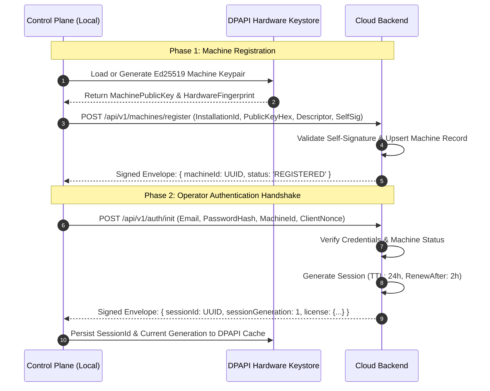
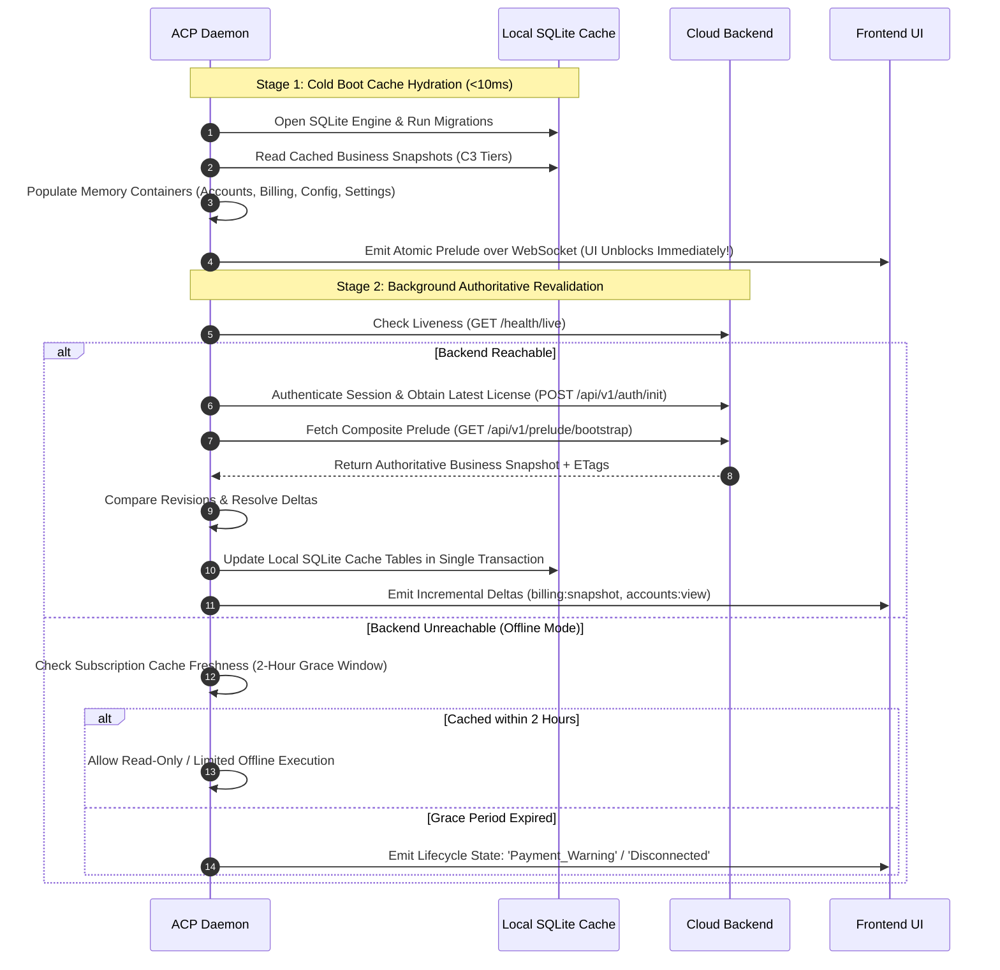

# ACP ↔ BACKEND BOUNDARY CONTRACT
## Forensic Audit, Authority Matrix, Protocol Surface, and Backend Conformance Specification

**Document Version:** 1.0.0  
**Specification Target:** Automation Control Plane (ACP) ↔ Cloud Backend (`bettingAutomationBackend`)  
**Standard Status:** Normative Architectural Contract & Backend Implementation Specification  
**Companion Specifications:**  
- `ACP_EXECUTION_PLANE_BOUNDARY_CONTRACT.md` (v3.0)
- `FRONTEND_ACP_BOUNDARY_CONTRACT.md` (v1.0.0)
- `acp-sqlite-cacheability-audit.md` (v1.0.0)
- `features/security/03-security-authority-canonical-specification.md`  
**Date:** September 10, 2026  

---

# TABLE OF CONTENTS
1. [Executive Architecture Verdict & Authority Model](#1-executive-architecture-verdict--authority-model)
2. [Forensic Backend Audit (Current vs. Required Future Contract)](#2-forensic-backend-audit-current-vs-required-future-contract)
3. [Authority Matrix & Master Residency Taxonomy](#3-authority-matrix--master-residency-taxonomy)
4. [Wire Protocol & Transport Contract (`ProtocolEnvelopeV2`)](#4-wire-protocol--transport-contract-protocolenvelopev2)
5. [ACP ↔ Backend Protocol Surface (Complete Operation Catalog)](#5-acp--backend-protocol-surface-complete-operation-catalog)
6. [Authentication, Machine Identity & Session Lifecycle](#6-authentication-machine-identity--session-lifecycle)
7. [Startup Bootstrap & Hydration Pipeline](#7-startup-bootstrap--hydration-pipeline)
8. [Capability, Licensing & Entitlement Model](#8-capability-licensing--entitlement-model)
9. [Subscription, Billing & Payment Gateway Contract](#9-subscription-billing--payment-gateway-contract)
10. [Betting Account Business Metadata & Zero-Secret Vault Boundary](#10-betting-account-business-metadata--zero-secret-vault-boundary)
11. [Operator Settings & Step-Up Security Contract](#11-operator-settings--step-up-security-contract)
12. [Customer Care, Support & Remote Diagnostics](#12-customer-care-support--remote-diagnostics)
13. [Notifications Hub Contract](#13-notifications-hub-contract)
14. [Mutation Semantics, Acknowledgements & Idempotency](#14-mutation-semantics-acknowledgements--idempotency)
15. [Caching, Freshness & Revalidation Contract (C0–C5)](#15-caching-freshness--revalidation-contract-c0c5)
16. [Server-to-Client Events, Outbox & State Reconciliation](#16-server-to-client-events-outbox--state-reconciliation)
17. [Machine-Readable Error Taxonomy & Resiliency Matrix](#17-machine-readable-error-taxonomy--resiliency-matrix)
18. [Security, Cryptography & Hardware Attestation](#18-security-cryptography--hardware-attestation)
19. [API Versioning, Schema Evolution & Extensibility](#19-api-versioning-schema-evolution--extensibility)
20. [Observability, Telemetry & Audit Chaining](#20-observability-telemetry--audit-chaining)
21. [Contract Invariants & Hard Rules](#21-contract-invariants--hard-rules)
22. [Hostile Review & Adversarial Edge-Case Resolution](#22-hostile-review--adversarial-edge-case-resolution)
23. [Backend Conformance Checklist & Remediation Roadmap](#23-backend-conformance-checklist--remediation-roadmap)

---

# 1. Executive Architecture Verdict & Authority Model

### 1.1 Architectural Topology
The betting automation ecosystem comprises four strictly decoupled, non-overlapping planes:
```text
 ┌────────────────────────────────────────────────────────────────────────┐
 │                             CLOUD BACKEND                              │
 │                 Ultimate Authority for Business Truth                  │
 │   Identity • Licensing • Billing • Entitlements • Server Settings       │
 └───────────────────────────────────┬────────────────────────────────────┘
                                     │
                 mTLS HTTPS / Signed ProtocolEnvelopeV2
                 Server-Sent Events / Push Invalidation
                                     │
                                     ▼
 ┌────────────────────────────────────────────────────────────────────────┐
 │                     AUTOMATION CONTROL PLANE (ACP)                     │
 │          Local Orchestration Daemon & Materialized View Cache          │
 │    Local State Store • DPAPI Credential Vault • Capability Resolver    │
 └──────────────┬──────────────────────────────────────────┬──────────────┘
                │                                          │
    Local Named Pipe (HMAC)                       Loopback HTTP & WS
   Protocol v3.0 Envelopes                     Plain JSON Snapshots/Deltas
                │                                          │
                ▼                                          ▼
 ┌──────────────────────────────┐          ┌──────────────────────────────┐
 │       EXECUTION PLANE        │          │       FRONTEND CONSOLE       │
 │   Browser Automation Engine  │          │   Next.js Operations UI      │
 │  Playwright • DOM Locators   │          │  Zustand • Tailwind Views    │
 │  Page Contexts • Odds Loops  │          │  Zero Math • Zero Secrets    │
 └──────────────────────────────┘          └──────────────────────────────┘
```

### 1.2 Non-Negotiable Ownership Boundaries
1. **Cloud Backend**: Sole authority for identity, user credentials, authentication verification, machine identity authorization, active subscriptions, billing plans, pricing, tax (VAT), payment webhook processing, licenses, entitlements/quotas, platform catalogs, customer support tickets, and server-owned settings.
2. **Automation Control Plane (ACP)**: Local daemon process running on the host. ACP owns local browser process orchestration, named-pipe communication with the Execution Plane, local hardware key protection (Windows DPAPI), encrypted local SQLite caching, local capability materialization for UI consumption, and real-time operational state.
3. **Execution Plane**: Independent automation worker process. Owns browser instances (Playwright/Chromium), browser cookies/DOM sessions, tactical odds polling loops, and locator execution. Communicates strictly with ACP over local IPC; **never** communicates with Backend or Frontend.
4. **Frontend Console**: Reactive Next.js client running in the user's browser. Communicates strictly with local ACP via loopback HTTP (`127.0.0.1:8000`) and WebSocket (`/ws/v1/events`). The Frontend **never** contacts the Cloud Backend directly, computes zero financial math, and stores zero secrets.

### 1.3 Key Architectural Axioms
- **Axiom 1 (Single Business Authority)**: The Cloud Backend is the sole source of truth for business invariants. ACP local storage is strictly a materialized cache; it can never mint, grant, or elevate business entitlements.
- **Axiom 2 (Single Runtime Authority)**: ACP in-memory state is the sole authority for runtime execution. Browser PIDs, engine status (`STARTING`, `RUNNING`, `STOPPED`), active connection handles, and live operational flags (`canStartAutomation`, `canPlaceBet`) exist purely in ACP memory.
- **Axiom 3 (Zero Cloud Credential Storage)**: Betting bookmaker credentials (passwords, TOTP secrets) are stored exclusively on the operator's machine within ACP's DPAPI-encrypted local keystore. Plaintext or reversibly encrypted account passwords must **never** be transmitted to or stored within the Cloud Backend.
- **Axiom 4 (Cryptographic Machine Boundary)**: All ACP ↔ Backend communication is mutually authenticated via Ed25519 signatures, single-use nonces, monotonic sequence numbers, and strict clock freshness boundaries (±30 seconds).

---

# 2. Forensic Backend Audit (Current vs. Required Future Contract)

An exhaustive forensic inspection of `bettingAutomationBackend` revealed significant legacy coupling and architectural boundary violations that must be eliminated to achieve protocol conformance.

### 2.1 Audit Findings Matrix
| Component / Route | Current Implementation in `bettingAutomationBackend` | Severity | Required Future Contract |
| :--- | :--- | :---: | :--- |
| **Tactical Automation** (`/api/v1/automation/tactical/*`) | Backend exposes `POST /tactical/bet`, `POST /tactical/cashout`, `POST /lifecycle/start`, `POST /lifecycle/stop`, `POST /validate`. | **CRITICAL VIOLATION** | **REMOVE ENTIRELY FROM BACKEND.** Tactical execution belongs 100% to ACP and Execution Plane. Backend must never receive tactical bet orders. |
| **Automation Config Storage** (`global_automation_configs` & `automation_account_configs`) | Backend stores browser spawning parameters (`slaveMode`, `headless`), proxy allocations, typing delays, and execution timeouts in PostgreSQL. | **HIGH VIOLATION** | **MIGRATE TO ACP LOCAL STORE.** Execution engine runtime parameters belong in ACP local SQLite. Backend only stores server-side business limits (e.g. `max_concurrent_browsers`). |
| **Betting Account Credentials** (`betting_accounts`) | Database columns `account_password_encrypted`, `password_iv`, `password_tag` store encrypted bookmaker passwords in cloud database. | **CRITICAL SECURITY RISK** | **ELIMINATE PASSWORDS FROM BACKEND.** Passwords remain in ACP DPAPI vault. Backend stores only account metadata: `id`, `name`, `platformDisplayName`, `accountUsername`, `backendState`, `tags`. |
| **Operational Capabilities** (`domain/automation/service.mjs`) | Backend computes `canStartAutomation`, `canPlaceBet`, `canCashOut`, and counts `activeBrowsers`. | **HIGH VIOLATION** | **REMOVE FROM BACKEND.** Operational capabilities are materialized dynamically in ACP memory by evaluating Backend-provided entitlements against live Execution Plane process health. |
| **Prelude Route** (`/api/v1/prelude`) | Bundles `getAutomationSnapshot()` (engine status, browser status) into the cloud prelude response. | **HIGH VIOLATION** | **PURGE RUNTIME STATE FROM PRELUDE.** Cloud prelude returns strictly business state: User Profile, License, Entitlements, Billing Snapshot, Platform Registry, Support Snapshot. |
| **Direct WebSocket Broadcasting** (`websocket/server.mjs`) | Backend broadcasts `accounts:delta`, `automation:delta`, `settings:snapshot` directly to WebSocket clients. | **MEDIUM VIOLATION** | **CHANGE TO SERVER-TO-ACP EVENT STREAM.** Backend emits Server-to-Client events (SSE/WebSocket) to connected ACP daemons with monotonic sequence tracking and replay support. |
| **Conditional Revalidation** (`/plans`, `/platforms`, `/support`) | Endpoints return full JSON payloads on every query with no ETags or `304 Not Modified` support. | **MEDIUM INEFFICIENCY** | **REQUIRE ETags & CONDITIONAL HEADERS.** Backend must support `If-None-Match` / `ETag` returning `304 Not Modified` for reference catalogs. |
| **Error Format & Handling** (`api/middleware/error-handler.mjs`) | Returns heterogeneous errors: generic strings, raw stack traces, or `{ error: string }`. | **MEDIUM DEFECT** | **STANDARDIZE ON MACHINE-READABLE TAXONOMY.** All errors must adhere to a standardized JSON error envelope with machine-readable error codes (`BE_ERR_*`) and explicit retryability. |
| **Protocol Authentication** (`api/middleware/envelope-validator.mjs`) | ProtocolEnvelopeV2 validation exists, but some endpoints allow bypass via raw Bearer tokens. | **HIGH SECURITY RISK** | **ENFORCE ENVELOPE AUTHENTICATION UNIFORMLY.** All ACP mutating requests must require valid Ed25519 signature, active machine session, and replay protection. |

---

# 3. Authority Matrix & Master Residency Taxonomy

### 3.1 Entity Authority & Responsibility Matrix
The following matrix defines the authoritative producer, durability layer, and caching tier for every system entity:

| Entity | Backend Authority | ACP Cache (SQLite) | ACP Memory (RAM) | Frontend (Zustand) | Classification Tier | Staleness SLA | Invalidation Mechanism |
| :--- | :--- | :--- | :--- | :--- | :---: | :---: | :--- |
| **User Identity & Auth** | Authoritative Master | Encrypted Profile Cache | Active Session Context | Read-only Display | **C3** (Persistent) | 15 min (token) | Logout / Revocation Push |
| **User Master Password** | Authoritative Hash | **FORBIDDEN (0%)** | Ephemeral Transit | Zero / Never Stored | **C0** (Never Persist)| 0s | Immediate Wipe |
| **Machine Registration** | Authoritative Registry | Local Machine Descriptor| Registered Keypair | Machine UUID Display | **C3** (Persistent) | Indefinite | Machine Revocation Push |
| **Subscription & Billing** | Authoritative Master | Encrypted Snapshot Cache| Active License Bounds | Read-only Display | **C3** (Persistent) | 2 hours (grace) | Paystack Webhook / Push |
| **Plan Catalog & Pricing** | Authoritative Master | Durable Catalog Table | Cached Catalog Map | Selectable Form Data | **C3** (Persistent) | 7 days | ETag (`If-None-Match`) |
| **Platform Registry** | Authoritative Master | Durable Registry Table| Cached Platform List | Selectable Dropdown | **C4** (Long-Lived) | 24 hours | Content Hash / ETag |
| **Entitlements & Quotas** | Authoritative Master | Entitlements Cache | Hard Clamping Bounds | Feature Visibility | **C3** (Persistent) | 2 hours (grace) | License Revision Bump |
| **Operational Capabilities**| Non-Authoritative | **FORBIDDEN (0%)** | **Authoritative Dynamic**| Button Disabled / Reason | **C5** (Live Engine) | 0s (Instant) | Real-time Engine Probe |
| **Betting Account Identity**| Authoritative Master | Metadata Cache | Active Account Pool | Accounts Viewport | **C3** (Persistent) | 5 min | Delta Push / Sync |
| **Bookmaker Credentials** | **FORBIDDEN (0%)** | Encrypted DPAPI Vault | Decrypted at Injection | Masked / Omitted | **C0** (Never Persist)| 0s | Local Credential Wipe |
| **Live Account Balances** | Non-Authoritative | Historical Log | **Authoritative Scrape** | Live Value Display | **C2** (Short-Lived) | 30 seconds | Scraper Sweep / Bet Settle|
| **Automation Lifecycle** | Non-Authoritative | **FORBIDDEN (0%)** | **Authoritative State** | Engine Controls | **C5** (Live Engine) | 0s (Instant) | Execution Plane IPC Event |
| **Tactical Bet Orders** | Non-Authoritative | Audit Ledger (Local) | In-Flight Order Ledger| Operation Status Tracker| **C1** (Memory Only) | 0s | Local IPC Completion ACK |
| **Server Settings (Profile)**| Authoritative Master | Settings Cache | Cached Settings | Form Inputs | **C3** (Persistent) | Immediate | Step-Up Intent ACK / Push |
| **Automation Preferences** | Non-Authoritative | **Authoritative Store** | Active Strategy Config | Form Inputs | **C3** (Local Master) | Immediate | Local Mutation ACK |
| **Support Tickets** | Authoritative Master | Ticket Summaries | Open Ticket Count | Ticket History | **C2** (Short-Lived) | 60 seconds | Ticket Status Push |
| **Support Documentation** | Authoritative Master | Rendered Markdown Tree | Cached Doc Headings | Knowledge Base View | **C4** (Long-Lived) | 30 days | ETag / SemVer Check |
| **Notifications Feed** | Merged Cloud Alerts | Durable Notification DB | Combined Alert Feed | Toast / Badge Counter | **C3** (Persistent) | Immediate | Real-time Delta Stream |

### 3.2 Master Cacheability Tiers (C0 – C5)
- **C0 (NEVER PERSIST)**: Passwords, tokens, private keys. Must never touch SQLite or log files.
- **C1 (MEMORY ONLY)**: In-flight execution promises, WebSocket socket descriptors, temporary order idempotency locks. Discarded on daemon restart.
- **C2 (SHORT-LIVED CACHE)**: Rapidly drifting business metrics (account balances, open ticket counts). TTL ≤ 5 minutes. Fallback to display with `stale: true`.
- **C3 (PERSISTENT CACHE)**: Monotonically revised business metadata (user profile, subscription snapshot, connected accounts list). Updated via change-driven push or re-sync.
- **C4 (LONG-LIVED REFERENCE)**: Static registries (platform directory, knowledge base articles). Validated via content-hash ETags.
- **C5 (LIVE AUTHORITATIVE)**: Real-time operational flags computed on the host (`canStartAutomation`, `canPlaceBet`). Recomputed continuously; caching forbidden.

---

# 4. Wire Protocol & Transport Contract (`ProtocolEnvelopeV2`)

All network traffic between ACP and the Cloud Backend MUST use TLS 1.3 in production and MUST encapsulate all authenticated requests and responses in a signed, canonicalized `ProtocolEnvelopeV2`.

### 4.1 Client Request Envelope (ACP → Backend)
```typescript
interface ClientRequestEnvelope<T = unknown> {
  version: 2;                  // Protocol major version (MUST be 2)
  sessionId: string;          // UUID of the authenticated session
  machineId: string;          // UUID of the registered hardware machine
  nonce: string;              // High-entropy unique nonce (e.g. "n_01J79B5W8C9X32A")
  timestamp: string;          // ISO-8601 UTC timestamp (e.g. "2026-09-10T12:00:00.000Z")
  clientGeneration: number;   // Monotonically increasing integer counter per machine
  clientServerEpoch: number;  // Current server epoch counter
  payload: T;                 // Domain-specific business payload (JSON object or Base64)
  signature: string;          // Hex-encoded Ed25519 signature
}
```

### 4.2 Backend Response Envelope (Backend → ACP)
```typescript
interface BackendResponseEnvelope<T = unknown> {
  version: 2;                  // Protocol major version (MUST be 2)
  timestamp: string;          // ISO-8601 UTC timestamp from Backend wall clock
  server_epoch: number;       // Authoritative server epoch counter
  generation: number;         // Authoritative session generation counter
  payload: T;                 // Authoritative business response payload
  signatures: {               // Key-version indexed Ed25519 signature map
    [keyVersion: string]: string; // e.g. "1": "45f92b7810e9c1d..."
  };
}
```

### 4.3 Canonical Serialization & Signing Standard
To guarantee deterministic cryptographic signatures across heterogeneous runtimes (Node.js, Go, Rust, Python), envelopes MUST be canonicalized according to **RFC 8785 (JSON Canonicalization Scheme - JCS)** prior to signing and verification.

#### Signing Algorithm:
1. Strip the `signature` (or `signatures`) field from the envelope.
2. Canonicalize all remaining keys in lexicographical (Unicode codepoint) order.
3. Prepend the domain separation prefix `b"CONTROL_PLANE_V1"` to prevent cross-protocol signature substitution:
   $$\text{Preimage} = \text{UTF-8}(\text{"CONTROL\_PLANE\_V1"}) \,\|\, \text{RFC8785}(\text{EnvelopeWithoutSignature})$$
4. Sign the preimage using the machine's Ed25519 private key:
   $$\text{Signature} = \text{Ed25519\_Sign}(\text{PrivKey}, \text{Preimage})$$

#### Verification Invariants:
- **Timestamp Skew Window**: The Backend MUST reject any request where $|\text{BackendTime} - \text{timestamp}| > 30\text{ seconds}$ with error `BE_AUTH_NONCE_EXPIRED`.
- **Single-Use Nonce**: The Backend MUST record all incoming nonces in a fast key-value store or `server_nonces` table with a 60-second TTL. If a nonce has already been seen within the window, the Backend MUST reject with `BE_AUTH_NONCE_REPLAYED`.
- **Monotonic Generation Rule**: `clientGeneration` MUST be strictly greater than or equal to the last recorded generation in `machine_session_states`. Decreases MUST be rejected with `BE_REV_GENERATION_MISMATCH`.

---

# 5. ACP ↔ Backend Protocol Surface (Complete Operation Catalog)

The following matrix documents the complete, exhaustive operational surface of the Cloud Backend required by the Control Plane:

| Domain | Method | Endpoint | Envelope Required | Authority | Idempotent | Description |
| :--- | :---: | :--- | :---: | :---: | :---: | :--- |
| **System** | `GET` | `/health/live` | No | Server | Yes | Basic service liveness check |
| **System** | `GET` | `/health/ready` | No | Server | Yes | Database & dependency readiness |
| **System** | `GET` | `/api/v1/system/version` | No | Server | Yes | Query current platform version & available binary updates |
| **Auth** | `POST` | `/api/v1/auth/init` | Yes | Server | Yes (Nonce)| Authenticate operator credentials & bootstrap session |
| **Auth** | `POST` | `/api/v1/machines/register` | Yes | Server | Yes (HW-ID)| Register or attest machine Ed25519 public key |
| **Auth** | `POST` | `/api/v1/sessions/renew` | Yes | Server | Yes | Extend session lease and obtain latest grace token |
| **Auth** | `POST` | `/api/v1/sessions/logout` | Yes | Server | Yes | Invalidate session and revoke local machine lease |
| **Auth** | `POST` | `/api/v1/authorization/resolve` | Yes | Server | Yes | Evaluate active license and issue signed capability token |
| **Prelude** | `GET` | `/api/v1/prelude/bootstrap` | Yes (Header) | Server | Yes | Comprehensive composite business state for initial boot |
| **Billing** | `GET` | `/api/v1/billing/snapshot` | Yes (Header) | Server | Yes | Fetch subscription status, active plan, and payment method |
| **Billing** | `GET` | `/api/v1/billing/plans` | No (ETag) | Server | Yes | Dynamic catalog of plans, pricing, VAT, and features |
| **Billing** | `POST` | `/api/v1/billing/checkout` | Yes | Server | Yes (Key) | Initialize Paystack/Flutterwave checkout session |
| **Billing** | `POST` | `/api/v1/billing/verify` | Yes | Server | Yes | Verify payment reference and unlock license |
| **Billing** | `POST` | `/api/v1/billing/cancel` | Yes | Server | Yes | Cancel subscription auto-renewal at period end |
| **Billing** | `POST` | `/api/v1/billing/resume` | Yes | Server | Yes | Restore auto-renewal for cancelled active subscription |
| **Platforms** | `GET` | `/api/v1/platforms` | No (ETag) | Server | Yes | Global catalog of supported bookmakers & status |
| **Accounts** | `GET` | `/api/v1/accounts` | Yes (Header) | Server | Yes | Paginated, filtered list of registered account metadata |
| **Accounts** | `POST` | `/api/v1/accounts` | Yes | Server | Yes (Vector) | Register account business metadata (No passwords!) |
| **Accounts** | `GET` | `/api/v1/accounts/:id` | Yes (Header) | Server | Yes | Detailed account profile and cloud audit log |
| **Accounts** | `PATCH`| `/api/v1/accounts/:id` | Yes | Server | Yes (Rev) | Update account nickname or metadata tags |
| **Accounts** | `DELETE`| `/api/v1/accounts/:id` | Yes | Server | Yes | Archive or permanently delete account metadata |
| **Settings** | `GET` | `/api/v1/settings` | Yes (Header) | Server | Yes | Retrieve server-owned operator profile & security settings |
| **Settings** | `POST` | `/api/v1/settings/intent` | Yes | Server | Yes (ReqId)| Execute settings mutation with optional step-up secret |
| **Support** | `GET` | `/api/v1/support/snapshot` | Yes (Header) | Server | Yes | Support ticket count, contact channels, and doc sync state |
| **Support** | `POST` | `/api/v1/support/tickets` | Yes | Server | Yes (Key) | Create customer support incident ticket |
| **Support** | `GET` | `/api/v1/support/tickets/:id`| Yes (Header) | Server | Yes | View support ticket conversation and replies |
| **Support** | `POST` | `/api/v1/support/diagnostics` | Yes | Server | Yes (Key) | Submit sanitized diagnostic report & performance logs |
| **Notifs** | `GET` | `/api/v1/notifications` | Yes (Header) | Server | Yes | Paginated cloud notification feed |
| **Notifs** | `PATCH`| `/api/v1/notifications/:id/read` | Yes | Server | Yes | Mark single notification as read |
| **Notifs** | `POST` | `/api/v1/notifications/mark-all-read` | Yes | Server | Yes | Mark all notifications as read |
| **Sync** | `POST` | `/api/v1/reconciliation/sync` | Yes | Server | Yes (Epoch)| State reconciliation and missed delta catch-up |
| **Events** | `GET` | `/api/v1/events/stream` | Yes (Auth) | Server | Yes | Server-Sent Events (SSE) stream for real-time invalidation |

---

# 6. Authentication, Machine Identity & Session Lifecycle

### 6.1 Cryptographic Machine Binding
Every physical ACP installation possesses a unique Ed25519 keypair generated on first boot and stored in the host operating system's secure credential vault (Windows DPAPI with Machine/User scope isolation). The private key never leaves the host.



### 6.2 Session Lifecycle Rules
- **Session Duration**: Server sessions expire 24 hours after issuance.
- **Renewal Threshold (`renew_after`)**: ACP SHOULD renew the session after 2 hours of active operation via `POST /api/v1/sessions/renew`.
- **Concurrent Session Policy**: A single user account MAY have multiple registered machines. However, each machine MUST possess its own distinct `machineId`, `sessionId`, and `session_generation` counter.
- **Revocation Cascade**: If an administrator or fraud rule revokes a machine in `machines`, the Backend MUST reject all subsequent requests from that `machineId` with `BE_AUTH_MACHINE_REVOKED`, immediately invalidating all associated sessions.

### 6.3 Step-Up Authentication Protocol
Certain high-risk operations (e.g., password changes, MFA reconfiguration, account deletion, and large plan upgrades) REQUIRE step-up authorization.
1. ACP submits the mutation intent without a challenge secret.
2. Backend responds with `200 OK` and status `REQUIRES_STEP_UP`:
   ```json
   {
     "requestId": "req_01J79B5W",
     "status": "REQUIRES_STEP_UP",
     "challengeType": "PASSWORD_OR_TOTP",
     "message": "Re-enter your master password or 2FA code to confirm this action."
   }
   ```
3. ACP prompts the user locally via Frontend modal.
4. ACP resubmits the intent with `stepUpSecret: "<user-input>"`.
5. Backend verifies the secret and returns `status: "ACCEPTED"`.

---

# 7. Startup Bootstrap & Hydration Pipeline

To guarantee sub-second startup times and eliminate hydration race conditions, ACP and the Backend adhere to a strict two-stage bootstrap protocol:



### 7.1 Authoritative Bootstrap Payload (`GET /api/v1/prelude/bootstrap`)
The Backend MUST provide a single aggregated endpoint returning the complete business state for the authenticated operator:
```json
{
  "serverTime": "2026-09-10T12:00:00.000Z",
  "serverEpoch": 1,
  "account": {
    "id": "usr_94829104",
    "name": "John Doe",
    "email": "operator@bettingautomation.io",
    "status": "ACTIVE"
  },
  "license": {
    "licenseId": "lic_pro_88291",
    "planId": "pro",
    "status": "VALID",
    "issuedAt": "2026-09-01T00:00:00.000Z",
    "expiresAt": "2026-10-01T00:00:00.000Z",
    "revision": 14
  },
  "entitlements": {
    "maxConcurrentBrowsers": 5,
    "allowedPlatforms": ["SportyBet", "Bet9ja", "BetKing", "1xBet", "Betway", "Bet365", "Pinnacle"],
    "features": {
      "autoAcceptOdds": true,
      "dynamicPricing": true,
      "multiAccountCycle": true,
      "customProxies": true
    }
  },
  "billing": {
    "currentPlan": "Pro",
    "price": 10000,
    "currency": "NGN",
    "currencySymbol": "₦",
    "status": "Active",
    "billingInterval": "Monthly",
    "renewalDate": "2026-10-01T00:00:00.000Z",
    "paymentMethod": {
      "cardBrand": "Mastercard",
      "last4": "4081",
      "expMonth": "12",
      "expYear": "2028"
    }
  },
  "catalogs": {
    "plansEtag": "W/\"etag-plans-v2\"",
    "platformsEtag": "W/\"etag-platforms-v1\""
  },
  "settings": {
    "name": "John Doe",
    "email": "operator@bettingautomation.io",
    "mfaEnabled": false,
    "notificationPreferences": {
      "emailAlerts": true,
      "pushAlerts": true,
      "weeklyReport": false
    }
  },
  "support": {
    "openTicketCount": 0,
    "supportChannelsAvailable": true
  }
}
```

---

# 8. Capability, Licensing & Entitlement Model

### 8.1 Zero Local Business Derivation Axiom
ACP MUST NOT infer capabilities from plan IDs, price strings, subscription names, or hardcoded client tables. All operational limits and permitted features MUST originate as authoritative claims within the Backend license envelope.

### 8.2 Entitlement Structure
```typescript
interface LicenseEntitlements {
  licenseId: string;
  revision: number;
  planId: string;
  status: 'VALID' | 'EXPIRING' | 'EXPIRED' | 'REVOKED' | 'SUSPENDED';
  validUntil: string; // ISO-8601
  limits: {
    maxConcurrentBrowsers: number;   // e.g. 2 for Starter, 5 for Pro, 20 for Enterprise
    maxActiveAccounts: number;       // Upper bound on connected betting accounts
    rateLimitOpsPerMinute: number;   // Permitted command ingress rate
  };
  features: {
    tacticalArbitrage: boolean;
    autoAcceptOddsChanges: boolean;
    customProxyPools: boolean;
    unlimitedRebet: boolean;
    prioritySupport: boolean;
  };
}
```

### 8.3 ACP Capability Materialization
ACP receives the Backend `LicenseEntitlements` and dynamically synthesizes the concrete boolean capabilities exposed to the Frontend:
$$\text{canStartAutomation} = (\text{license.status} == \text{'VALID'}) \land (\text{engine.status} == \text{'STOPPED'}) \land (\text{activeBrowsers} \le \text{limits.maxConcurrentBrowsers})$$
If a capability evaluates to `false`, ACP attaches a human-readable `disabledReason` explaining the exact constraint (e.g. *"Plan browser quota reached (5/5). Upgrade plan to increase capacity."*).

---

# 9. Subscription, Billing & Payment Gateway Contract

The Backend is the sole authority for billing truth, payment gateway integration (Paystack / Flutterwave), invoice generation, and subscription status.

### 9.1 Monetary Standard & Currency Invariant
- **Base Currency**: Nigerian Naira (`NGN` / `₦`).
- **Unit Representation**:
  - API responses and database records transmit monetary values in **Major Units** (`10000.00` = ₦10,000.00).
  - Outbound gateway integrations convert to **Sub-Units** (Paystack/Flutterwave Kobo: $\text{Kobo} = \text{MajorUnits} \times 100$).
- **Tax (Statutory VAT)**: Standard Nigerian VAT (7.5%) is calculated and included on the Backend; the Frontend and ACP never perform VAT arithmetic.

### 9.2 Checkout Initiation Flow (`POST /api/v1/billing/checkout`)
1. **ACP Request**:
   ```json
   {
     "planId": "pro",
     "billingInterval": "monthly",
     "returnUrl": "http://localhost:8000/workspace/billing/callback"
   }
   ```
2. **Backend Execution**:
   - Validates plan existence in `subscription_plans`.
   - Generates unique transactional payment reference (e.g. `PSTK_REC_01J79B5W`).
   - Calls Paystack Initialize API with operator email and calculated Kobo amount.
3. **Backend Response**:
   ```json
   {
     "checkoutUrl": "https://checkout.paystack.com/3910x9921",
     "reference": "PSTK_REC_01J79B5W",
     "amount": 10000,
     "currency": "NGN",
     "planName": "Pro",
     "billingInterval": "monthly"
   }
   ```

### 9.3 Asynchronous Webhook Processing & License Provisioning
1. The payment gateway delivers a signed webhook (`charge.success`) to `POST /api/v1/billing/webhook/paystack`.
2. The Backend verifies the HMAC-SHA512 signature against `PAYSTACK_SECRET_KEY`.
3. In a single atomic database transaction (`SERIALIZABLE`):
   - Inserts record into `payment_events` with idempotency guard on `provider_event_id`.
   - Upserts `subscriptions` record (`status = 'ACTIVE'`, `renewal_date = now() + 1 month`).
   - Creates new `licenses` record bumping `license_revision = license_revision + 1`.
   - Inserts event `LICENSE_PROVISIONED` into `outbox_events`.
4. The background outbox worker pushes a `BILLING_STATUS_UPDATED` event to the operator's active ACP connection.

---

# 10. Betting Account Business Metadata & Zero-Secret Vault Boundary

### 10.1 Zero-Secret Architectural Axiom
Under no circumstances may plaintext bookmaker passwords, reversible credential ciphers, or 2FA seed secrets be transmitted to or stored within the Cloud Backend.

```text
 ┌──────────────────────────────────────────────────────────┐
 │               OPERATOR HOST / LOCAL MACHINE              │
 │                                                          │
 │   ┌───────────────────────┐   DPAPI / AEAD Key           │
 │   │ User Inputs Password  │ ──────────────────────┐      │
 │   └───────────────────────┘                       ▼      │
 │                                       ┌────────────────┐ │
 │                                       │ ACP DPAPI Vault│ │
 │                                       │ (Local SQLite) │ │
 │                                       └────────────────┘ │
 └───────────────────────────┬──────────────────────────────┘
                             │
            Metadata ONLY:   │ • Platform: "SportyBet"
    (NO PASSWORDS TRANSMITTED) • Username: "sporty_trader"
                             │ • Nickname: "Primary Sporty"
                             ▼
 ┌──────────────────────────────────────────────────────────┐
 │                      CLOUD BACKEND                       │
 │                                                          │
 │   CREATE TABLE betting_accounts (                        │
 │       id UUID PRIMARY KEY,                               │
 │       platform_display_name VARCHAR(100) NOT NULL,       │
 │       account_username VARCHAR(255) NOT NULL,            │
 │       backend_state VARCHAR(50) DEFAULT 'ACTIVE',        │
 │       CONSTRAINT uq_account UNIQUE (platform, username)  │
 │   );                                                     │
 └──────────────────────────────────────────────────────────┘
```

### 10.2 Account Registration Wire Contract (`POST /api/v1/accounts`)
- **Request from ACP**:
  ```json
  {
    "id": "acc_01J79B5W",
    "name": "Primary Sporty",
    "platformDisplayName": "SportyBet",
    "accountUsername": "sporty_trader_01",
    "tags": ["primary", "high-volume"]
  }
  ```
- **Backend Invariant**: The Backend MUST enforce composite uniqueness on `(account_id, lower(platform_display_name), lower(account_username))`. Duplicate registrations return `409 Conflict` (`BE_STATE_ACCOUNT_EXISTS`).

---

# 11. Operator Settings & Step-Up Security Contract

Settings are strictly partitioned based on architectural ownership:

### 11.1 Settings Partitioning Matrix
| Setting Category | Settings Fields | Authoritative Layer | Concurrency Model | Step-Up Required? |
| :--- | :--- | :---: | :---: | :---: |
| **Profile** | `name`, `avatarUrl` | Cloud Backend | Last-Write-Wins | No |
| **Email Address** | `email`, `pendingEmail` | Cloud Backend | Verification Flow | **YES (Password)** |
| **Password** | `passwordHash` | Cloud Backend | Strict Comparison | **YES (Old Password)** |
| **Security / MFA**| `mfaEnabled`, `mfaSecret` | Cloud Backend | Two-Phase Confirmation | **YES (TOTP Token)** |
| **Account Lifecycle**| `accountStatus`, `deletionScheduledAt` | Cloud Backend | 14-day Grace Period | **YES (Password)** |
| **Notifications** | `emailAlerts`, `pushAlerts`, `weeklyReport`| Cloud Backend | Optimistic Revision | No |
| **Automation Defaults**| `defaultExecutionMode`, `maxConcurrentRuns`| ACP Local Store | Local Monotonic Rev | No |
| **UI Presentation**| `theme` ('light'/'dark'), `density` | Frontend / Local | Client LocalStorage | No |

### 11.2 Intent/Acknowledgement Envelope (`POST /api/v1/settings/intent`)
```typescript
interface SettingsIntentRequest {
  requestId: string;           // UUID for client correlation
  type: 
    | 'UPDATE_PROFILE'         // { name, avatarUrl }
    | 'CHANGE_EMAIL'           // { newEmail }
    | 'UPDATE_PASSWORD'        // { currentPassword, newPassword }
    | 'CONFIGURE_MFA'          // { enable: boolean, code?: string }
    | 'REVOKE_SESSIONS'        // Invalidate all other machine sessions
    | 'SCHEDULE_DELETION'      // Begin 14-day account deletion grace
    | 'CANCEL_DELETION';       // Restore active status
  payload: Record<string, unknown>;
  stepUpSecret?: string;       // Password or TOTP token if challenged
}
```

---

# 12. Customer Care, Support & Remote Diagnostics

### 12.1 Separation of Support vs. Runtime Diagnostics
1. **Customer Support Data (Cloud Owned)**: Incident tickets, technician replies, ticket status (`OPEN`, `PENDING`, `RESOLVED`, `CLOSED`), and public contact methods.
2. **System Diagnostics Data (ACP Owned)**: Live execution logs, CPU/RAM utilization, proxy latency histograms, and named-pipe error counters.

### 12.2 Secure Diagnostic Telemetry Submission (`POST /api/v1/support/diagnostics`)
ACP periodically or upon explicit user action bundles sanitized diagnostic metrics and transmits them to the Backend:
```json
{
  "reportId": "diag_01J79B5W",
  "machineId": "mch_8829104",
  "timestamp": "2026-09-10T12:00:00.000Z",
  "system": {
    "os": "Windows 11 Pro 23H2",
    "nodeVersion": "v22.12.0",
    "acpVersion": "v1.0.0",
    "cpuLoadPercent": 14.2,
    "memoryUsedBytes": 348127392
  },
  "executionSummary": {
    "engineStatus": "RUNNING",
    "activeBrowsers": 3,
    "totalBetsPlaced24h": 142,
    "failedOperations24h": 2
  },
  "sanitizedLogs": [
    "2026-09-10T11:58:02.000Z [INFO] Engine started successfully",
    "2026-09-10T11:59:15.000Z [WARN] Proxy node 185.x.x.x latency spike: 840ms"
  ]
}
```
**Sanitization Invariant**: ACP MUST scrub all betting account usernames, passwords, IP credentials, and session tokens before dispatching diagnostic payloads.

---

# 13. Notifications Hub Contract

### 13.1 Hybrid Notification Model
The notification system merges two distinct alert streams into a unified user feed:
1. **Cloud Business Notifications**: Payment receipts, renewal warnings, security alerts (new machine login), and policy updates. Emitted by Backend.
2. **Local Operational Notifications**: Bet placed, odds drift threshold exceeded, proxy node offline, browser crashed. Emitted locally by ACP.

### 13.2 Wire Schema (`AppNotification`)
```typescript
interface AppNotification {
  id: string;                          // Unique identifier (UUID or ULID)
  timestamp: string;                   // ISO-8601 UTC
  severity: 'CRITICAL' | 'WARNING' | 'INFO' | 'SUCCESS';
  category: 'AUTOMATION' | 'ACCOUNT' | 'SYSTEM' | 'SECURITY' | 'BILLING';
  title: string;                       // Short headline (max 80 chars)
  message: string;                     // Detailed description
  read: boolean;                       // Read state
  metadata?: Record<string, unknown>;  // Optional context (e.g. { accountId, invoiceId })
}
```

---

# 14. Mutation Semantics, Acknowledgements & Idempotency

### 14.1 Distributed Mutation Sequence
All mutations crossing the ACP ↔ Backend boundary follow a strict six-step state transition:
```text
[1. Request Dispatched] ──> [2. Nonce/Signature Verified] ──> [3. Transactional Lock]
                                                                     │
[6. Local Reconcile]    <── [5. Push Event Invalidation] <── [4. Atomic Commit & ACK]
```

### 14.2 Idempotency Standard
Every mutating operation MUST include a unique idempotency key (passed via `Idempotency-Key` HTTP header or within the signed envelope payload):
- The Backend MUST cache the result of processed idempotency keys for a minimum of **24 hours**.
- If a client retransmits a request with an identical idempotency key while the original is still processing, the Backend MUST return `409 Conflict` (`BE_CONC_IN_FLIGHT`).
- If retransmitted after completion, the Backend MUST return the cached original response with header `X-Cache-Lookup: HIT`.

---

# 15. Caching, Freshness & Revalidation Contract (C0–C5)

### 15.1 TTL Policies & Freshness Thresholds
In accordance with `FreshnessEvaluator.mjs` and the master cacheability audit:
- **Account Balance Summaries (`C2`)**: TTL = 30 seconds.
- **Support Ticket Counts (`C2`)**: TTL = 60 seconds.
- **System Version Update Check (`C2`)**: TTL = 300 seconds (5 minutes).
- **Subscription Operational Grace (`C3`)**: Max offline tolerance = 7,200 seconds (2 hours).
- **Platform Registry Catalog (`C4`)**: TTL = 86,400 seconds (24 hours).
- **Subscription Plans Catalog (`C3`)**: TTL = 604,800 seconds (7 days).
- **Knowledge Base Documentation (`C4`)**: TTL = 2,592,000 seconds (30 days).

### 15.2 HTTP Conditional Revalidation Standard
Endpoints serving reference data (`/api/v1/billing/plans`, `/api/v1/platforms`, `/api/v1/support/documentation`) MUST emit an `ETag` header (SHA-256 content hash). ACP transmits `If-None-Match: <etag>` on subsequent boots. If the catalog is unchanged, the Backend MUST return `304 Not Modified` with an empty body.

---

# 16. Server-to-Client Events, Outbox & State Reconciliation

### 16.1 Guaranteed Delivery via Transactional Outbox
To prevent dual-write inconsistencies between PostgreSQL database transactions and real-time message streams, the Backend MUST implement the **Transactional Outbox Pattern**:
1. All domain state mutations insert an outbox event into `outbox_events` in the same database transaction.
2. A resilient background outbox worker claims pending events using `FOR UPDATE SKIP LOCKED` and dispatches them to active ACP client streams.

### 16.2 Event Wire Schema
```typescript
interface BackendEventEnvelope<T = unknown> {
  eventId: string;           // Monotonically ordered ULID or UUID
  eventType: 
    | 'LICENSE_REVOKED'
    | 'LICENSE_UPDATED'
    | 'SUBSCRIPTION_STATUS_CHANGED'
    | 'INVOICE_GENERATED'
    | 'ACCOUNT_LOCKED'
    | 'PLATFORM_STATUS_CHANGED'
    | 'FORCE_LOGOUT';
  timestamp: string;         // ISO-8601
  sequenceNumber: number;    // Monotonic per-account integer sequence
  payload: T;
}
```

### 16.3 Gap Detection & Missed-Event Replay
ACP tracks `lastObservedSequence`. If an incoming event carries `sequenceNumber > lastObservedSequence + 1`, ACP detects a dropped event and immediately invokes `POST /api/v1/reconciliation/sync` to perform a full state reconciliation.

---

# 17. Machine-Readable Error Taxonomy & Resiliency Matrix

The Backend MUST NOT return generic HTTP errors or unstructured text. All error responses MUST return a standard JSON error envelope:
```json
{
  "error": {
    "code": "BE_AUTH_NONCE_EXPIRED",
    "message": "The request timestamp is skewed greater than ±30 seconds from server clock.",
    "category": "AUTHENTICATION",
    "retryable": false,
    "target": "timestamp",
    "timestamp": "2026-09-10T12:00:00.000Z",
    "requestId": "req_01J79B5W"
  }
}
```

### 17.1 Master Error Code Registry
| Error Code | HTTP Status | Category | Retryable? | Description |
| :--- | :---: | :--- | :---: | :--- |
| `BE_AUTH_INVALID_CREDENTIALS` | 401 | Auth | No | Invalid email or password |
| `BE_AUTH_SESSION_EXPIRED` | 401 | Auth | No | Session token expired; re-auth required |
| `BE_AUTH_SESSION_REVOKED` | 403 | Auth | No | Session explicitly invalidated |
| `BE_AUTH_MACHINE_NOT_FOUND` | 403 | Machine | No | Hardware ID not recognized |
| `BE_AUTH_MACHINE_REVOKED` | 403 | Machine | No | Machine banned or blocked |
| `BE_AUTH_INVALID_SIGNATURE` | 401 | Crypto | No | Ed25519 signature verification failed |
| `BE_AUTH_NONCE_EXPIRED` | 400 | Replay | No | Timestamp drift > ±30,000ms |
| `BE_AUTH_NONCE_REPLAYED` | 409 | Replay | No | Nonce has already been submitted |
| `BE_REV_GENERATION_MISMATCH` | 409 | Concurrency | No | Generation counter decreased (tamper detected) |
| `BE_REV_EPOCH_MISMATCH` | 409 | Concurrency | No | Server epoch mismatch; resync required |
| `BE_PERM_ENTITLEMENT_EXCEEDED`| 403 | Licensing | No | Action exceeds plan quota (e.g. browser limit) |
| `BE_PERM_LICENSE_EXPIRED` | 403 | Licensing | No | Active subscription required |
| `BE_PERM_STEP_UP_REQUIRED` | 403 | Security | No | Operation requires password/TOTP challenge |
| `BE_VAL_SCHEMA_VIOLATION` | 400 | Validation | No | Payload schema malformed |
| `BE_STATE_ACCOUNT_EXISTS` | 409 | Conflict | No | Account vector (platform, username) duplicate |
| `BE_STATE_RESOURCE_LOCKED` | 423 | Concurrency | **YES (Backoff)**| Row locked by concurrent transaction |
| `BE_RATE_LIMIT_EXCEEDED` | 429 | RateLimit | **YES (Retry-After)**| Command rate quota exceeded |
| `BE_SYS_SERVICE_UNAVAILABLE` | 503 | Dependency | **YES (Backoff)**| Downstream gateway or database down |
| `BE_SYS_DATABASE_TIMEOUT` | 504 | Dependency | **YES (Backoff)**| Database transaction timeout |

---

# 18. Security, Cryptography & Hardware Attestation

### 18.1 Cryptographic Suite
- **Signatures**: Ed25519 (Edwards-curve Digital Signature Algorithm, RFC 8032).
- **Hashing**: SHA-256 (FIPS 180-4) for canonical JSON hashing and nonce tracking.
- **Local Storage**: AES-256-GCM authenticated encryption via Windows DPAPI hardware master key.
- **Wire Transport**: TLS 1.3 with forward secrecy.

### 18.2 Audit Log Hash Chaining
All critical security events (`LOGIN_SUCCESS`, `MACHINE_REGISTERED`, `LICENSE_REVOKED`, `PAYMENT_RECEIVED`) logged in `security_events` MUST be cryptographically hash-chained:
$$\text{event\_hash}_n = \text{SHA256}(\text{prev\_hash}_{n-1} \,\|\, \text{RFC8785}(\text{EventRecord}_n))$$
This creates a tamper-evident audit ledger that detects historical database alteration.

---

# 19. API Versioning, Schema Evolution & Extensibility

1. **URL Versioning**: All business endpoints MUST reside under `/api/v1/`.
2. **Protocol Major Version**: The envelope wire version is `2`. Breaking changes to envelope framing increment to `version: 3`.
3. **Additive Schema Invariant**: New fields added to JSON payloads MUST be optional. ACP decoders MUST silently ignore unknown properties without throwing errors.
4. **Deprecation Policy**: Any endpoint scheduled for deprecation MUST return the `Deprecation: @<timestamp>` and `Sunset: @<timestamp>` HTTP response headers at least 90 days prior to retirement.

---

# 20. Observability, Telemetry & Audit Chaining

1. **Traceability**: All requests crossing the boundary MUST include a distributed correlation ID passed via header `X-Trace-Id` (ULID format).
2. **Structured Logging**: Both Backend and ACP MUST emit structured JSON logs tagged with `traceId`, `machineId`, `sessionId`, and `generation`.
3. **Telemetry Push**: ACP transmits operational health summaries to `POST /api/v1/support/diagnostics` every 6 hours or upon unhandled fault.

---

# 21. Contract Invariants & Hard Rules

The following twenty invariants are mathematically absolute and MUST be maintained by any conforming implementation:

1. **Single Source of Business Authority**: Backend is the sole authority for billing, licensing, identity, and entitlements.
2. **Single Source of Runtime Authority**: ACP is the sole authority for browser execution, process PIDs, and tactical engine states.
3. **Zero Frontend Direct Access**: Frontend Console NEVER communicates directly with Cloud Backend.
4. **Zero Execution Plane Direct Access**: Execution Plane NEVER communicates directly with Cloud Backend.
5. **Zero Cloud Credential Storage**: Bookmaker passwords and TOTP secrets NEVER leave the operator's machine.
6. **Strict Cryptographic Enveloping**: All mutating requests MUST carry valid Ed25519 signatures and single-use nonces.
7. **Monotonic Generation Ordering**: Session and machine generation counters MUST NOT decrease.
8. **Replay Window Enforcement**: Timestamp drift exceeding ±30 seconds MUST be rejected.
9. **Two-Hour Operational Grace Window**: ACP may operate in offline read-only mode for at most 2 hours following loss of Backend connectivity.
10. **Composite Account Uniqueness**: Bookmaker accounts MUST enforce unique `(account_id, lower(platform), lower(username))`.
11. **Idempotent Financial Checkout**: Payment checkout endpoints MUST require and enforce unique idempotency keys.
12. **Transactional Outbox Delivery**: All server events MUST be persisted transactionally before asynchronous dispatch.
13. **Data-Bearing Acknowledgements**: All mutations MUST return structured status and authoritative resulting snapshots.
14. **No Database Leaks into API**: Database schema names, internal foreign keys, and private hash chains MUST NOT be exposed directly in public API payloads.
15. **Explicit Machine-Readable Error Codes**: ACP MUST NOT parse error messages by regex or HTTP status codes alone.
16. **Deterministic Canonicalization**: Signatures MUST evaluate over RFC 8785 canonical JSON with domain separation `CONTROL_PLANE_V1`.
17. **Step-Up Verification for Sensitive Operations**: Destructive settings changes MUST require step-up authentication.
18. **Atomic Prelude Hydration**: The Backend MUST provide a single composite endpoint for cold-boot hydration.
19. **Strict ETag Support for Catalogs**: Reference catalogs MUST support conditional `If-None-Match` revalidation.
20. **Standalone Mock Verification**: The protocol surface MUST allow testing ACP against a mock backend and testing Backend against an automated test suite completely independently.

---

# 22. Hostile Review & Adversarial Edge-Case Resolution

| Threat / Edge Case | Attack Scenario | Contract Defense & Exact Behavior |
| :--- | :--- | :--- |
| **Expired Subscription** | Operator continues running bets after subscription ends. | Backend sets `license.status = 'EXPIRED'`, bumps revision, and pushes `LICENSE_UPDATED`. ACP receives event, invalidates memory capabilities (`canStartAutomation = false`, `canPlaceBet = false`), and stops new order intake. |
| **Payment Webhook Failure** | Paystack charges user, but webhook delivery times out. | Operator triggers manual verification (`POST /api/v1/billing/verify`). Backend queries Paystack API directly, confirms transaction, provisions license, and returns fresh snapshot. |
| **Revoked Entitlement Mid-Flight** | Admin revokes account while automation is actively running. | Backend outbox pushes `FORCE_LOGOUT` / `LICENSE_REVOKED`. ACP immediately closes browser sessions, cancels pending intents, and updates UI to `Operational_Revoked`. |
| **Simultaneous ACP Instances** | User copies SQLite cache to a second machine and runs both. | Second machine has different DPAPI hardware key and cannot decrypt first machine's machine identity. If registered as new machine, Backend assigns new `machineId` and enforces separate concurrent limits. |
| **Stale Cache / Clock Skew** | Host clock is set back 2 hours to spoof expired license check. | Envelope verification rejects timestamp with `BE_AUTH_NONCE_EXPIRED` (±30s window). SQLite cache tracks monotonic `lastValidatedAt`; backward clock shift triggers `DatabaseCorruptError` and freezes execution. |
| **Complete Backend Outage** | Cloud Backend suffers prolonged 4-hour infrastructure downtime. | First 2 hours: ACP runs in `Grace_Period` mode using cached entitlements. After 2 hours: FreshnessEvaluator trips `subscription_grace`, ACP disables automation and renders `Payment_Warning`. |
| **Duplicate Network Mutation** | Network drops response; ACP retries `POST /api/v1/accounts`. | Backend checks `(platform, username)` unique constraint and `Idempotency-Key`. Returns original `201 Created` or `409 Conflict` (`BE_STATE_ACCOUNT_EXISTS`) without creating duplicate records. |
| **Lost Server Event** | WebSocket disconnects during outbox event emission. | On reconnect, ACP submits `lastObservedSequence`. If Backend sequence is higher, Backend triggers full snapshot sync via `/reconciliation/sync`. |
| **User Logout during Mutation** | User clicks logout while a setting mutation is in-flight. | ACP clears in-memory session token immediately. Pending response is discarded. Local cache is locked. |
| **Account Switch during Hydration** | User logs into account B while hydration for account A is running. | `StateStore.hydrate(userId)` resets all in-memory containers before populating new user state, preventing cross-user data bleed. |
| **Backend Schema Evolution** | Backend adds new mandatory fields to subscription plans. | ACP decoders follow additive schema rule: unknown fields are preserved; missing optional fields take defensive defaults. |
| **Concurrent Settings Edits** | Two operators modify strategy settings simultaneously. | Settings intents include `expectedHash` or `revision`. Backend evaluates optimistic lock; out-of-order edit receives `409 Conflict` (`BE_STATE_RESOURCE_LOCKED`). |

---

# 23. Backend Conformance Checklist & Remediation Roadmap

To bring `bettingAutomationBackend` into 100% compliance with this specification, backend engineers must execute the following remediation tasks:

- [ ] **1. Eliminate Tactical Automation Handlers**: Delete `/tactical/bet`, `/tactical/cashout`, `/lifecycle/start`, `/lifecycle/stop`, and `/validate` from `src/api/routes/automation.mjs`.
- [ ] **2. Strip Runtime State from Automation Domain**: Remove `browser_status`, `activeBrowsers`, `canStartAutomation`, and `canPlaceBet` logic from `src/domain/automation/service.mjs`.
- [ ] **3. Purge Password Storage from Backend Database**: Drop columns `account_password_encrypted`, `password_iv`, and `password_tag` from `betting_accounts` table. Remove password arguments from `createBettingAccount`.
- [ ] **4. Refactor Prelude Endpoint**: Update `src/api/routes/prelude.mjs` and `src/domain/prelude/service.mjs` to return strictly business state (Account, License, Entitlements, Billing, Catalogs, Settings, Support).
- [ ] **5. Implement ETag & Conditional Header Support**: Add SHA-256 ETag middleware to `/api/v1/billing/plans`, `/api/v1/platforms`, and `/api/v1/support/documentation`.
- [ ] **6. Standardize Error Envelope**: Refactor `src/api/middleware/error-handler.mjs` to return the standardized `BE_*` error taxonomy with `retryable` flags.
- [ ] **7. Enforce ProtocolEnvelopeV2 Uniformly**: Mount `envelopeValidator` on all mutating routes (`/api/v1/accounts`, `/api/v1/settings/intent`, `/api/v1/billing/checkout`).
- [ ] **8. Implement Server-to-Client Outbox Event Stream**: Expose `GET /api/v1/events/stream` (SSE) backed by `outbox_events` table for change-driven push invalidation.
- [ ] **9. Enforce Idempotency Middleware**: Implement 24-hour key caching for `Idempotency-Key` headers on all financial and account registration mutations.
- [ ] **10. Verify Standalone Conformance**: Execute automated test suite verifying all 20 contract invariants without launching ACP or Frontend.
