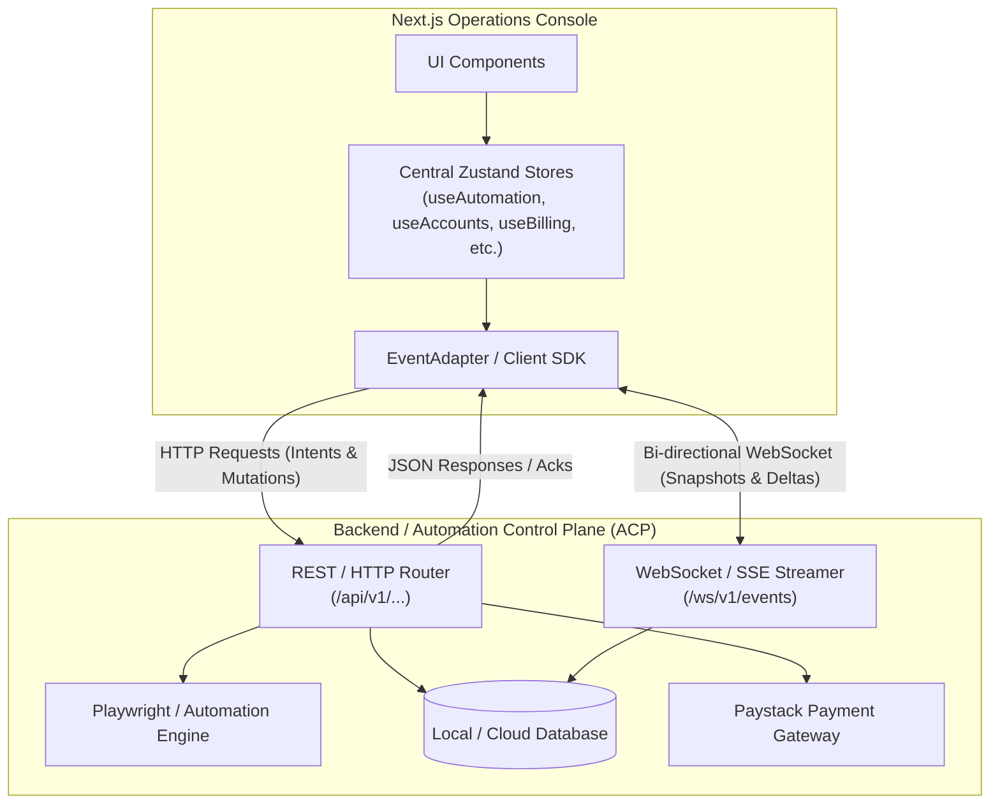

# Backend Architecture & Data Contract Specification
**System:** Betting Automation Control Plane & Cloud Backend  
**Frontend Version:** `v0.1.0-alpha`  
**Target Execution Binaries:** `v0.2.0`  
**Base Currency:** Nigerian Naira (`₦` / `NGN`)  
**Specification Date:** September 2026  

---

## 1. Executive Summary & Communication Topology

The **Betting Automation Frontend** is a state-driven, reactive Operations Console built with Next.js and Zustand. It operates in tandem with a local/remote **Automation Control Plane (ACP)** and a cloud backend server.

The client communicates through two complementary channels:
1. **REST / HTTP API**: For imperative command intents, bulk mutations, transactional checkouts, file uploads, and initial snapshot queries.
2. **Real-time Bidirectional Stream (WebSocket / SSE)**: For zero-latency telemetry pushes, engine status ticks, account runtime state deltas, active browser counts, and event logs.



---

## 2. Canonical Constants & Registries

All domain primitives must match these centralized canonical values:

### 2.1 Supported Betting Bookmakers
The backend must support and validate against the canonical platform registry (`src/constants/platforms.ts`):
* `SportyBet` (Default)
* `Bet9ja`
* `BetKing`
* `1xBet`
* `Betway`
* `Bet365`
* `Pinnacle`

### 2.2 System & Versioning
* `APP_NAME`: `"Betting Automation Suite"`
* `APP_VERSION`: `"v0.1.0-alpha"`
* `PENDING_UPDATE_VERSION`: `"v0.2.0"`

### 2.3 Currency
* `DEFAULT_CURRENCY_SYMBOL`: `"₦"`
* `DEFAULT_CURRENCY_CODE`: `"NGN"`
* All monetary values in the database and API are represented in **Major Units** (`10000` = ₦10,000) or serialized with explicit sub-unit currency conversions for payment gateways (e.g. Paystack Kobo: `10000 * 100`).

### 2.4 Billing Defaults
* `DEFAULT_PLAN_NAME`: `"Pro"`
* `DEFAULT_PLAN_PRICE`: `10000` (₦10,000 / month)
* `DEFAULT_BILLING_INTERVAL`: `"Monthly"`

---

## 3. Global Application State Machine

The client renders interface overlays based on the top-level application state (`useAppStore.ts`). The server must emit transitions matching this enum:

```typescript
export type ApplicationState = 
  | 'Uninitialized'             // Client booting, waiting for server handshake
  | 'Initializing'              // Loading user identity and core snapshots
  | 'Fatal_Startup_Error'       // Control plane failed to initialize drivers
  | 'Authentication_Required'   // User must supply credentials (/login)
  | 'Authentication_Failed'     // Invalid login credentials or expired token
  | 'Awaiting_Email_Verification' // Account created, pending confirmation
  | 'Payment_Required'          // Unsubscribed; must checkout via Paystack
  | 'Payment_Processing'        // Webhook / gateway verification in progress
  | 'Payment_Pending'           // Awaiting banking settlement
  | 'Payment_Warning'           // Subscription expiring or charge failed
  | 'Grace_Period'              // Past due but within access grace window
  | 'Authorized'                // Fully authenticated and licensed (Normal operation)
  | 'CustomerCareUnavailable'   // Support desk backend is offline
  | 'Synchronizing_Cache'       // Control plane rebuilding local index/DB
  | 'Session_Expired'           // JWT / Refresh token expired
  | 'Operational_Revoked'       // License terminated by admin
  | 'Disconnected'              // Lost connection to Control Plane server
  | 'Unknown';                  // Fallback
```

---

## 4. Domain Data Schemas & API Specifications

### 4.1 Domain 1: Automation Engine & Tactical Operations

#### 4.1.1 Data Models (`src/store/useAutomationStore.ts`)

```typescript
// 1. Engine Lifecycle
export type AutomationLifecycle = 
  | 'STOPPED' 
  | 'STARTING' 
  | 'RUNNING' 
  | 'STOPPING' 
  | 'ERROR_DEGRADED';

export type EngineStatus = 'OFFLINE' | 'READY' | 'RUNNING' | 'ERROR';

// 2. Global Automation Configuration
export interface GlobalAutomationConfiguration {
  pricing: {
    mode: 'PROFIT_TARGET' | 'FIXED';
    baseStake: number;                 // e.g. 100
    targetProfit: number;              // e.g. 30
    minimumAcceptableProfit: number;   // e.g. 0
    resolutionStrategy: 'CLAMP_THEN_REDUCE_PROFIT' | 'ABORT';
    platformIncrement: number;         // e.g. 1
    selectionPreference: 'ROUND_NUMBERS' | 'EXACT';
    restorePolicyOnRebet: boolean;
  };
  risk: {
    autoAcceptOddsChanges: boolean;
    maxStake: number;                  // e.g. 10000
    minimumStake: number;              // e.g. 10
    abortOnMarketSuspend: boolean;
  };
  rebet: {
    maxRebetAttempts: number;          // e.g. 3
    restorePolicyOnRebet: boolean;
  };
  proxy: {
    proxyFailureMode: 'strict' | 'loose';
    proxyAllocationMode: 'dedicated' | 'round_robin';
    maxAccountsPerProxy: number;       // e.g. 5
    masterUseProxy: boolean;
  };
  execution: {
    timeouts: {
      resultTimeoutMs: number;         // e.g. 30000
      navigationTimeoutMs: number;     // e.g. 10000
      loginTimeoutMs: number;          // e.g. 15000
      decisionFreshnessTTLMs: number;  // e.g. 3000
      reconciliationTimeoutMs: number; // e.g. 120000
    };
    retries: {
      maxExecutionRetries: number;     // e.g. 3
      maxRecoveryAttempts: number;     // e.g. 3
      recoveryBaseDelayMs: number;     // e.g. 2000
    };
    keyboardTypingDelayMs: number;     // e.g. 250
    maxRecordedActions: number;        // e.g. 1000
  };
  browserSpawning: {
    maxAccountsToSpawn: number;        // e.g. 2
    slaveMode: 'headless' | 'headful';
    masterUseProxy: boolean;
    debugSlowMo: number;               // e.g. 0
  };
  advancedRuntime: {
    useStealthPlugin: boolean;
    browserBinary: 'chromium' | 'chrome' | 'firefox';
    randomizeUserAgent: boolean;
    blockWebRTC: boolean;
    matchProxyTimezone: boolean;
    canvasSpoofing: boolean;
  };
}

// 3. Account Automation Snapshot (Active participant in engine)
export interface AccountAutomationSnapshot {
  id: string;                          // Foreign key to Account.id
  name: string;
  platformDisplayName: string;         // e.g. 'SportyBet'
  accountUsername: string;             // e.g. 'sporty_pro_01'
  accountStatus: 'IDLE' | 'IN_USE' | 'PROCESSING' | 'DEGRADED';
  browserStatus: 'ACTIVE' | 'STOPPED' | 'LAUNCHING' | 'CRASHED';
  betCycleEnabled: boolean;            // Participates in odds polling/placement
  pricingSource: 'GLOBAL' | 'CUSTOM';
  riskSource: 'GLOBAL' | 'CUSTOM';
  rebetSource: 'GLOBAL' | 'CUSTOM';
  customPricing?: Partial<GlobalAutomationConfiguration['pricing']>;
  customRisk?: Partial<GlobalAutomationConfiguration['risk']>;
  customRebet?: Partial<GlobalAutomationConfiguration['rebet']>;
  pendingOperation?: 'TOGGLING_BET_CYCLE' | 'DEACTIVATING' | null;
  canActivate: boolean;
  canDeactivate: boolean;
  canToggleBetCycle: boolean;
}

// 4. Automation System Telemetry
export interface AutomationSystemStatus {
  acpConnected: boolean;
  engineStatus: EngineStatus;
  backendConnected: boolean;
  activeBrowsers: number;
  totalConfiguredCapacity: number;
}

// 5. Complete Workspace Snapshot
export interface AutomationWorkspaceSnapshot {
  lifecycle: AutomationLifecycle;
  lifecycleMessage?: string;
  capabilities: {
    canStartAutomation: boolean;
    canStopAutomation: boolean;
    stopDisabledReason?: string;
    canPlaceBet: boolean;
    placeBetDisabledReason?: string;
    canCashOut: boolean;
    cashOutDisabledReason?: string;
    canValidate: boolean;
    validateDisabledReason?: string;
    canActivateAccount: boolean;
    canDeactivateAccount: boolean;
    canIncreaseBrowserCount: boolean;
    canDecreaseBrowserCount: boolean;
    canToggleBetCycle: boolean;
    canEditPricing: boolean;
    canEditRisk: boolean;
    canEditRebet: boolean;
    canEditProxy: boolean;
    canEditExecution: boolean;
  };
  globalConfig: GlobalAutomationConfiguration;
  accounts: AccountAutomationSnapshot[];
  systemStatus: AutomationSystemStatus;
  globalActionPending?: 'STARTING' | 'STOPPING' | 'PLACING_BET' | 'CASHING_OUT' | 'VALIDATING' | null;
}
```

#### 4.1.2 Automation REST Endpoints

| Method | Endpoint | Request Body | Response Body | Description |
| :--- | :--- | :--- | :--- | :--- |
| `GET` | `/api/v1/automation/snapshot` | None | `AutomationWorkspaceSnapshot` | Fetch full automation workspace state |
| `POST` | `/api/v1/automation/start` | None | `{ success: boolean, lifecycle: 'STARTING' }` | Initiates browser runners and odds loops |
| `POST` | `/api/v1/automation/stop` | None | `{ success: boolean, lifecycle: 'STOPPING' }` | Gracefully closes browsers and pauses loops |
| `POST` | `/api/v1/automation/operations/place-bet` | `{ marketId?: string, odds?: number, stake?: number }` | `{ operationId: string, status: 'QUEUED' }` | Tactical manual bet trigger |
| `POST` | `/api/v1/automation/operations/cash-out` | `{ betId?: string, threshold?: number }` | `{ operationId: string, status: 'QUEUED' }` | Immediate cash out execution |
| `POST` | `/api/v1/automation/operations/validate` | None | `{ status: 'VALID', activeCount: number }` | Validates credentials & sessions |
| `POST` | `/api/v1/automation/accounts/activate` | `{ id?: string, name: string, platformDisplayName: string, accountUsername: string }` | `{ account: AccountAutomationSnapshot }` | Activates an account into automation pool |
| `POST` | `/api/v1/automation/accounts/:id/deactivate` | None | `{ success: boolean, accountId: string }` | Shuts down browser and detaches account |
| `PATCH` | `/api/v1/automation/accounts/:id/bet-cycle` | `{ enabled: boolean }` | `{ accountId: string, betCycleEnabled: boolean }` | Toggles cycle participation without shutdown |
| `PUT` | `/api/v1/automation/accounts/:id/config` | `{ category: 'pricing'\|'risk'\|'rebet', source: 'GLOBAL'\|'CUSTOM', values: object }` | `{ success: boolean, account: AccountAutomationSnapshot }` | Applies per-account overrides |
| `PUT` | `/api/v1/automation/config/:category` | `{ values: object }` | `{ success: boolean, globalConfig: GlobalAutomationConfiguration }` | Updates global configuration category |

---

### 4.2 Domain 2: Accounts Management

#### 4.2.1 Data Models (`src/store/useAccountsStore.ts`)

```typescript
export type PresentationCategory = 'Healthy' | 'Warning' | 'Critical' | 'Neutral';

export interface AccountSnapshot {
  id: string;                          // Primary Key: 'acc-1', 'acc-2'
  name: string;                        // Display nickname
  platformDisplayName: string;         // 'SportyBet', 'Bet9ja', etc.
  accountUsername: string;             // Login username
  accountPassword?: string;            // Encrypted / masked in responses
  avatarUrl?: string;
  backendState: 'ACTIVE' | 'SUSPENDED' | 'LOCKED' | 'ARCHIVED';
  presentationCategory: PresentationCategory;
  statusDescription: string;
  warningMessage?: string;
  isSelectable: boolean;
  availableActions: ('ACTIVATE' | 'DEACTIVATE' | 'DELETE')[];
  pendingOperation: {
    type: string;
    stage: string;
    progressPercentage?: number;
  } | null;
  tags: string[];
  lastUpdated: string;                 // ISO 8601
  lastSynchronization: string;         // ISO 8601
}

export interface BulkOperationCapabilities {
  supportedOperations: ('BULK_DELETE' | 'BULK_ACTIVATE' | 'BULK_DEACTIVATE')[];
  maximumSelection: number;            // e.g. 20
  requiresConfirmation: boolean;
  canRunWhileAutomationActive: boolean;
  disabledReasons?: string[];
}

export interface SearchMetadata {
  totalCount: number;
  currentFilters: { field: string; operator: string; value: string }[];
  appliedTags: string[];
  savedSearches: string[];
  recentSearches: string[];
}

export interface AccountsViewPayload {
  viewportAccounts: AccountSnapshot[];
  bulkCapabilities: BulkOperationCapabilities;
  searchMetadata: SearchMetadata;
}
```

#### 4.2.2 Identity & Uniqueness Invariant
> [!IMPORTANT]
> Account identity is strictly defined by the **`(platformDisplayName, accountUsername)` vector** (case-insensitive). The backend database must enforce a unique composite constraint on `UNIQUE(lower(platform_display_name), lower(account_username))`.

#### 4.2.3 Accounts REST Endpoints

| Method | Endpoint | Query / Body | Response | Description |
| :--- | :--- | :--- | :--- | :--- |
| `GET` | `/api/v1/accounts` | `?offset=0&limit=50&sortBy=name&filterQuery=...` | `AccountsViewPayload` | Paginated, filtered account list |
| `POST` | `/api/v1/accounts` | `{ name?: string, platformDisplayName: string, accountUsername: string, accountPassword: string }` | `AccountSnapshot` | Register new betting account |
| `GET` | `/api/v1/accounts/:id` | None | `AccountSnapshot & { history: any[], diagnostics: any }` | Detailed account profile & audit logs |
| `POST` | `/api/v1/accounts/:id/action` | `{ type: 'ACTIVATE_ACCOUNT' \| 'DEACTIVATE_ACCOUNT' \| 'ARCHIVE_ACCOUNT' \| 'DELETE_ACCOUNT' }` | `{ success: boolean, accountId: string }` | Executes single account action |
| `POST` | `/api/v1/accounts/bulk-action` | `{ type: 'BULK_ACTIVATE' \| 'BULK_DEACTIVATE' \| 'BULK_DELETE', accountIds: string[] }` | `BulkOperationResult` | Executes bulk operational intent |

---

### 4.3 Domain 3: Billing & Paystack Recurring Checkout

#### 4.3.1 Data Models (`src/store/useBillingStore.ts`, `src/constants/billing.ts`)

```typescript
export interface PaymentMethodSnapshot {
  cardBrand: string;                   // 'Mastercard', 'Visa', 'Verve'
  last4: string;                       // '4081'
  expMonth: string;                    // '12'
  expYear: string;                     // '2028'
}

export interface InvoiceItem {
  id: string;                          // 'inv_101'
  reference: string;                   // 'PSTK-REC-89214'
  date: string;                        // ISO 8601
  amount: number;                      // 10000 (Major units ₦)
  status: 'Paid' | 'Failed' | 'Pending';
  receiptUrl?: string;
}

export interface BillingSnapshot {
  currentPlan: string;                 // 'Pro'
  price: number;                       // 10000
  currency: string;                    // '₦' (or 'NGN')
  status: 'Active' | 'Cancelled' | 'Payment_Warning' | 'Past_Due' | string;
  billingInterval: string;             // 'Monthly'
  renewalDate: string | null;          // ISO 8601
  expirationDate: string | null;       // ISO 8601
  availableActions: ('UPDATE_PAYMENT' | 'CANCEL_SUBSCRIPTION' | 'RESUME_SUBSCRIPTION' | 'CONTACT_SUPPORT')[];
  notices: string[];
  paymentMethod?: PaymentMethodSnapshot | null;
  invoices?: InvoiceItem[];
  invoiceSummary?: Record<string, any>;
}
```

#### 4.3.2 Billing REST Endpoints & Webhooks

| Method | Endpoint | Request Body | Response Body | Description |
| :--- | :--- | :--- | :--- | :--- |
| `GET` | `/api/v1/billing` | None | `BillingSnapshot` | Current subscription status & payment cards |
| `POST` | `/api/v1/billing/checkout/initialize` | `{ planName: string, email: string }` | `{ authorizationUrl: string, accessCode: string, reference: string }` | Paystack standard / inline initialization |
| `POST` | `/api/v1/billing/checkout/verify` | `{ reference: string }` | `{ status: 'Authorized', snapshot: BillingSnapshot }` | Verifies charge and unlocks workspace |
| `POST` | `/api/v1/billing/session` | None | `{ portalUrl: string }` | Initializes Paystack card update session |
| `POST` | `/api/v1/billing/subscription/cancel` | None | `{ status: 'Cancelled', expirationDate: string }` | Cancels auto-renewal at period end |
| `POST` | `/api/v1/billing/subscription/resume` | None | `{ status: 'Active', renewalDate: string }` | Restores auto-renewal |
| `POST` | `/api/v1/billing/webhook/paystack` | Paystack Webhook Payload (HMAC-SHA512) | `{ received: true }` | Handles `charge.success`, `subscription.disable`, `invoice.payment_failed` |

---

### 4.4 Domain 4: Operator Settings & Step-Up Security

#### 4.4.1 Data Models (`src/store/useSettingsStore.ts`)

```typescript
export interface ProfileSnapshot {
  name: string;
  email: string;
  pendingEmail?: string | null;
  avatarUrl?: string | null;
}

export interface SecuritySnapshot {
  accountStatus: 'ACTIVE' | 'PENDING_DELETION';
  deletionScheduledAt?: string | null;
  mfaEnabled: boolean;
  activeSessions: number;
}

export interface AutomationPreferencesSnapshot {
  defaultExecutionMode: 'auto' | 'manual';
  maxConcurrentRuns: number;
}

export interface NotificationPreferencesSnapshot {
  emailAlerts: boolean;
  pushAlerts: boolean;
  weeklyReport: boolean;
}

export interface PresentationPreferencesSnapshot {
  theme: 'light' | 'dark' | 'system';
  density: 'comfortable' | 'compact';
}

export interface SettingsSnapshot {
  profile: { status: 'AVAILABLE' | 'UNAVAILABLE'; data?: ProfileSnapshot };
  security: { status: 'AVAILABLE' | 'UNAVAILABLE'; data?: SecuritySnapshot };
  automationPreferences: { status: 'AVAILABLE' | 'UNAVAILABLE'; data?: AutomationPreferencesSnapshot };
  notifications: { status: 'AVAILABLE' | 'UNAVAILABLE'; data?: NotificationPreferencesSnapshot };
  presentationPreferences: PresentationPreferencesSnapshot;
  capabilities: {
    canChangeName: boolean;
    canChangeEmail: boolean;
    canChangePassword: boolean;
    canConfigureMFA: boolean;
    canRevokeSessions: boolean;
    canDeleteAccount: boolean;
    canCancelDeletion: boolean;
  };
}
```

#### 4.4.2 Intent & Step-Up Challenge Contract

All settings mutations use the **Intent/Acknowledgement Pattern** (`POST /api/v1/settings/intent`):

```typescript
// Request:
export interface SettingsIntentRequest {
  type: 
    | 'UPDATE_PROFILE'        // { name: string }
    | 'CHANGE_EMAIL'          // { email: string }
    | 'CANCEL_EMAIL_CHANGE'   // {}
    | 'UPDATE_PASSWORD'       // { currentPassword: string, newPassword: string }
    | 'CONFIGURE_MFA'         // { enabled: boolean }
    | 'REVOKE_SESSIONS'       // {}
    | 'DELETE_ACCOUNT'        // {} (Requires Step-Up)
    | 'CANCEL_DELETION'       // {}
    | 'UPDATE_NOTIFICATIONS'; // { emailAlerts, pushAlerts, weeklyReport }
  payload: Record<string, any>;
  stepUpSecret?: string;       // Password or TOTP token for sensitive actions
}

// Response:
export interface IntentAck<T = unknown> {
  requestId: string;
  status: 
    | 'ACCEPTED'               // Mutation executed successfully
    | 'REJECTED'               // Validation failed
    | 'REQUIRES_STEP_UP'       // Password or 2FA token required
    | 'CHALLENGE_FAILED'       // Invalid secret
    | 'CHALLENGE_EXPIRED'      // Challenge timed out
    | 'SESSION_EXPIRED'        // Re-authentication needed
    | 'TEMPORARILY_UNAVAILABLE';
  section?: 'PROFILE' | 'SECURITY' | 'AUTOMATION' | 'NOTIFICATIONS';
  data?: T;
  message?: string;
}
```

---

### 4.5 Domain 5: Notifications Hub

#### 4.5.1 Data Models (`src/store/useNotificationStore.ts`)

```typescript
export interface AppNotification {
  id: string;                          // 'notif-1725720000000'
  timestamp: string;                   // ISO 8601
  severity: 'CRITICAL' | 'WARNING' | 'INFO' | 'SUCCESS';
  category: 'AUTOMATION' | 'ACCOUNT' | 'SYSTEM' | 'SECURITY';
  title: string;
  message: string;
  read: boolean;
  metadata?: Record<string, any>;      // e.g. { marketId: '4928', accountId: 'acc-1' }
}
```

#### 4.5.2 Notifications REST Endpoints

| Method | Endpoint | Query / Body | Response | Description |
| :--- | :--- | :--- | :--- | :--- |
| `GET` | `/api/v1/notifications` | `?unreadOnly=boolean&severity=ALL\|CRITICAL\|...` | `{ notifications: AppNotification[], unreadCount: number }` | Fetches notification feed |
| `PATCH` | `/api/v1/notifications/:id/read` | None | `{ success: boolean, id: string }` | Marks single notification as read |
| `POST` | `/api/v1/notifications/mark-all-read` | None | `{ success: boolean, markedCount: number }` | Marks all notifications as read |
| `DELETE` | `/api/v1/notifications/:id` | None | `{ success: boolean, id: string }` | Deletes single notification |
| `DELETE` | `/api/v1/notifications/clear-all` | None | `{ success: boolean }` | Clears all notifications |

---

### 4.6 Domain 6: System Updates & Control Plane Lifecycle

#### 4.6.1 Data Models (`src/store/useSystemUpdateStore.ts`, `src/constants/system.ts`)

```typescript
// Structured restart request sent from frontend:
export interface SystemRestartIntent {
  type: 'SYSTEM_RESTART_AND_UPDATE';
  targetVersion: string;               // e.g. 'v0.2.0'
  requestedAt: string;                 // ISO 8601
}

export interface SystemRestartResponse {
  status: 'ACCEPTED' | 'REJECTED';
  message: string;                     // "Control Plane accepted restart request for v0.2.0."
}
```

#### 4.6.2 System Lifecycle Endpoints

| Method | Endpoint | Request Body | Response Body | Description |
| :--- | :--- | :--- | :--- | :--- |
| `GET` | `/api/v1/system/version` | None | `{ currentVersion: 'v0.1.0-alpha', hasUpdateDownloaded: boolean, availableVersion: 'v0.2.0' }` | Queries update status |
| `POST` | `/api/v1/system/restart-and-update` | `SystemRestartIntent` | `SystemRestartResponse` | Dispatches structured reboot signal to Control Plane |

---

### 4.7 Domain 7: Customer Care & System Diagnostics

#### 4.7.1 Data Models (`src/store/useCustomerCareStore.ts`)

```typescript
export interface ContactMethodMetadata {
  id: string;
  title: string;                       // 'Support Ticket', 'Live Chat'
  description: string;
  actionType: 'INTERNAL_ROUTE' | 'EXTERNAL_LINK';
  actionTarget: string;                // '/workspace/support/tickets/new' or URL
  available: boolean;
}

export interface CustomerCareSnapshot {
  openTicketCount: number;
  contactMethods: ContactMethodMetadata[];
  documentationState: { cached: boolean; sections?: any[] };
  documentationLastSync: string | null;
  systemHealthSummary: 'Healthy' | 'Degraded' | 'Offline';
}
```

#### 4.7.2 Customer Care REST Endpoints

| Method | Endpoint | Request Body | Response Body | Description |
| :--- | :--- | :--- | :--- | :--- |
| `GET` | `/api/v1/support/snapshot` | None | `CustomerCareSnapshot` | Support status, contact channels, docs sync |
| `POST` | `/api/v1/support/tickets` | `{ subject: string, message: string, category: string, fileIds?: string[] }` | `{ ticketId: string, status: 'OPEN' }` | Creates a new support ticket |
| `POST` | `/api/v1/support/attachments` | `multipart/form-data` | `{ fileId: string, fileName: string, sizeBytes: number }` | Attaches diagnostic screenshots/logs |
| `POST` | `/api/v1/support/diagnostics` | `{ telemetry: object, recentLogs: string[] }` | `{ reportId: string, status: 'RECEIVED' }` | Submits secure system diagnostic report |

---

## 5. Real-Time Streaming Specification (WebSocket / SSE)

### 5.1 Connection Endpoint
`ws://localhost:8000/ws/v1/events` (or `WSS://` in production).

### 5.2 Streaming Envelope
All messages transmitted across the socket follow a strict envelope:

```typescript
export interface WebSocketMessage<T = any> {
  topic: 
    | 'app:state'
    | 'automation:snapshot'
    | 'automation:delta'
    | 'accounts:view'
    | 'accounts:delta'
    | 'billing:snapshot'
    | 'settings:snapshot'
    | 'notifications:new'
    | 'system:update_ready';
  timestamp: string;                   // ISO 8601
  payload: T;
}
```

### 5.3 Delta Message Types (Real-Time Granular Updates)

#### Automation Delta (`automation:delta`):
```typescript
export type AutomationDelta = 
  | { type: 'ACCOUNT_UPDATED'; accountId: string; partialSnapshot: Partial<AccountAutomationSnapshot> }
  | { type: 'ACCOUNT_ACTIVATED'; account: AccountAutomationSnapshot }
  | { type: 'ACCOUNT_DEACTIVATED'; accountId: string }
  | { type: 'LIFECYCLE_CHANGED'; lifecycle: AutomationLifecycle; message?: string }
  | { type: 'STATUS_UPDATED'; systemStatus: Partial<AutomationSystemStatus> };
```

#### Accounts Delta (`accounts:delta`):
```typescript
export type AccountDelta = 
  | { type: 'ACCOUNT_UPDATED'; accountId: string; partialSnapshot: Partial<AccountSnapshot> }
  | { type: 'ACCOUNT_CREATED'; partialSnapshot: AccountSnapshot }
  | { type: 'ACCOUNT_DELETED'; accountId: string }
  | { type: 'ACCOUNT_STATUS_CHANGED'; accountId: string; backendState: string; presentationCategory: PresentationCategory }
  | { type: 'ACTION_FAILED'; accountId?: string; errorReason: string }
  | { type: 'BULK_OPERATION_RESULT'; result: { operation: string; successful: number; failed: number; errors: { id: string; reason: string }[] } };
```

#### Notifications Delta (`notifications:new`):
Payload is `AppNotification`. The frontend appends it to `useNotificationStore` and increments the unread badge in real time.

---

## 6. Recommended Relational Database Schema (PostgreSQL / SQLite)

```sql
-- 1. Operator Accounts & Authentication
CREATE TABLE operators (
    id UUID PRIMARY KEY DEFAULT gen_random_uuid(),
    name VARCHAR(255) NOT NULL,
    email VARCHAR(255) UNIQUE NOT NULL,
    pending_email VARCHAR(255),
    password_hash VARCHAR(255) NOT NULL,
    mfa_enabled BOOLEAN DEFAULT FALSE,
    mfa_secret VARCHAR(255),
    account_status VARCHAR(50) DEFAULT 'ACTIVE', -- 'ACTIVE', 'PENDING_DELETION'
    deletion_scheduled_at TIMESTAMP WITH TIME ZONE,
    created_at TIMESTAMP WITH TIME ZONE DEFAULT NOW(),
    updated_at TIMESTAMP WITH TIME ZONE DEFAULT NOW()
);

-- 2. Betting Accounts (Unique Vector: Platform + Username)
CREATE TABLE betting_accounts (
    id UUID PRIMARY KEY DEFAULT gen_random_uuid(),
    operator_id UUID NOT NULL REFERENCES operators(id) ON DELETE CASCADE,
    name VARCHAR(255) NOT NULL,
    platform_display_name VARCHAR(100) NOT NULL, -- 'SportyBet', 'Bet9ja', etc.
    account_username VARCHAR(255) NOT NULL,
    account_password_encrypted TEXT NOT NULL,
    backend_state VARCHAR(50) DEFAULT 'ACTIVE',  -- 'ACTIVE', 'SUSPENDED', 'LOCKED', 'ARCHIVED'
    presentation_category VARCHAR(50) DEFAULT 'Healthy',
    status_description TEXT DEFAULT 'Operating normally',
    warning_message TEXT,
    tags JSONB DEFAULT '[]',
    last_synchronization TIMESTAMP WITH TIME ZONE DEFAULT NOW(),
    created_at TIMESTAMP WITH TIME ZONE DEFAULT NOW(),
    updated_at TIMESTAMP WITH TIME ZONE DEFAULT NOW(),
    CONSTRAINT uq_platform_username UNIQUE (platform_display_name, account_username)
);

-- 3. Automation Participations & Custom Overrides
CREATE TABLE automation_account_configs (
    account_id UUID PRIMARY KEY REFERENCES betting_accounts(id) ON DELETE CASCADE,
    bet_cycle_enabled BOOLEAN DEFAULT TRUE,
    pricing_source VARCHAR(20) DEFAULT 'GLOBAL', -- 'GLOBAL', 'CUSTOM'
    risk_source VARCHAR(20) DEFAULT 'GLOBAL',
    rebet_source VARCHAR(20) DEFAULT 'GLOBAL',
    custom_pricing JSONB,
    custom_risk JSONB,
    custom_rebet JSONB,
    updated_at TIMESTAMP WITH TIME ZONE DEFAULT NOW()
);

-- 4. Global Automation Configuration
CREATE TABLE global_automation_configs (
    id VARCHAR(50) PRIMARY KEY DEFAULT 'primary',
    pricing JSONB NOT NULL,
    risk JSONB NOT NULL,
    rebet JSONB NOT NULL,
    proxy JSONB NOT NULL,
    execution JSONB NOT NULL,
    browser_spawning JSONB NOT NULL,
    advanced_runtime JSONB NOT NULL,
    updated_at TIMESTAMP WITH TIME ZONE DEFAULT NOW()
);

-- 5. Subscriptions & Invoices (Paystack)
CREATE TABLE subscriptions (
    id UUID PRIMARY KEY DEFAULT gen_random_uuid(),
    operator_id UUID NOT NULL REFERENCES operators(id) ON DELETE CASCADE,
    plan_name VARCHAR(100) DEFAULT 'Pro',
    amount NUMERIC(12, 2) DEFAULT 10000.00,
    currency VARCHAR(10) DEFAULT 'NGN',
    status VARCHAR(50) DEFAULT 'Active',         -- 'Active', 'Cancelled', 'Past_Due'
    billing_interval VARCHAR(50) DEFAULT 'Monthly',
    renewal_date TIMESTAMP WITH TIME ZONE,
    expiration_date TIMESTAMP WITH TIME ZONE,
    paystack_customer_code VARCHAR(255),
    paystack_subscription_code VARCHAR(255),
    card_brand VARCHAR(50),
    card_last4 VARCHAR(4),
    card_exp_month VARCHAR(2),
    card_exp_year VARCHAR(4),
    created_at TIMESTAMP WITH TIME ZONE DEFAULT NOW(),
    updated_at TIMESTAMP WITH TIME ZONE DEFAULT NOW()
);

CREATE TABLE invoices (
    id VARCHAR(100) PRIMARY KEY,                 -- 'inv_101'
    operator_id UUID NOT NULL REFERENCES operators(id) ON DELETE CASCADE,
    reference VARCHAR(255) UNIQUE NOT NULL,      -- 'PSTK-REC-89214'
    amount NUMERIC(12, 2) NOT NULL,
    currency VARCHAR(10) DEFAULT 'NGN',
    status VARCHAR(50) NOT NULL,                 -- 'Paid', 'Failed', 'Pending'
    paid_at TIMESTAMP WITH TIME ZONE,
    receipt_url TEXT,
    created_at TIMESTAMP WITH TIME ZONE DEFAULT NOW()
);

-- 6. Notifications Feed
CREATE TABLE notifications (
    id VARCHAR(100) PRIMARY KEY,
    operator_id UUID NOT NULL REFERENCES operators(id) ON DELETE CASCADE,
    severity VARCHAR(50) NOT NULL,               -- 'CRITICAL', 'WARNING', 'INFO', 'SUCCESS'
    category VARCHAR(50) NOT NULL,               -- 'AUTOMATION', 'ACCOUNT', 'SYSTEM', 'SECURITY'
    title VARCHAR(255) NOT NULL,
    message TEXT NOT NULL,
    is_read BOOLEAN DEFAULT FALSE,
    metadata JSONB,
    created_at TIMESTAMP WITH TIME ZONE DEFAULT NOW()
);
```

---

## 7. Implementation Checklist for Backend Engineers

1. [ ] **Implement Database Migrations**: Create tables with composite unique index on `(lower(platform_display_name), lower(account_username))`.
2. [ ] **Configure Paystack Webhook**: Listen on `POST /api/v1/billing/webhook/paystack` with signature verification (`x-paystack-signature`).
3. [ ] **Implement REST Intent Handlers**:
   * Automation start/stop & tactical bet/cashout controls.
   * Settings step-up challenge verification for password/email/account deletion.
   * System update restart intent dispatcher (`handleSystemRestartRequest`).
4. [ ] **Implement WebSocket Stream**:
   * Broadcast `app:state`, `automation:delta`, and `accounts:delta` upon state changes.
   * Send full initial snapshot upon client connection.
5. [ ] **Integrate Browser Drivers**:
   * Wire account runners to Playwright/Chromium instances with proxy allocation.
   * Report live `activeBrowsers` and browser status ticks.
