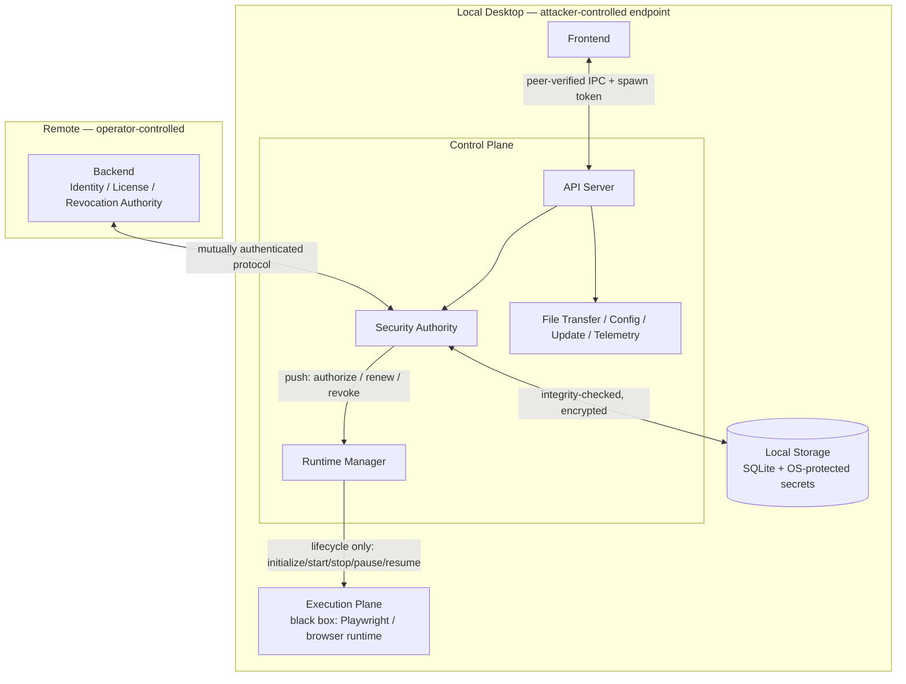
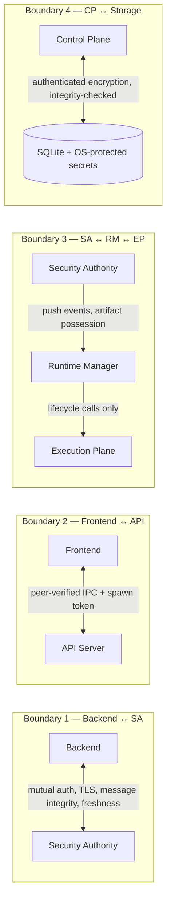
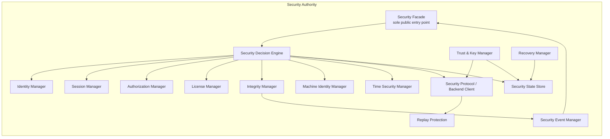
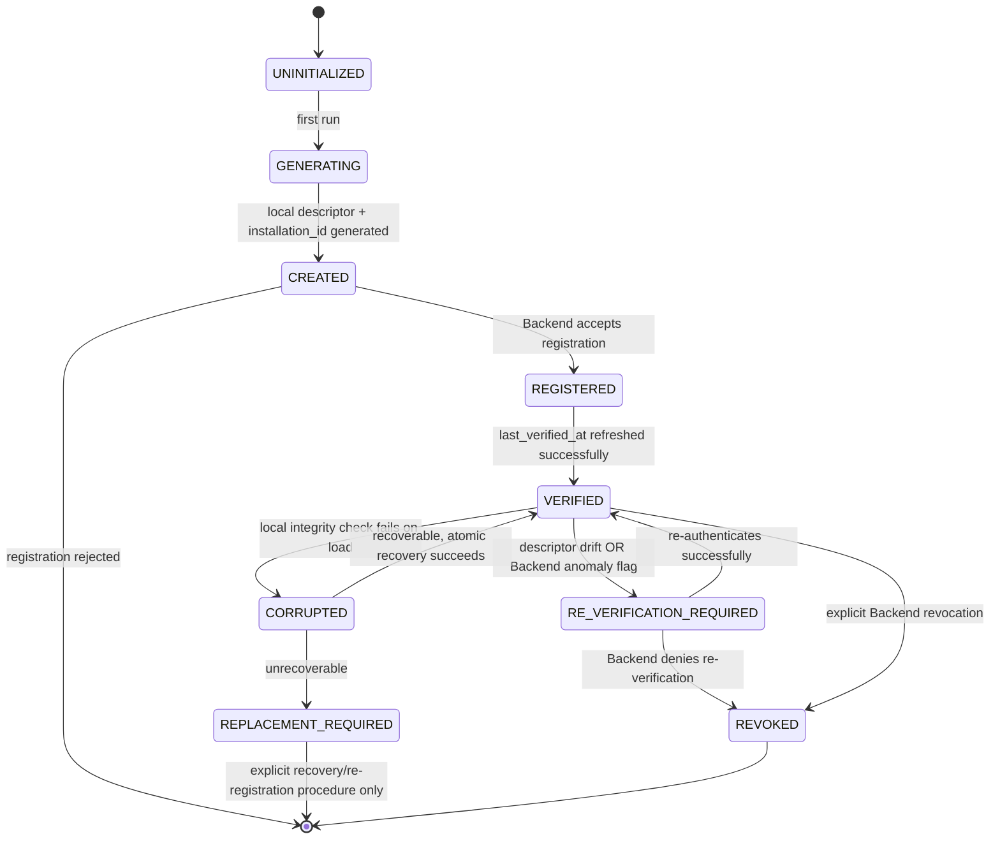
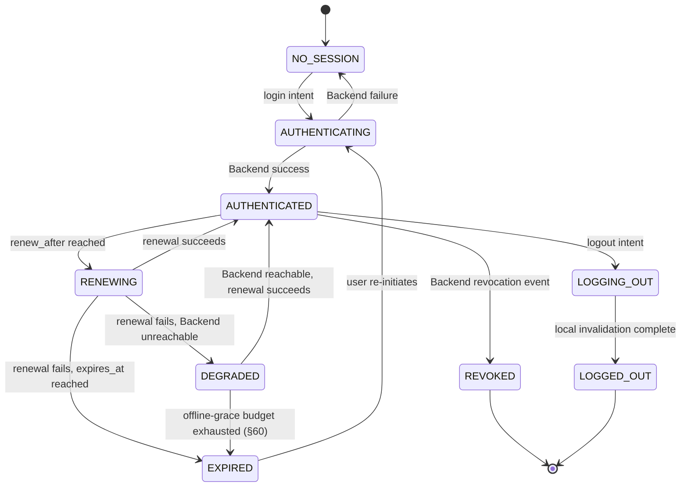
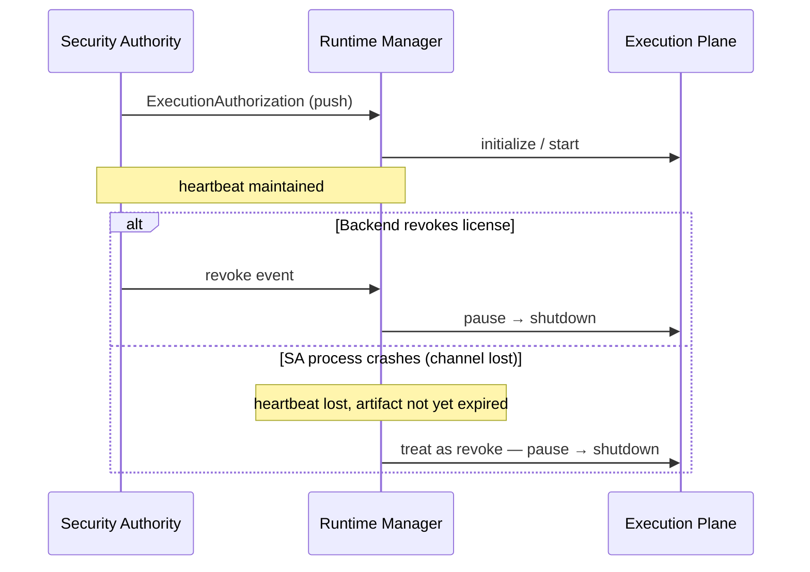
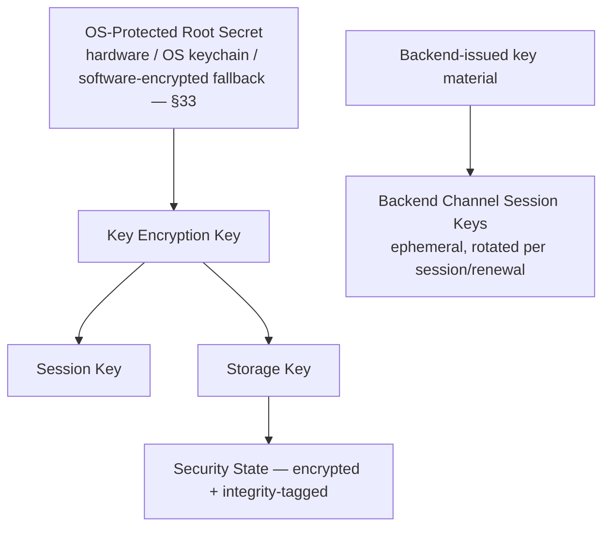

# Control Plane Security Authority
# Canonical Security Architecture & System Specification

## 1. Document Status

This is the authoritative source of truth for the Security Authority subsystem of the Control Plane. It supersedes all 18 original individual Security Authority documents, which are retained as historical/design artifacts. It also supersedes the first-pass `unified-spec.md` produced before this document, which is retained as a historical intermediate artifact. `01-hostile-security-review.md` is the security audit record behind this specification; `02-architectural-reconstruction.md` is the architectural decision record. This document does not summarize either — it incorporates their conclusions directly, in corrected form, alongside the full technical depth of the 18 source documents.

An engineer who has never read the original 18 documents should be able to read only this document and understand the entire Security Authority: what it is, why it exists, what it trusts, what it doesn't, what authority it has, how state changes, how failures behave, how recovery and concurrency and persistence work, how attacks are detected and handled, and what guarantees do and do not exist.

## 2. Purpose

The Security Authority is the subsystem of the Control Plane responsible for establishing, maintaining, evaluating, and terminating the security state under which the local application is permitted to operate. It answers one question, continuously, for every operation the Control Plane might perform:

> **Given the current identity, machine, session, authorization, licensing, integrity, connectivity, and security conditions, is this operation currently permitted?**

It is not an authentication microservice bolted onto the application. It is the local security authority and security-state coordinator for the entire Control Plane — the single place security decisions are made, so that no other subsystem has to reconstruct policy from scratch.

## 3. Scope

**In scope:** identity (machine and user), authentication, session management, authorization, licensing/entitlement, the capability model, cryptographic architecture and key lifecycle, protocol architecture between Control Plane and Backend, local persistence and its integrity, tamper detection and response, the complete security state machine, the Runtime Manager's contract with the Security Authority, the Frontend/local-API trust boundary, and failure/recovery/concurrency behavior for all of the above.

**Out of scope:** Execution Plane internals (browser automation, synchronization, locator resolution, scheduling), Frontend UI/UX, Backend internal implementation (only its protocol contract with the Control Plane is specified), and business/pricing logic — plan names and pricing tiers never appear as security-relevant identifiers; only capabilities and entitlement states do.

## 4. System Context



Everything inside the "Local Desktop" boundary — including the Control Plane's own process — runs on a machine the primary adversary (§9) fully controls. The Backend is the only unconditionally authoritative component. The Security Authority is the single reconciliation point between local reality and Backend authority; nothing downstream of it (Runtime Manager, Execution Plane, Frontend, other Control Plane subsystems) is trusted to perform that reconciliation itself.

## 5. Architectural Principles

1. **Authenticate identity, establish trust, determine authority, then permit operation** — never collapsed into one boolean. `AuthenticationResult.status = AUTHENTICATED` never implies `authorization = AUTHORIZED`; these are evaluated and represented separately throughout.
2. **The endpoint is hostile.** Every local control raises cost; none is a guarantee against the primary adversary. Where a guarantee is impossible, §70 says so explicitly.
3. **The Backend is authoritative for remote state; the Security Authority is authoritative for local enforcement of that state, and only that state.**
4. **Fail closed.** Unknown security state defaults to `DENIED`, never to `AUTHORIZED` (`Security_Authority_API_Interface_Contract.md` §3.2, retained verbatim as a first principle). The one bounded exception — offline continuation of an already-granted capability — is explicit, scoped, and time-boxed (§60), never implicit.
5. **The Security Authority owns security decisions; no external subsystem may infer `authenticated`/`licenseValid`/`sessionValid`/`machineTrusted` from unrelated state** (Internal Design §3.1, retained verbatim).
6. **The Execution Plane is a capability consumer, not a decision-maker.** It receives an opaque `ExecutionAuthorization` artifact; it never learns why it was issued.
7. **The Frontend expresses intent, not authorization.** It may request `login`, `logout`, `runtime start`, `runtime stop`, `configuration changes`, `file transfer`, `status information` — it cannot declare `authenticated = true`.
8. **No custom cryptography.** Established, audited primitives only; this document specifies required properties, not invented algorithms.
9. **Detection is not prevention, and resistance is not immunity** (retained from the tamper-detection document, strengthened per Reconstruction §9 — this statement lives directly next to the tamper state machine in §50, not only here).
10. **Subsystems are black boxes to each other where the boundary is real, except for cross-cutting infrastructure**, which is deliberately shared through a thin, authority-free Platform layer (§81) rather than duplicated per subsystem — the one addition this specification makes to the otherwise-unanimous architectural style of the 18 source documents (see Hostile Review HR-24).
11. **Callers receive decisions, not mechanisms** (`API_Interface_Contract.md` §3.4) — a caller receives `AUTHORIZED`/`DENIED`/`REAUTHENTICATION_REQUIRED`/`DEGRADED`, never "RSA key X was used" or "database row Q contained the license."
12. **The internal implementation is stably replaceable** — Node.js, Rust, and WebAssembly components may be swapped without changing the public Security Authority contract (§81).

## 6. Security Objectives

O1. Casual local tampering (editing a config value, modifying a database row) must not grant unauthorized access.
O2. Isolated binary patching of a single check must not silently and permanently defeat enforcement everywhere it matters — server-confirmed paths exist for sensitive operations (§26).
O3. Captured or replayed local/network messages must not manufacture authorization (§39).
O4. A restored snapshot, cloned VM, or copied installation must not restore previously-revoked authorization (§48–49).
O5. The Execution Plane must never run without a currently-valid `ExecutionAuthorization` artifact, and must treat loss of contact with the Security Authority as revocation, not as continued permission (§30, Reconstruction §4).
O6. Every security-relevant state transition is attributable, auditable, and traceable to a Backend decision where entitlement is concerned (§77).
O7. The system degrades predictably and fails closed under every failure mode enumerated in §55–58.
O8. Authentication never implies authorization; authorization never implies licensing; licensing never implies application integrity; application integrity never implies tamper prevention; machine identity never implies user identity; cryptographic integrity never implies authorization (§68, Security Invariants — these distinctions are load-bearing throughout, not decorative).

## 7. Threat Model

### 7.1 Primary Adversary

A person with full control of the desktop machine, intentionally attempting to bypass subscription/licensing enforcement. Assume this person can, per the source threat model (`Security_Architecture_Threat_Model_State_Model.md`) verbatim: inspect and reverse-engineer binaries; attach debuggers; inspect process memory; modify, replace, or copy any local file including the database and configuration; clone or snapshot the machine/VM; manipulate the system clock; start, stop, and duplicate the Control Plane process; call the local API directly; create malicious local clients; replay captured local or network messages; observe local communications where technically possible; attempt to bypass the Backend entirely; force permanent offline operation; forge local authorization/license/machine-identity state; replace cryptographic material; downgrade protocols; roll back application state; prevent or interfere with updates; patch security checks and tamper-detection logic itself; exploit crash recovery, degraded/offline mode, and concurrency/race conditions.

### 7.2 Secondary Adversary

A network attacker attempting to intercept, modify, or impersonate Backend communication. Standard TLS-based posture applies (§39.1) and is not the novel contribution of this document.

### 7.3 Explicitly Not Assumed

The attacker does **not** control the Backend. The Backend is the remote authority for account, authentication, authorization, and licensing state (source threat model, verbatim).

### 7.4 Explicitly Out of Scope

Physical attacks below the OS (cold-boot RAM extraction, hardware implants), Backend compromise itself, and build-toolchain/supply-chain compromise — real risks, belonging to different security programs.

### 7.5 The Actual Objective

Not "prevent reverse engineering" — explicitly disclaimed as unrealistic by the source documents and by this one. The objective: make unauthorized modification and subscription bypass substantially harder and more expensive, specifically ensuring (source objectives list, retained and organized):

- authentication cannot be trivially bypassed
- authorization and licensing cannot be trivially forged
- local state cannot trivially manufacture authorization
- captured messages cannot be replayed to gain authorization
- stale responses cannot restore obsolete authorization
- rollback cannot silently restore old security state
- machine identity cannot trivially be copied (§48, corrected per Reconstruction §2)
- local IPC cannot trivially be abused (§29, corrected per Reconstruction §3)
- frontend input cannot grant authority
- Execution Plane activity cannot imply authorization on its own
- security failures cannot accidentally become authorization grants
- recovery mechanisms cannot silently bypass security controls

## 8. Protected Assets

| Asset | Why it matters | Primary protection |
|---|---|---|
| Session credentials | Impersonation of an authenticated user | OS-protected storage where available, short lifetime, machine-bound (§34) |
| Machine identity (`installation_id`, `machine_id`, `key_reference`) | Basis for licensing enforcement | Two-layer design (§18), key_reference resolved through OS-protected tier (§34) |
| Cryptographic keys | Confidentiality/integrity of everything else | Tiered storage (§33–34), never logged (§76) |
| Authorization/capability state | Directly gates paid functionality | Cache only (§21), Backend-confirmed, generation-protected against rollback (§27, §48) |
| License/entitlement data | Business-critical | Backend-authoritative, locally cached with explicit staleness rules (§22, §60) |
| Security event/audit log | Forensics, anomaly-detection input | Append-oriented, optionally hash-chained (§77) |
| Execution authorization artifacts | Gate on Execution Plane activity | Short-lived, scoped, non-forgeable, non-reusable outside context (§30) |

## 9. Attacker Capabilities

Restated from §7.1 as a checklist for implementers and testers (this list doubles as the seed set for §89's security test suite): inspect binaries; reverse engineer; debug; inspect memory; modify/replace/copy files; copy installations; clone VMs; snapshot/restore filesystem; manipulate clock; terminate/start/duplicate processes; invoke local APIs; interact with Frontend and IPC; create malicious local clients; replay messages; observe local traffic; bypass Backend; force offline operation; forge local state; replace crypto material; downgrade protocols; roll back state; interfere with updates; patch security and tamper-detection checks; exploit crash recovery, degraded mode, and concurrency.

## 10. Trust Model

Trust is multi-dimensional, never a single boolean, matching the `SecurityContext` structure defined in `API_Interface_Contract.md` §6: `Machine Identity, Authentication State, Session State, License State, Authorization State, Integrity State, Tamper State, Backend Trust State, Time State, Protocol State`. A user can simultaneously be `machine: TRUSTED, authentication: AUTHENTICATED, license: EXPIRED` — the system represents and acts on exactly that combination, never collapsing it to one flag.

### Trust Domains (`Internal_Design.md` §7, retained)

| Domain | Members | Posture |
|---|---|---|
| A — Backend | Remote service | Authoritative, but must itself authenticate to the client (§39.2) |
| B — Control Plane enforcement | Security Authority, Runtime Manager | Locally authoritative for enforcement only, never for remote facts |
| C — Local environment | Frontend, filesystem, OS, other local processes, Execution Plane | Potentially compromised at all times |

## 11. Trust Boundaries



| Boundary | Trusted party | Untrusted party | Auth | Confidentiality | Integrity | Freshness | Replay protection | Failure semantics |
|---|---|---|---|---|---|---|---|---|
| Backend ↔ SA | Backend, after verification | Network attacker | Mutual (server cert + client credential) | TLS | Message-level MAC/signature | Generation counters (§27, §48) | Nonce-bound responses (§39) | Fail closed → `BACKEND_UNAVAILABLE` → offline policy (§60) |
| Frontend ↔ API | Neither by default | Frontend, other local processes | Peer credentials + spawn token (§29) | Local (loopback) | Token-authenticated requests | Per-request token | Single-use spawn token | Reject → `IPC_UNTRUSTED` event |
| SA ↔ RM ↔ EP | SA | Execution Plane | In-process, artifact possession | N/A (in-process) | SA-pushed, RM holds no independent authority | `ExecutionAuthorization.security_epoch`-bound (§30) | Execution Plane cannot self-renew | Loss of channel → treated as revoke, not as continued authorization (Reconstruction §4) |
| Control Plane ↔ Storage | Neither — OS/filesystem is attacker-reachable | Local attacker with file access | N/A | Authenticated encryption envelope (§43–44) | AEAD tag over payload + associated data (§44) | Generation counters (§48) | Compare-and-swap via SQLite transactions (§46) | Corruption → recovery hierarchy (§57) |

Frontend, Local API, and IPC boundaries are treated together under Boundary 2 because they are, architecturally, one boundary crossed by one caller — the Frontend — and the redesign in §29 addresses all three by name.

---

## 12. Security Authority

The Security Authority is the security-critical subsystem of the Control Plane. It is not merely an authentication service — it is the local security authority and security-state coordinator, establishing the boundary between untrusted/partially-trusted inputs and the authorized, operating Control Plane:

```text
Untrusted / partially trusted inputs
              │
              ▼
       Security Authority
              │
              ▼
     Authorized Control Plane
              │
              ▼
       Runtime Manager → Execution Plane
```

It does not own business logic, browser automation, synchronization, Playwright, or the reason an operation is being performed. It determines only whether an operation is security-permitted.

## 13. Security Authority Responsibilities

**Owns (§5.1–5.8 of Internal Design, retained):** authentication state and the authenticated principal; machine identity creation, persistence, verification, binding, and clone-detection *signals* (detection itself is Backend-side, §18); session establishment, lifetime, renewal, invalidation, generation tracking; authorization evaluation and freshness enforcement; the local representation of licensing (never the licensing authority itself); integrity monitoring (binary, configuration, security-state, installation, update); cryptographic trust coordination (identities, key material, signatures, rotation, certificate validation); secure persistence of all of the above.

**Never owns (§6, retained in full):** browser management (launch/close/context/page/locator/Playwright), synchronization (event/DOM sync, scheduling, replay, action simulation), file transfer (chunking, assembly, retries), Frontend presentation (UI state, layout, notifications), business persistence (application records unrelated to security), or Backend authority itself.

## 14. Security Authority Internal Architecture



This mirrors `Security_Authority_Architecture_Internal_Design.md` §11 exactly, retained because the full read-through confirmed it is architecturally sound: these are logical components, not necessarily separate processes, and every arrow into the Decision Engine is an input; only the Decision Engine (via the Security State Store) mutates authoritative state.

## 15. Component Responsibilities

| Component | Responsibility | Must never do |
|---|---|---|
| Security Facade | Sole public entry point; validates requests; coordinates internal components | Expose internal components (`SessionManager`, `LicenseManager`, `IntegrityManager`) directly to external callers |
| Security Decision Engine | Evaluates identity + session + authorization + license + machine + integrity + time + protocol + security state together, produces `ALLOW / DENY / REAUTHENTICATE / REAUTHORIZE / RENEW / BLOCK / DEGRADED` | Check a single variable in isolation and call it a decision |
| Identity Manager | Authentication state: `UNKNOWN, AUTHENTICATING, AUTHENTICATED, INVALID, REVOKED` | Determine licensing or authorization |
| Machine Identity Manager | Identity creation/persistence/validation/corruption handling/replacement; clone-detection *signal generation* | Declare a machine trusted purely on local evidence (§18) |
| Session Manager | Creation, activation, renewal, expiry, invalidation, logout, generation tracking, stale-response rejection | Assume "session exists locally" implies "session is valid remotely" |
| Authorization Manager | Whether the authenticated principal is authorized; permission sets; freshness; revocation processing | Manufacture authorization from cached state alone (except within the bounded offline policy, §60) |
| License Manager | Local representation of entitlement; expiration, renewal, downgrade, upgrade, revocation, grace periods | Manufacture licenses — the Backend remains authoritative |
| Integrity Manager | Binary, config, security-state, installation, update integrity; rollback detection; tamper classification, producing `VERIFIED / SUSPECTED / FAILED / COMPROMISED / UNKNOWN` | Silently repair corruption or treat absence of a signal as `VERIFIED` |
| Trust & Key Manager | Local identity keys, Backend trust anchors, session keys, encryption/signing/verification keys, certificate metadata, key generations | Expose private key material to JS/Node code unnecessarily; candidate for native/Rust implementation (§81) |
| Security State Store | Persistence for local security state (SQLite-backed) | Be treated as, or become, an authority in its own right (§43) |
| Security Protocol / Backend Client | Message construction/validation for the Backend channel | Apply a response without passing the freshness/replay checks (§39) |
| Recovery Manager | Crash/corruption/rollback recovery paths | Delete-and-regenerate as a default recovery action (§57) |
| Security Event Manager | Publishes security-state events/audit trail | Treat an emitted event as itself an authorization mechanism (§75, Invariant) |

## 16. Dependency Rules

- The Security Authority may depend on its own internal components and, through the Trust & Key Manager, on native/Rust cryptographic primitives.
- Nothing outside the Security Authority depends on its internals — only on the Security Facade (§71–74).
- The Security Authority never depends on the Runtime Manager or Execution Plane (dependency direction is one-way: SA → RM → EP).
- The Security Authority never depends on the Frontend.
- Other Control Plane subsystems (File Transfer, Runtime Manager, API Server, Configuration, Update Manager, Telemetry) must not independently implement authentication, licensing, session validation, or trust decisions (`API_Interface_Contract.md` §2, retained verbatim) — they consume Security Authority decisions exclusively.

## 17. Authority Model

| Fact | Who decides | Who merely observes/caches |
|---|---|---|
| Account identity, account status | Backend | Security Authority (Identity Manager) |
| Machine registration, duplication policy | Backend (§18) | Security Authority (Machine Identity Manager — generates signals, doesn't decide) |
| Authorization, entitlement, revocation | Backend | Security Authority (Authorization/License Managers cache and enforce locally) |
| Whether a *specific local operation* is currently permitted | Security Authority (Decision Engine) | — this is the one fact the Security Authority itself decides, by combining Backend-sourced facts with local integrity/tamper/time state |
| Application/binary/config integrity | Security Authority (Integrity Manager) | — genuinely local; the Backend has no visibility into this without the Security Authority reporting it |
| Whether the Execution Plane may currently act | Security Authority, expressed via `ExecutionAuthorization` | Runtime Manager (translates only, §30) |

## 18. Machine Identity

### 18.1 Schema (retained from `Local_Security_Storage_Schem_Persistence_Model.md` §8.2, semantics corrected per Reconstruction §2)

```text
MachineIdentity
    machine_id            — Backend-assigned, exists only after registration
    installation_id       — generated locally at first run; load-bearing (§2 fix)
    identity_version
    status                — UNINITIALIZED | GENERATING | CREATED | REGISTERED |
                             VERIFIED | CORRUPTED | REPLACEMENT_REQUIRED |
                             RE_VERIFICATION_REQUIRED | REVOKED
    created_at
    last_registered_at
    last_verified_at
    key_reference          — MUST resolve into OS-protected storage tier (§34)
    backend_binding_id
    generation              (machine_generation, §27)
    created_by_version
    updated_at
```

### 18.2 Two-Layer Model

**Layer 1 (`installation_id` + local descriptor):** generated locally, advisory only. It is never treated by the local client as proof of anything — its role is to give the Backend a value to correlate across registration attempts.

**Layer 2 (`machine_id`):** assigned only by the Backend, only in response to a registration request tied to an authenticated account. Every downstream authorization decision uses this identifier, never Layer 1 alone.

### 18.3 Lifecycle



**Invariant (retained verbatim, `local_security_storage_architecture.md` §20–21):** the database must never silently convert `CORRUPTED` into `VERIFIED`, and machine identity replacement must always require an explicit recovery/re-registration procedure — never triggered merely because `machine_id` is missing or storage failed to load.

### 18.4 Duplication / Cloning

Copied installations and cloned VMs are **not** detected by the local client declaring itself un-cloned. Per Reconstruction §2: the Backend observes `installation_id`/`machine_id` correlation across registration and re-verification attempts over time and applies policy (flag, require re-verification, revoke). The local client's only responsibility is honest reporting and participation in the `RE_VERIFICATION_REQUIRED` flow. This directly resolves Hostile Review HR-01: the schema was always shaped correctly (separate `machine_id`/`installation_id` fields existed from the start); what was missing was stating plainly that the *decision* lives at the Backend, not in `key_reference` alone.

## 19. User Identity

User identity is distinct from machine identity and from license identity — three separate concepts that must never be conflated (`Internal_Design.md` §15, retained verbatim: "It must distinguish application installation identity from user identity and from license identity. These are separate concepts."). The `principal_id` returned by authentication (§20) is an opaque identifier deliberately scoped to avoid exposing unnecessary Backend account structure to the rest of the Control Plane.

## 20. Authentication

Authentication establishes identity only — it answers "who is this," not "what may they do" (§21) and not "is this machine trusted" (§18, evaluated in parallel, never substituted). 

```text
AuthenticationRequest { username, password, client_context, protocol_version }
   (additional challenge data per Backend protocol as needed)

AuthenticationResult {
    status: AUTHENTICATED,
    principal_id: <opaque>,
    session_reference: <opaque>,
    authorization_state: ...
}
```

Identity Manager states: `UNKNOWN, AUTHENTICATING, AUTHENTICATED, INVALID, REVOKED`. Successful authentication does not imply authorization — `Authentication = SUCCESS, Authorization = DENIED` is an entirely valid, expected combination (`Internal_Design.md` §14, retained verbatim), representable throughout this specification's state model (§64).

Partial authentication (credentials accepted, machine registration or entitlement lookup still pending) is a distinct, representable condition — never coerced into a premature fully-authenticated state. The specific wire protocol (password/OAuth/OIDC/passkey) is a Backend-contract decision outside this document's scope; the requirement placed on the Security Authority is that it treat the outcome as one of `success | failure | partial | unknown` and never assume `unknown → success`.

---

## 21. Authorization

Authorization answers "what is this principal allowed to do," and is a **cache of a Backend-issued grant**, never an independent authority (`Local_Security_Storage_Schem_Persistence_Model.md` §22, retained verbatim — this is one of the single most important sentences carried forward from the source documents):

```text
Backend → Authorization Grant → Security Authority → Local Authorization State
```

never:

```text
Local Database → "User is authorized" (forever)
```

```text
AuthorizationRecord
    authorization_id
    session_id
    user_id
    machine_id
    status
    issued_at
    effective_at
    expires_at
    revision              (authorization_revision, §27)
    backend_revision
    license_id
    capability_set         — see §23, canonical CAP_* enum
    policy_version
    last_verified_at
```

`authorize(request)` evaluates `principal, operation, resource, execution_context` against `authentication + session + license + machine trust + integrity + tamper state + policy + current generation state` together (`API_Interface_Contract.md` §14, retained). This is a genuine multi-factor evaluation, not a single flag check.

## 22. Licensing

Entitlement ≠ authorization ≠ license, three distinct concepts:

- **Entitlement** — the Backend's record of what an account is permitted to purchase-derived access to.
- **License** — the Backend's currently-active grant of that entitlement; can lapse, pause, renew.
- **Authorization (§21)** — what the Security Authority actually hands to the Runtime Manager right now, computed from entitlement + license + session + machine trust together.

```text
LicenseRecord
    license_id
    account_id
    machine_binding
    plan_id
    status                 — UNKNOWN | VALID | EXPIRING | EXPIRED | REVOKED | SUSPENDED | INVALID
    issued_at
    effective_at
    expires_at
    revoked_at
    revision                (license_revision, §27)
    capabilities
    limits
    backend_revision
    last_verified_at
```

A license upgrade or downgrade is itself a new authorization state (`Local_Security_Storage_Schem_Persistence_Model.md` §24–25, retained): the Security Authority must not assume an upgrade exists merely because the user completed payment locally — the Backend must issue the authoritative update, and the new capability set must take effect according to the Backend's authorization revision, so that an old, locally-cached capability set cannot continue granting access after a downgrade or revocation.

**Causal linkage (Reconstruction §10):** a `license_revision` change must co-occur, in the same transaction, with a corresponding `authorization_revision` change. Observing one advanced without the other is not classified as either valid or corrupted state — it is `SECURITY_STATE_UNCERTAIN` (§64), forcing reconciliation (§59) before any further transition.

## 23. Capability Model

The preferred authorization model is capability-oriented, not policy-internals-exposing (`API_Interface_Contract.md` §15, retained: "This prevents callers from reconstructing security policy themselves"). Canonical enum, per Reconstruction §12 (resolving three conflicting namings found across the source documents):

```text
CAP_AUTOMATION_START
CAP_AUTOMATION_STOP
CAP_BROWSER_ALLOCATE
CAP_FILE_UPLOAD
CAP_FILE_DOWNLOAD
CAP_CONFIG_MODIFY
CAP_UPDATE_INSTALL
```

A caller asks `authorize(CAP_AUTOMATION_START)`, never reconstructs the answer itself from `isUserLicensed() && isAuthenticated() && isMachineValid()`. `AuthorizationRecord.capability_set` (§21) is expressed in exactly this vocabulary; the Execution Plane's `ExecutionAuthorization.constraints` (§30) uses the same vocabulary — one shape, one seam, resolving the schema/contract mismatch a naive implementation would otherwise invent.

## 24. Session Architecture

```text
SessionRecord
    session_id
    status                — NO_SESSION | AUTHENTICATING | AUTHENTICATED | RENEWING |
                             DEGRADED | EXPIRED | REVOKED | LOGGING_OUT | LOGGED_OUT | INVALID
    issued_at
    expires_at
    renew_after
    last_renewed_at
    last_verified_at
    authentication_method
    authorization_snapshot_id
    server_key_version
    session_protocol_version
    created_at
    updated_at
```

`issued_at`, `renew_after`, and `expires_at` are three distinct concepts (`Local_Security_Storage_Schem_Persistence_Model.md` §19, retained with its own example): `issued_at = 10:00, renew_after = 10:40, expires_at = 11:00` — at 10:40 the Security Authority attempts renewal; at 11:00 the session is expired unless renewal succeeded. The database must reject impossible combinations (its own example: `status = EXPIRED` with `expires_at` in the future is invalid and must not be representable).

**Session state is a strict input to overall security state, never a same-named parallel state** (Reconstruction §13, resolving Hostile Review HR-13): session-level `DEGRADED`/`REVOKED` feed the Security Decision Engine (§14) alongside license/machine/integrity state; they are not themselves the whole-system `DEGRADED`/`REVOKED` states defined in §64.

Session secrets, where they must be persisted, prefer OS-protected storage over a plaintext SQLite column, and the fewer components with access to a session secret, the better (`Local_Security_Storage_Schem_Persistence_Model.md` §18, retained).

## 25. Session Lifecycle



**Renewal concurrency:** all renewal triggers (proactive timer at `renew_after`, reactive renewal triggered by an authorization failure mid-request) coalesce through a single per-session renewal mutex — a trigger arriving while a renewal is in flight awaits the existing attempt's result rather than starting a second one ("only one authoritative renewal transition should exist at a time," `API_Interface_Contract.md` §13, retained verbatim).

**Logout sequence** (`API_Interface_Contract.md` §11, retained): `logout → invalidate session → invalidate authorization → invalidate execution authorization → notify Runtime Manager → Execution Plane authorization revoked`. Whether currently-running operations are allowed to finish or must terminate is governed by §55–58 (Failure and Recovery), specifically the active-operation policy table in §61.

## 26. Backend Trust Model

The Backend is authoritative for identity, machine registration/revocation, license/entitlement state, and server-side authorization policy. It is never authoritative for Execution Plane internals, local UI, or local process internals — it communicates authority; the Control Plane applies it locally.

A successful network connection does not imply Backend trust (`API_Interface_Contract.md` §27, retained verbatim). Trust requires, together: TLS, certificate validation, protocol validation, server identity, message integrity, freshness, and session state — not connectivity alone.

The Backend, symmetrically, must treat every Control Plane instance as a potentially compromised client — it does not extend implicit trust to well-formed-looking requests. Its own anomaly detection (§70.2) is the actual backstop when local enforcement is defeated by a sophisticated attacker.

**Backend-side mass-revocation circuit breaker (Reconstruction §14):** the Security Authority treats every individual Backend revocation as authoritative and acts immediately (§58, §61) — this is not weakened. The circuit breaker is a Backend-operations control: the Backend rate-limits and flags for human review any revocation/downgrade batch exceeding a configured anomaly threshold before it fans out to clients, protecting against a Backend-side bug or bad deploy issuing mass anomalous revocations. Named here because the Security Authority's own correct "always trust an individual revocation" behavior is precisely what makes such a Backend-side bug dangerous without this safety net.

---

## 27. Frontend Security Boundary

The Frontend is a client, not a security authority (`Internal_Design.md` §8, retained verbatim). It may request `login, logout, runtime start, runtime stop, configuration changes, file transfer, status information` — it cannot declare `authenticated = true, authorized = true, license = valid`. The Security Authority determines those values regardless of what the Frontend's request claims.

The Frontend never receives raw credentials beyond what its own display requires, never receives Backend tokens beyond display purposes, and never receives cryptographic key material. It receives a **summarized security state snapshot** (§74) through the Control Plane API — never direct storage access (§45).

## 28. Local API Security

The local HTTP/WebSocket API is an untrusted boundary (`API_Interface_Contract.md` §30, retained). The API Server translates external requests into internal intents; it never decides whether an operation is allowed:

```text
Frontend
   │  POST /runtime/start
   ▼
API Server
   │
   ▼
SecurityAuthority.authorize(CAP_AUTOMATION_START)
   │
   ├── DENIED
   └── AUTHORIZED ──▶ RuntimeManager
```

The following must never be trusted merely because an API client supplied them (`API_Interface_Contract.md` §32, retained verbatim): `user_id, license_id, machine_id, authorization, role, subscription_level, session_state`. They must originate from authoritative Security Authority state, never from caller-supplied metadata.

The following setters must never exist in the public API, under any name (`API_Interface_Contract.md` §46, retained verbatim — this is one of the most important negative-space requirements in the entire specification): `setAuthenticated(), setAuthorized(), setLicense(), setMachineTrusted(), setIntegrityValid(), setSessionValid(), setTamperClear(), grantExecution()`. Security state changes only through legitimate state transitions (§64–66), never through a caller-invoked setter.

## 29. IPC Security

**Resolves Hostile Review HR-02.** The trust-domain table (§11, §71) distinguishes Frontend from arbitrary local processes by name; this section defines the mechanism that actually tells them apart, which no source document specified:

1. **Transport-level peer verification.** Unix domain socket peer credentials (`SO_PEERCRED`) or Windows named-pipe client-process inspection, confirming the connecting process is the specific, code-signed Frontend executable the Control Plane itself spawned — verified by executable path and signature, not by a claimed process name.
2. **Per-session spawn-time capability token.** Issued to the Frontend process at spawn, delivered via inherited file descriptor or a child-process-scoped environment variable — not a location any unrelated local process can trivially read — and required as a bearer credential on every local API call.

Failure of either check produces `IPC_UNTRUSTED` (a state name already present in the Tamper-Aware State Machine document's vocabulary, now given a defined trigger), routed through the tamper-response pipeline (§51) exactly as any other integrity signal — no separate state machine required.

## 30. Execution Plane Authorization

The Runtime Manager must not translate user authentication directly into execution permission (`API_Interface_Contract.md` §23, retained verbatim):

```text
RuntimeManager → SecurityAuthority → ExecutionAuthorization
```

`authorizeExecution()` returns an opaque artifact:

```text
ExecutionAuthorization
    authorization_id
    scope
    security_epoch          — bound to the generation state at issuance (§27)
    issued_at
    expires_at
    constraints              — expressed in CAP_* vocabulary (§23)
    integrity_proof
```

The artifact is scoped, short-lived where appropriate, bound to the intended runtime, bound to the generation state, cryptographically authenticated, non-forgeable, and non-reusable outside its intended context (`API_Interface_Contract.md` §24, retained verbatim in full).

**Revocation** (§25, retained): session expiry, license revocation, tamper detection, machine trust loss, logout, or Backend revocation all invalidate execution authorization. The Runtime Manager receives the resulting decision and determines the appropriate Execution Plane action — the Security Authority does not know how the Execution Plane stops or recovers browsers; that knowledge belongs entirely to the Runtime Manager/Execution Plane boundary, which is out of this document's scope.

**Control-channel loss (Reconstruction §4, resolving Hostile Review HR-03):** the one gap the source documents left open. The Runtime Manager treats loss of its event channel to the Security Authority — crash, IPC failure, Security Authority restart — as equivalent to a revoke for any capability not already safely completable, **regardless of whether the held artifact's own `expires_at` has passed**. "No revoke received" and "channel unavailable" are not the same thing as "still authorized." The Runtime Manager health-checks its connection on an interval; loss of heartbeat triggers the same restrictive path as an explicit revoke.



## 31. Cryptographic Architecture

No custom cryptography, at any point — established, audited libraries and standard constructions only. This document specifies required *properties*; algorithm selection is an implementation decision made once and versioned (§79).

| Use case | Required properties |
|---|---|
| Backend channel | Confidentiality, integrity, server authentication (mutual for the client side), replay resistance, forward secrecy — standard modern TLS provides all of these; no bespoke session protocol is needed |
| Local storage envelope | Confidentiality **and** integrity together — encryption alone is explicitly insufficient (§43) |
| Local IPC spawn token | Unforgeability, single-use or short-lived |
| Generation counters (§27) | Authenticity via the storage envelope's integrity protection, not bare unauthenticated integers |
| Execution authorization artifact | Non-forgeability, scope-binding, non-reusability outside context |

**Distinctions the architecture depends on being kept separate at every layer** (retained from the source documents' explicit list, and enforced structurally throughout this specification rather than only asserted once): confidentiality, integrity, authenticity, authentication, authorization, freshness, replay resistance, key agreement, signatures, MACs, encryption, secure storage. Encryption provides confidentiality; it does not by itself provide authenticity or tamper detection (§43.2) — a protected record requires authenticated encryption, not `AES(ciphertext)` alone (`Local_Security_Storage_Schem_Persistence_Model.md` §36, retained verbatim).

## 32. Key Hierarchy



Different purposes use different keys — `K_storage, K_session, K_machine, K_transport` are never the same raw key reused everywhere (`local_security_storage_architecture.md` §36, retained verbatim); this limits the blast radius of any single key's compromise. The OS-protected root secret is never used directly for bulk operations — it wraps (encrypts) the working keys below it, so working-key rotation doesn't require re-deriving trust from the root each time.

## 33. Key Lifecycle

```text
GENERATED → ACTIVE → ROTATION_PENDING → ROTATED → RETIRED → DESTROYED
```

A retired key may remain temporarily available for decrypting previously-persisted data — "retired does not necessarily mean immediately deleted" (`Local_Security_Storage_Schem_Persistence_Model.md` §13, retained verbatim). Rotation is versioned explicitly:

```text
key_id = K001, version = 1, status = RETIRED
key_id = K002, version = 2, status = ACTIVE
```

Encrypted records carry enough metadata (as associated data, §44) to determine which key version protects them, so rotation never silently corrupts already-persisted state.

**Key loss:** if the key required to decrypt security state is permanently lost, the state may be unrecoverable — the system must not silently generate a replacement key and treat old ciphertext as valid. It transitions to a recovery state (§57) requiring reauthentication/re-registration, never a silent substitution.

**Compromise response:** a believed-compromised key is immediately marked `KEY_COMPROMISED` (a distinct status from `ROTATED`), all data it protected is scheduled for re-encryption under a newly generated key, and — because local key compromise implies the local environment itself may be compromised — the Integrity Manager raises its tamper classification (§51) rather than treating key compromise as pure cryptographic housekeeping.

## 34. Secure Key Storage

`key_storage_tier ∈ { hardware, os_keychain, software_encrypted }` (Reconstruction §6, resolving Hostile Review HR-05). Selected at first key generation by probing platform capability in preference order (TPM/Secure-Enclave-backed API → OS keychain → software-encrypted-at-rest fallback). Stored as an explicit field on the Security State Record (§46), surfaced in audit/telemetry (§76), and used as a risk-based policy input (shorter session/renewal windows and a reduced offline-grace budget on `software_encrypted` are reasonable defaults — exact values are tunable, §95). It never blocks functionality — a machine without hardware-backed storage still works, at an explicitly lower, visible trust tier rather than a silently-assumed-equivalent one.

`MachineIdentity.key_reference` (§18.1) resolves through this tier — connecting the identity-binding fix (§18) and the key-storage-tiering fix (§34) into one consistent design rather than two independent patches, as flagged in Reconstruction §2's closing note.

Sensitive material should not be stored as a bare `secret.bin` with only application-managed encryption where OS facilities exist (`local_security_storage_architecture.md` §7, retained). The principle: *the filesystem stores ciphertext; the operating system protects the key required to use the ciphertext.* Not everything needs this level of protection — transfer progress, UI preferences, cache indexes, non-sensitive telemetry, and ordinary configuration do not belong in OS-protected storage (§9 of the same document, retained) — the goal is security *classification*, not indiscriminate encryption.

---

## 35. Protocol Architecture

Transport is standard TLS (current supported version per platform policy) for the Backend channel — not a bespoke protocol. Certificate/trust-anchor validation uses either the OS trust store or application-pinned anchors (§95, open deployment decision). The client verifies Backend identity before trusting any response — "encryption without server authentication does not solve the man-in-the-middle problem" (retained principle from the Backend trust model document).

Message types, retained from `security_authority_protocol_specification.md`'s protocol vocabulary:

```text
AUTH_INIT → AUTH_CHALLENGE → AUTH_RESPONSE → AUTH_RESULT
MACHINE_REGISTER → MACHINE_REGISTER_RESULT
SESSION_ESTABLISH → SESSION_ESTABLISH_RESULT
SESSION_RENEW → SESSION_RENEW_RESULT
LICENSE_REQUEST → LICENSE_RESULT
SECURITY_STATE_REQUEST → SECURITY_STATE_RESULT
AUTHORIZATION_REQUEST → AUTHORIZATION_RESULT
REVOCATION_NOTICE                (Backend-initiated, unsolicited)
START_RUNTIME / STOP_RUNTIME     (Runtime Manager ↔ Execution Plane, out of protocol scope for SA↔Backend)
```

## 36. Message Model

Every security-state-mutating request/response pair carries a client-generated nonce, the client's current generation state (§27), and a protocol version; the response echoes the nonce and the generation it was computed against:

```json
{
  "protocol_version": 4,
  "nonce": "client-generated, single-use",
  "generation": { "session": 41, "authorization": 17, "license": 9, "machine": 3 },
  "payload": { "...": "..." },
  "signature_or_mac": "..."
}
```

## 37. Request Lifecycle

`CREATED → SENT → RESPONSE_PENDING → COMMITTED | RETRY_PENDING | FAILED` (`Local_Security_Storage_Schem_Persistence_Model.md` §29, retained as `PendingTransaction.state`). A crash while `RESPONSE_PENDING` must not be resolved by guessing — see §56 (Reconciliation) for the required `UNKNOWN → RECONCILIATION → confirmed success | confirmed failure | expired/invalid` procedure.

## 38. Response Lifecycle

A response is applied to local state **if and only if** it echoes a nonce the Security Authority itself generated for an outstanding request, **and** every generation counter it reports is `>= ` the corresponding current local generation (§27, §39). A response failing either check is discarded, not merely logged — discarding, not erroring loudly to the caller, is deliberate: a response that fails this check may be an attacker's replay attempt, and the correct behavior is silent rejection plus a `SecurityEvent` (§77), not a caller-visible error that would help an attacker calibrate their attempt.

## 39. Replay Protection

**Resolves the "replayed requests/responses" edge case explicitly and by name.** The rule stated once, referenced everywhere else in this document that discusses "stale" or "replayed" (§38, §48, §66): a response is accepted if and only if (a) its nonce matches an outstanding Security-Authority-generated request not yet resolved, and (b) every generation field it carries is `>=` the current corresponding local generation. Requests themselves carry non-predictable (not merely sequential) nonces so a captured request cannot be replayed to produce a second effect against the Backend.

### 39.1 TLS / Transport-Level Replay

Standard TLS session properties prevent low-level record replay; this section governs *application-level* message replay, which TLS alone does not address (a captured, still-validly-encrypted application message replayed within the same TLS session, or against a new one, is exactly what the nonce+generation rule above catches).

### 39.2 Server Authentication

Restated from §26: a successful TLS handshake proves the server presented a certificate chaining to a trusted anchor; it does not by itself prove the server is the legitimate Backend for *this* application unless certificate/trust-anchor validation (§35) is also performed.

## 40. Freshness

Freshness is enforced by the same generation-counter mechanism as replay protection (§27, §39) — this specification does not introduce a separate freshness concept, because the source documents' own best insight (the "why generations matter" section) is that generation counters solve freshness, replay, delayed responses, concurrent requests, and stale callbacks with one mechanism, not five (`Local_Security_Storage_Schem_Persistence_Model.md` §27, retained verbatim: "This protects against: replay, delayed responses, concurrent requests, stale callbacks, race conditions").

## 41. Protocol Versioning

`protocol_version` is checked together with generation-state compatibility in one handshake (§42), not independently.

## 42. Protocol Downgrade Protection

```text
handshake_result = check(protocol_version, generation_state)

protocol_version < minimum_accepted        → PROTOCOL_INCOMPATIBLE  (update required)
generation_state below minimum accepted    → REAUTHENTICATION_REQUIRED / RECONCILIATION_REQUIRED
otherwise                                   → proceed
```

Both axes are checked together so they cannot silently drift out of sync with each other — a client that passes the protocol-version check but is behind on generation state (e.g., a restored snapshot, §49) is caught by the same handshake, not a separately-coded, potentially-inconsistent path. An attacker attempting to force acceptance of an old, since-deprecated protocol version by claiming a stale `protocol_version` is rejected outright by the `minimum_accepted` floor — the Backend never negotiates below its stated floor regardless of what the client claims to support.

---

## 43. Local Security Storage

**Core principle, retained verbatim as the single most load-bearing sentence in this section:** *local persistence preserves security state; it does not create security authority* (`Local_Security_Storage_Schem_Persistence_Model.md` §1). SQLite is the persistence mechanism; the Security Authority is the authority:

```text
SQLite ≠ Authority
```

An attacker who modifies `security.db` must not automatically gain the ability to declare `authorized = true` (`local_security_storage_architecture.md` §11, retained). Local storage is a security-state cache and continuity mechanism, never an independent licensing authority.

### 43.1 Storage Classification (retained, `Local_Security_Storage_Schem_Persistence_Model.md` §6)

| Classification | Example | Encryption | Integrity | Lifetime |
|---|---|---|---|---|
| Public metadata | schema version | Optional | Yes | Permanent |
| Security metadata | key ID | Optional | Yes | Long-lived |
| Sensitive metadata | session identifiers | Yes | Yes | Temporary |
| Secret | refresh credential | Yes | Yes | Temporary |
| Cryptographic key | private key | Prefer OS store | Yes | Long-lived |
| Authorization state | license grant | Yes | Yes | Renewable |
| Audit/security event | transition record | Optional/Yes | Yes | Configurable |
| Ephemeral state | challenge nonce | Usually not persisted | Yes | Very short |

### 43.2 Encryption vs. Integrity — Kept Structurally Separate

Encryption provides confidentiality. Integrity protection provides authenticity + tamper detection. A protected record therefore uses authenticated encryption (ciphertext + authentication tag over plaintext + associated data), never `AES(ciphertext)` alone. Integrity matters *more* than secrecy for some fields — the source documents' own example, retained: an attacker doesn't need to *read* `license_valid = false`; they need to *change* it to `true`. Authorization state therefore requires strong integrity protection specifically, independent of whether it also needs confidentiality.

## 44. Persistence Model — Storage Envelope

```text
StorageEnvelope
    format_version
    record_type
    record_id
    key_id
    algorithm
    nonce
    ciphertext
    authentication_tag
    created_at
    updated_at
```

**Associated data** — `record_type, record_id, schema_version` — is authenticated without being encrypted, specifically so an attacker cannot take an `encrypted_session_record` blob and relabel it as an `encrypted_license_record` (or move a still-valid old record's ciphertext into a different logical slot) and have it pass verification (`Local_Security_Storage_Schem_Persistence_Model.md` §38, retained with its own example). This is the mechanism that prevents field/record substitution across the entire storage layer, not merely within one record.

## 45. Database Schema

Retained principal entities (`Local_Security_Storage_Schem_Persistence_Model.md` §7), not required to map one-to-one onto physical tables:

```text
MachineIdentity         (§18)
InstallationIdentity
KeyRecord                (§33)
ServerTrustRecord
SessionRecord             (§24)
AuthorizationRecord       (§21)
LicenseRecord             (§22)
SecurityStateRecord       (§46)
PendingTransaction        (§37)
SecurityEvent             (§77)
StorageMetadata
RollbackGuard
```

**Storage access is exclusively through the Security Authority** (`Local_Security_Storage_Schem_Persistence_Model.md` §67, retained): Runtime Manager, License display logic, the API Server, and Authentication-adjacent code never touch SQLite directly —

```text
BAD:  RuntimeManager → SQLite ; LicenseManager → SQLite ; API Server → SQLite
GOOD: Security Authority → Security Storage → SQLite
```

The Security Authority owns transactions as a unit, not as independent calls per field:

```text
BAD:  storage.getSession(); storage.saveSession(); storage.saveLicense()   (independently, per one logical transition)
GOOD: Security Authority → one Security Storage Transaction { session, authorization, license, security state }
```

### Conceptual Storage Interface (retained, `Local_Security_Storage_Schem_Persistence_Model.md` §68)

```ts
interface SecurityStorage {
  initialize(): Promise<void>;
  getMachineIdentity(): Promise<MachineIdentity | null>;
  saveMachineIdentity(identity: MachineIdentity): Promise<void>;
  getSession(): Promise<SessionRecord | null>;
  commitSession(session: SessionRecord): Promise<void>;
  invalidateSession(reason: string): Promise<void>;
  getAuthorization(): Promise<AuthorizationRecord | null>;
  commitAuthorization(authorization: AuthorizationRecord): Promise<void>;
  getLicense(): Promise<LicenseRecord | null>;
  commitLicense(license: LicenseRecord): Promise<void>;
  recordSecurityEvent(event: SecurityEvent): Promise<void>;
  verifyIntegrity(): Promise<IntegrityResult>;
  recover(): Promise<RecoveryResult>;
  close(): Promise<void>;
}
```

## 46. Atomicity

Security state transitions must be atomic — session renewal must never persist `{new token, old expiration}` or `{new expiration, old token}` as a valid combination:

```text
BEGIN IMMEDIATE;
UPDATE sessions ...
UPDATE authorization ...
UPDATE security_state ...
COMMIT;   -- or ROLLBACK on any failure; no partial commit is ever exposed
```

`SecurityStateRecord`, the compact representation of current authority state:

```text
SecurityState
    state_version
    security_state
    session_generation
    authorization_revision
    license_revision
    machine_generation
    server_trust_version
    last_transition
    last_transition_at
    updated_at
```

## 47. Crash Consistency

SQLite WAL mode is a durability mechanism, not a security mechanism (`Local_Security_Storage_Schem_Persistence_Model.md` §33, retained verbatim) — it does not prevent database tampering, file replacement, rollback, or malicious local processes; integrity protection (§44) must exist above it. The dangerous direction, explicitly forbidden: `UNAUTHORIZED → partially written → AUTHORIZED`. The safe recovery direction: `uncertain → revalidate` (`local_security_storage_architecture.md` §43, retained verbatim). A crash mid-transaction must never be resolved toward the more privileged state.

Disk-full (`ENOSPC`) and other write failures must not be resolved by declaring in-memory success — the sequence is always `modify → persist → verify commit → publish state`, never `modify memory → tell everybody success → attempt persistence` (§45 of the storage-architecture document, retained verbatim).

## 48. Rollback Protection

A monotonic generation counter, Backend-confirmed (§27), detects a restored snapshot, cloned VM, or copied installation presenting an *old* generation state on next Backend contact. If `current epoch = 50` and a restored database contains `epoch = 41`, this must be classified `SECURITY_STATE_ROLLBACK`, not normal initialization (`local_security_storage_architecture.md` §29, retained verbatim). Encryption does not inherently prevent rollback — an attacker can copy `valid.db` from yesterday over today's file, and the cryptographic contents still decrypt correctly (`Local_Security_Storage_Schem_Persistence_Model.md` §39, retained verbatim) — freshness requires generation counters, monotonic counters, or Backend revisions specifically, not just encryption.

**Local rollback vs. legitimate data loss:** if `current backend-known revision = 42` but `stored local revision = 37`, the Security Authority must not assume attack immediately — the local database could legitimately have lost recent state (e.g., a disk failure that lost the last few writes). It enters reconciliation (§56) rather than outright rejection:

```text
LOCAL STATE REGRESSED → BACKEND RECONCILIATION → restore current state | security failure
```

## 49. Snapshot and Clone Handling

Filesystem snapshots create the canonical rollback scenario, worked through explicitly in the source documents: license valid on Day 1, revoked on Day 2, filesystem restored to Day-1 state on Day 3 — the local system might incorrectly believe the license is still valid unless the Backend remains the authoritative check on next contact (`Local_Security_Storage_Schem_Persistence_Model.md` §42, retained). This is precisely why authorization is a cache (§21), never treated as sufficient on its own indefinitely — the offline-grace policy (§60) exists specifically to bound how long a restored/stale snapshot's cached state can be trusted before Backend reconciliation is mandatory.

VM cloning and copied installations are addressed structurally at §18.4 — Backend-side correlation of `installation_id`/`machine_id`/registration behavior over time, not local self-certification.

---

## 50. Tamper Detection

The Integrity Manager (§15) monitors, per the retained component breakdown from `Internal_Design.md` §19: Binary Verification, Configuration Verification, State Verification, Manifest Verification, Rollback Detection, Installation Verification, and Tamper Classification — producing signals `VERIFIED | SUSPECTED | FAILED | COMPROMISED | UNKNOWN`.

### Verification Levels

| Level | When | What's checked |
|---|---|---|
| Installation | Install/update time | Signed installer/package integrity |
| Startup | Every launch | Executable/library signatures, storage envelope integrity (§44), generation sanity (§27) |
| Runtime | Continuous/periodic | Process integrity signals where the platform allows, IPC peer verification (§29), state-machine invariant checks |
| Update | Update application | `UPDATE_PREPARE → UPDATE_VERIFY → UPDATE_COMMIT → UPDATE_COMPLETE` (§53) |

### Tamper Classification

| Category | Examples | Default response |
|---|---|---|
| Critical | Executable/library signature mismatch, storage envelope MAC failure, generation counter higher than the Backend ever issued (a forged-generation attack, not legitimate progress) | Immediate: block new authorization, force reauthentication, escalate degradation level (§52) |
| Significant | `IPC_UNTRUSTED` (§29), `CLOCK_ANOMALY` (§54), unexpected state transition, `CLONE_SUSPECTED` | Degrade, require revalidation, do not immediately terminate safe-to-complete operations |
| Non-critical | Non-security configuration drift | Log, no state-machine impact |

## 51. Application Integrity

Integrity verification covers executable components, signed resources, security configuration, native modules, cryptographic metadata, and security storage (`API_Interface_Contract.md` §19, retained). The interface must not expose which exact file, checksum, or internal detector triggered a failure to ordinary callers — `TAMPER_DETECTED` is sufficient for most consumers; privileged diagnostic tooling may receive more detail under controlled conditions (§19–20, retained). This is deliberate: exposing detection mechanics teaches an attacker exactly what to patch around.

**Non-guarantee, stated here directly adjacent to the mechanism it qualifies (resolving Hostile Review HR-08 — this exact placement is the fix):** an attacker who can patch the executable can, in principle, patch the function that reports these findings just as they could patch `authorize() → true`. Tamper detection raises the cost of unsophisticated and automated bypass and produces evidence for Backend-side anomaly detection (§26); it is not, and structurally cannot be, a guarantee against a sufficiently capable local attacker acting alone. This is why sensitive decisions retain a server-confirmed path (§26) rather than resting on local detection alone. See §70 for the complete, consolidated non-guarantee list.

## 52. Tamper Response

Degradation levels, unifying the state vocabulary harvested across all 18 source documents into one ordered scale:

| Level | Name | Meaning |
|---|---|---|
| 0 | NORMAL | No security concern |
| 1 | OFFLINE_GRACE | Backend unreachable, within budget (§60) |
| 2 | REAUTHENTICATION_REQUIRED | Session/generation stale or grace exhausted |
| 3 | INTEGRITY_DEGRADED | Significant tamper signal(s) observed |
| 4 | TAMPER_SUSPECTED | Critical signal or multiple correlated significant signals |
| 5 | COMPROMISED | Confirmed critical finding; local enforcement no longer trusted for this session |

Possible response outcomes at the mechanism level, retained from the source vocabulary: `WARN, DEGRADED, REAUTHENTICATE, REPAIR, REVOKE_LOCAL_STATE, REQUIRE_REREGISTRATION, TERMINATE_SECURITY_SESSION`.

**Monotonicity:** response is monotonic with respect to trust — recovery only moves the level *down* through explicit, Backend-confirmed reauthentication, never automatically and never based on the same untrusted local state that raised the level in the first place (a Category-Critical event must not be "recovered from" by a local-only check, since that check runs in the same potentially-compromised environment).

Detection does not necessarily mean immediate termination — the Security Authority classifies severity first (`local_security_storage_architecture.md` §49, retained).

## 53. Update Security

```text
UPDATE_PREPARE → UPDATE_VERIFY → UPDATE_COMMIT → UPDATE_COMPLETE
```

A signed update package is verified before atomic replacement. A migration or update that cannot complete atomically leaves the pre-update schema and data intact and forces a Backend round-trip to confirm state before proceeding, rather than continuing with partially-migrated security state (§80, Migration). Update interruption, malicious updates, and downgrade attacks are addressed by the same version/generation handshake used elsewhere (§42) — an update cannot silently downgrade the security posture below the Backend's stated minimum-accepted protocol version.

## 54. Clock Security

The Security Authority never blindly trusts the system clock for security decisions (`API_Interface_Contract.md` §38, retained). Clock anomalies include rollback, forward jump, sleep/wake, manual adjustment, and NTP correction.

- **Clock rollback** (e.g., `last_observed_time = 10:00` then `system_time = 08:00`) is treated as suspicious, never as "two more hours of validity" (`local_security_storage_architecture.md` §26, retained with its own example).
- **Clock jump forward** could incorrectly make a session appear expired; the Security Authority distinguishes real expiration from clock anomaly where possible, rather than accepting either interpretation blindly.
- **Monotonic time** is used for durations — timeouts, retry delays, renewal timers, heartbeat intervals. **Wall-clock time** is used for absolute expiry, Backend time comparison, and human-readable events (`Local_Security_Storage_Schem_Persistence_Model.md` §62, retained). Where the protocol provides trusted server-time information, the Security Authority maintains a bounded estimate: `{ server_time, clock_offset, measurement_time, uncertainty }` (§25 of the storage-architecture document, retained), which assists expiration, replay prevention, and anomaly detection together.
- **Sleep/hibernation:** on wake, the Security Authority re-evaluates security state, expiration, network, and Backend connectivity — it never blindly continues previous timers (`Local_Security_Storage_Schem_Persistence_Model.md` §63, retained).
- **Offline-grace budget specifically** (resolving Hostile Review HR-04, the one place clock handling and persistence intersect in a way the source documents left genuinely incomplete): the accumulated-offline-duration value itself must be persisted and periodically checkpointed to the integrity-checked store while offline — not recomputed fresh from a process-lifetime-only monotonic timer — so that restarting the application cannot reset the budget. On startup, a wallclock-vs-accumulated-duration mismatch (consistent with restart-looping to defeat a process-lifetime timer) is itself classified `CLOCK_ANOMALY` and does not reset the budget.

## 55. Network Failure

Detection: connection failure at the transport layer. Classification: operational, not itself a security event. Transition: `OFFLINE_GRACE` (§52, §60). Retry: exponential backoff, bounded. Reconciliation: on reconnect, the version/generation handshake (§42) runs before any cached state is trusted further. User-visible result: degraded-mode indicator, not a hard failure, within the offline-grace budget.

## 56. Backend Failure

Backend reachable-but-erroring is classified the same as unreachable beyond a threshold (both ultimately governed by the offline-grace policy, §60) — distinguishing "we know the answer is negative" (`LICENSE_REVOKED`) from "we currently cannot obtain the answer" (`BACKEND_UNAVAILABLE`) is essential, per `API_Interface_Contract.md` §36, retained verbatim: these are not interchangeable, and safe degraded operation depends on keeping them distinct throughout the implementation, not just in this document.

**Backend returns after a long outage:** the version/generation handshake (§42) governs recovery uniformly whether the outage was seconds or weeks — there is no separate "long outage" code path, deliberately, to avoid the drift risk of two independently-coded reconciliation paths.

## 57. Security Failure Classification

Local corruption is classified, never silently repaired (`Local_Security_Storage_Schem_Persistence_Model.md` §51, retained): `RECOVERABLE | SUSPICIOUS | SECURITY_CRITICAL | FATAL`. Corruption is not automatic reset — the dangerous pattern, explicitly forbidden: `database corrupted → delete database → create fresh identity → continue`, because this can turn tampering into a recovery mechanism (`local_security_storage_architecture.md` §47, retained verbatim). Instead: `corruption → quarantine/recovery state → revalidation`.

### Recovery Hierarchy (retained, `Local_Security_Storage_Schem_Persistence_Model.md` §52)

```text
1. Validate current state
2. Attempt atomic recovery
3. Reconcile with Backend
4. Restore trusted state
5. Re-establish identity if permitted
6. Require user intervention
```

Never: `delete everything → generate everything again → continue` — this destroys evidence and creates security inconsistencies.

## 58. Recovery Architecture

| Failure | Detection | Classification | Recovery |
|---|---|---|---|
| Network unreachable | Connection failure | Operational | Offline-grace policy (§55, §60) |
| Backend unavailable (reachable, erroring) | Protocol-level error | Operational | Same degraded posture as unreachable beyond threshold (§56) |
| TLS/DNS failure | Connection-layer error | Operational | Retry with backoff; not itself evidence of tamper |
| Local database corruption | Integrity check failure at read | Security-relevant | Recovery hierarchy (§57) |
| Storage envelope MAC failure | Integrity check failure | Critical (§50) | Escalate degradation, require reauthentication |
| Process crash mid-transaction | Startup `PendingTransaction` marker found `RESPONSE_PENDING` | Operational, resolved restrictively | Reconciliation (§56), never guess success |
| Clock rollback/jump | Wallclock vs. monotonic/Backend-time comparison | Security-relevant | Mark time unreliable, require revalidation |
| Key loss | Decryption failure, correct-looking ciphertext, absent key | Security-relevant | Cannot recover that data; forces reauthentication/re-registration (§33) |
| Machine identity corruption | Integrity check failure at load | Security-relevant | Recovery state, never auto-regenerate (§18.3) |

---

## 59. Reconciliation Architecture

`reconcile()` is a first-class Security Authority operation, used whenever local and remote state may disagree: startup after crash, network reconnection, ambiguous renewal outcome, Backend unavailability, a restored filesystem snapshot, clock anomaly, server key rotation, or protocol change (`API_Interface_Contract.md` §26, retained list). Reconciliation establishes authoritative state — it does not simply retry the previous operation, because retrying an operation whose outcome is genuinely unknown (§37, `RESPONSE_PENDING` on restart) could double-apply a side effect the first attempt already completed.

```text
UNKNOWN → RECONCILIATION → confirmed success | confirmed failure | expired/invalid
```

`reconcile()` is idempotent — calling it twice converges toward the same authoritative state rather than compounding (`API_Interface_Contract.md` §34, retained).

## 60. Offline and Degraded Modes

**The reconciling rule (resolving Hostile Review HR-06 — stated once here, referenced everywhere else that touches offline behavior, per Reconstruction §7):**

> Backend unavailable → determine existing authorization state → apply offline policy.

Neither "assume authorized" nor "assume unauthorized" on backend failure is acceptable (`Local_Security_Storage_Schem_Persistence_Model.md` §44, retained verbatim — both directions explicitly named as bad in the source document).

| Capability class | Continuation of an existing grant while offline | New request while offline |
|---|---|---|
| Continue an active execution (already holds `ExecutionAuthorization`) | Permitted within the offline-grace budget (§54) | N/A |
| Start new execution (`CAP_AUTOMATION_START`) | N/A | **Denied** — cached authorization is never sufficient to originate a new grant |
| Read-only/informational operations | Permitted indefinitely | Permitted |
| License/entitlement-changing operations | N/A | **Denied**, always requires a live Backend round trip |

```text
Backend unavailable
        │
previous authorization still valid?
        │
   within offline-grace budget (§54)?
        │
     ┌──┴──┐
    YES    NO
     │      │
     ▼      ▼
 DEGRADED  DENIED
```

`Security_Authority_API_Interface_Contract.md` §37 states the negative rule alone (`if backendOffline: allowEverything()` and `if lastLoginWasSuccessful: continueForever()` are both explicitly forbidden); this section is that document's missing positive half, now stated in the one place implementers actually code the offline path against — the traceability gap identified as Hostile Review HR-06 is closed by this cross-reference existing at all, not by any change to the underlying rule, which was already correct in the source material.

## 61. Concurrency Model

| Scenario | Resolution |
|---|---|
| Concurrent login | Serialized — the Security Authority does not blindly execute conflicting security transitions concurrently (`API_Interface_Contract.md` §33, retained) |
| Concurrent logout | Idempotent (§34) — `logout(); logout();` converges, does not produce inconsistent state |
| Concurrent renewal | Per-session mutex, coalesced (§25) |
| `renew` racing `logout` | Cannot both independently mutate session state — final state is deterministic via the same serialization used for login (`API_Interface_Contract.md` §33's own worked example, retained) |
| Multiple Control Plane processes | Single-instance OS-level exclusive lock at startup (§62), chosen from the menu of options the source documents left open (Reconstruction §8) |
| Multiple local API clients | Each authenticated independently per §29; no shared mutable state exposed between them beyond what the Security Decision Engine serializes internally |
| Authorization change while Execution Plane is active | Governed by §61's active-operation table below, and by §30's control-channel-loss rule |
| Stale Backend response applied after newer local state exists | Rejected by the nonce/generation rule (§39) |
| Two writers to local storage | SQLite transaction boundaries owned exclusively by the Security Authority (§45–46); no other component writes security tables directly |

### Active-Operation Policy During Authorization Change

| Trigger | Already-running operation | New operation request |
|---|---|---|
| License expires | Continue until natural completion or offline-grace boundary, then restrict (product-configurable: immediate/graceful/restricted, §95) | Denied |
| License/account revoked | Stop as soon as safely possible — Runtime Manager issues pause → shutdown, not an abrupt kill mid-transaction where avoidable | Denied |
| Backend becomes unreachable | Continue within offline-grace policy (§60) | Governed by §60's table |
| Tamper detected, Level ≥ 3 (§52) | Governed by tamper-response policy, independent of licensing state | Denied |

## 62. Multi-Process Behavior

**Resolves Hostile Review HR-07.** SQLite's own locking protects database consistency but does not solve two independent Control Plane instances both attempting security operations (`Local_Security_Storage_Schem_Persistence_Model.md` §56, retained verbatim — this exact distinction between database-level locking and process-level arbitration is why this section exists separately from §46). Chosen mechanism, from the menu the source documents left open: an OS-level exclusive lock/mutex (`flock`/`O_EXCL` on POSIX, named mutex on Windows), acquired before any security-state read at startup. A second launch attempt fails acquisition and hands off to (or notifies) the existing instance rather than proceeding independently. A stale lock is never deleted blindly — the system determines whether the owning process actually still exists before treating a lock as stale (`local_security_storage_architecture.md` §54, retained verbatim); a robust OS-specific liveness check is preferred over a naive lock file.

---

## 63. Security State Machine

The overall security state is the output of the Security Decision Engine (§14) evaluating identity, session, license, machine, integrity, tamper, and generation state together — it is not any single subsystem's state alone (this is the structural fix for Hostile Review HR-13: session states like `DEGRADED`/`REVOKED` are *inputs* here, not independently-named outputs at this level).

```mermaid
stateDiagram-v2
    [*] --> UNINITIALIZED
    UNINITIALIZED --> INITIALIZING: SecurityAuthority.initialize()
    INITIALIZING --> SECURITY_STATE_READY: machine + storage + integrity verified
    INITIALIZING --> SECURITY_STATE_UNCERTAIN: interrupted prior transition found (§37)
    SECURITY_STATE_UNCERTAIN --> SECURITY_STATE_READY: reconciliation (§59) resolves it
    SECURITY_STATE_READY --> UNAUTHENTICATED
    UNAUTHENTICATED --> AUTHENTICATING: login intent
    AUTHENTICATING --> AUTH_FAILED: Backend rejects
    AUTHENTICATING --> AUTHENTICATED: Backend accepts
    AUTH_FAILED --> UNAUTHENTICATED
    AUTHENTICATED --> AUTHORIZING: authorization + license lookup
    AUTHORIZING --> OPERATIONAL: authorization + license resolved, generation advances
    AUTHORIZING --> AUTHZ_FAILURE: license or authorization lookup fails
    AUTHZ_FAILURE --> UNAUTHENTICATED
    OPERATIONAL --> RENEWING: renew_after reached
    RENEWING --> OPERATIONAL: renewal succeeds
    RENEWING --> OFFLINE_GRACE: Backend unreachable
    OFFLINE_GRACE --> OPERATIONAL: Backend reachable, handshake (§42) passes
    OFFLINE_GRACE --> REAUTHENTICATION_REQUIRED: offline-grace budget exhausted (§60)
    OPERATIONAL --> EXPIRED: session or license expiry
    OPERATIONAL --> REVOKED: Backend revocation event
    OPERATIONAL --> INTEGRITY_DEGRADED: significant tamper signal (§50)
    INTEGRITY_DEGRADED --> TAMPER_SUSPECTED: critical or correlated signals
    TAMPER_SUSPECTED --> COMPROMISED: critical finding confirmed
    COMPROMISED --> [*]: local enforcement no longer trusted; Backend-side response (§26) takes over
    EXPIRED --> REAUTHENTICATION_REQUIRED
    REVOKED --> REAUTHENTICATION_REQUIRED
    REAUTHENTICATION_REQUIRED --> AUTHENTICATING: user re-initiates
    REAUTHENTICATION_REQUIRED --> [*]: user declines / uninstalls
    OPERATIONAL --> LOGGING_OUT: logout intent
    LOGGING_OUT --> LOGGED_OUT
    LOGGED_OUT --> [*]
```

## 64. Complete State Definitions

| State | Meaning | Entry conditions | Allowed operations | Prohibited operations | Persistence |
|---|---|---|---|---|---|
| `UNINITIALIZED` | No security bootstrap has occurred | Fresh process start | `initialize()` only | Anything else | None yet |
| `INITIALIZING` | Bootstrap in progress | `initialize()` called | None externally visible | Any external security decision | In-progress, not yet committed |
| `SECURITY_STATE_UNCERTAIN` | Cannot safely determine current state, typically after an interrupted transition (§37) | `PendingTransaction` found in `RESPONSE_PENDING` on startup, or generation-counter causal-graph violation (§22, Reconstruction §10) | `reconcile()` only | All authorization decisions default `DENIED` (§5, principle 4) | Persisted marker |
| `SECURITY_STATE_READY` | Bootstrap complete, no principal yet | Integrity/storage/machine verified | `authenticate()` | Any authorized operation | Persisted |
| `UNAUTHENTICATED` | No valid authenticated principal | Startup ready, or logout complete, or auth failure | `authenticate()` | Everything requiring `AUTHENTICATED` | — |
| `AUTHENTICATING` | Authentication in flight | `authenticate()` called | None | Concurrent second `authenticate()` for the same attempt (§61) | Ephemeral |
| `AUTH_FAILED` | Authentication rejected | Backend rejected credentials | `authenticate()` retry | Anything requiring authentication | — |
| `AUTHENTICATED` | Identity established, authorization not yet resolved | Backend accepted credentials | License/authorization lookup | Execution-authorization requests (§30) | Persisted (principal, session) |
| `AUTHORIZING` | Resolving license + authorization | Authenticated, lookup in flight | None externally visible | — | Ephemeral |
| `AUTHZ_FAILURE` | Authentication succeeded, authorization/license lookup failed | Backend error on license/authz fetch | Retry, or return to `UNAUTHENTICATED` | Any authorized operation | — |
| `OPERATIONAL` | Fully authorized, capability set active | Authorization + license resolved | Authorized capabilities per `capability_set` (§21) | — | Persisted (full security state, §46) |
| `RENEWING` | Session renewal in flight | `renew_after` reached | Existing capabilities continue | New authorization grants pending renewal outcome | Ephemeral, mutex-guarded (§25) |
| `OFFLINE_GRACE` | Backend unreachable, within budget | Network/Backend failure while `OPERATIONAL`/`RENEWING` | Per §60's offline policy table | New-grant operations (§60) | Persisted budget accumulator (§54) |
| `EXPIRED` | Session or license naturally expired | `expires_at` reached without renewal | None authorized | All | Persisted |
| `REVOKED` | Backend explicitly revoked | `REVOCATION_NOTICE` received | None authorized | All | Persisted |
| `INTEGRITY_DEGRADED` | Significant tamper signal observed | Category-Significant finding (§50) | Safe-to-complete operations only (§61) | New authorization-sensitive requests | Persisted event (§77) |
| `TAMPER_SUSPECTED` | Critical or correlated signals | Escalation from `INTEGRITY_DEGRADED` | Minimal | Nearly all | Persisted event |
| `COMPROMISED` | Confirmed critical finding | Critical tamper confirmed | None | All — local enforcement itself is no longer trusted | Persisted event; Backend notified |
| `REAUTHENTICATION_REQUIRED` | Current state cannot safely continue | Expiry, revocation, or grace exhaustion | `authenticate()` | Any operation bypassing re-authentication | Persisted |
| `LOGGING_OUT` | Logout sequence in progress | `logout()` called | Completing the logout sequence (§25) | New authorization requests | Ephemeral |
| `LOGGED_OUT` | Logout complete | Logout sequence finished | `authenticate()` | Anything assuming prior session validity | Persisted (cleared) |

## 65. Complete Transition Table

| From | Trigger | Preconditions | Validation | To | Side effects | Failure behavior | Crash behavior | Concurrency behavior |
|---|---|---|---|---|---|---|---|---|
| `UNINITIALIZED` | `initialize()` | None | — | `INITIALIZING` | Begin bootstrap sequence | N/A | Restart re-enters `INITIALIZING` | Single-instance lock acquired first (§62) |
| `INITIALIZING` | Bootstrap completes cleanly | Integrity + storage + machine verified | — | `SECURITY_STATE_READY` | Generation state loaded | — | — | — |
| `INITIALIZING` | `PendingTransaction` found `RESPONSE_PENDING`, or generation causal-graph violation | — | — | `SECURITY_STATE_UNCERTAIN` | Log event | — | This *is* the crash-recovery path | — |
| `SECURITY_STATE_UNCERTAIN` | `reconcile()` resolves | Backend confirms outcome | Nonce/generation check (§39) | `SECURITY_STATE_READY` or prior authenticated state | Generation advances | Reconciliation retried with backoff | — | Idempotent (§59) |
| `UNAUTHENTICATED` | `authenticate()` | None | — | `AUTHENTICATING` | Nonce generated for request | — | — | Second concurrent attempt for same principal serialized |
| `AUTHENTICATING` | Backend success | Response passes nonce/generation check | Per §39 | `AUTHENTICATED` | Session generation advances (§27) | — | Crash mid-flight → `SECURITY_STATE_UNCERTAIN` on restart | — |
| `AUTHENTICATING` | Backend failure/timeout | — | — | `AUTH_FAILED` | No state persisted as valid | — | — | — |
| `AUTHENTICATED` | License/authorization resolved | Both Backend-confirmed | Nonce/generation check | `OPERATIONAL` | `authorization_revision` + `license_revision` advance together (§22) | Partial resolution → `AUTHZ_FAILURE` | Crash mid-flight → `SECURITY_STATE_UNCERTAIN` | — |
| `OPERATIONAL` | `renew_after` reached | — | — | `RENEWING` | Renewal mutex acquired (§25) | — | — | Coalesces concurrent triggers |
| `RENEWING` | Renewal succeeds | Response nonce/generation valid | Per §39 | `OPERATIONAL` | `session_generation` advances | — | — | — |
| `RENEWING` | Backend unreachable | — | — | `OFFLINE_GRACE` | Offline-grace timer starts/resumes (§54) | — | Accumulator persisted, restart-safe | — |
| `OFFLINE_GRACE` | Backend reachable again | Handshake (§42) passes | Nonce/generation + protocol-version check | `OPERATIONAL` | Generation reconciled | — | — | — |
| `OFFLINE_GRACE` | Budget exhausted | `accumulated_offline_ms > OFFLINE_GRACE_MAX` | — | `REAUTHENTICATION_REQUIRED` | Continuation capabilities revoked per §60 | — | — | — |
| `OPERATIONAL` | Revocation event | Nonce/generation valid | Per §39 | `REVOKED` | Capability set → empty; Runtime Manager notified (§30) | — | — | Immediate, not queued behind renewal |
| `OPERATIONAL` | Significant tamper signal | — | — | `INTEGRITY_DEGRADED` | `SecurityEvent` logged (§77) | — | — | — |
| `INTEGRITY_DEGRADED` | Critical/correlated signal | — | — | `TAMPER_SUSPECTED` → `COMPROMISED` | Escalating restriction (§52) | — | — | Monotonic — never auto-recovers (§52) |
| `REAUTHENTICATION_REQUIRED` | User re-initiates | — | — | `AUTHENTICATING` | New nonce generated | — | — | — |

## 66. Invalid Transitions

The following are explicitly rejected by the state machine implementation itself, not merely avoided by convention (per §5 principle 4 and the retained invariant list in §68):

- `COMPROMISED → OPERATIONAL` without passing through Backend-confirmed reauthentication.
- Any transition applying a response that fails the nonce/generation check (§39) — the response is discarded, the state does not move.
- `SECURITY_STATE_UNCERTAIN → OPERATIONAL` directly (must pass through reconciliation, §59).
- Any transition that would decrease a generation counter (`session_generation`, `authorization_revision`, `license_revision`, `machine_generation`) — always rejected and classified as `SECURITY_STATE_ROLLBACK` (§48).
- `INTEGRITY_DEGRADED`/`TAMPER_SUSPECTED`/`COMPROMISED` → any lower-numbered degradation level (§52) without external (Backend-confirmed) reauthentication — self-recovery based on the same local state that triggered escalation is structurally disallowed.

## 67. Crash Recovery Transitions

Any state persisted mid-transaction (§46) recovers via the `PendingTransaction` mechanism (§37): on restart, a transaction found in `RESPONSE_PENDING` routes to `SECURITY_STATE_UNCERTAIN → reconcile()`, never toward a guessed outcome. This is the single crash-recovery mechanism referenced by every other section that discusses "what if the process crashes here" (§46, §53, §58) — deliberately one mechanism, not one per subsystem, to avoid the drift risk Hostile Review HR-09/HR-10 identified in having multiple independently-evolving "what does uncertain mean here" pathways.

## 68. Security Invariants

Numbered as a single canonical list, merging and deduplicating the invariant lists independently stated across four different source documents (`local_security_storage_architecture.md` §80, `Local_Security_Storage_Schem_Persistence_Model.md` throughout, `Security_Authority_API_Interface_Contract.md` §48, and the reconstruction's own additions) — this consolidation is itself part of what Hostile Review HR-21 (glossary/vocabulary consolidation) calls for.

1. Local files cannot independently grant authorization.
2. Modification of persisted security state is always detectable (§44).
3. Old security state cannot silently replace newer state (§48, §65's rollback-rejection rule).
4. Private cryptographic material is never stored as ordinary plaintext (§34).
5. Security transitions are crash-consistent (§46–47).
6. Corrupted security state is never interpreted as valid authorization (§57).
7. A copied installation cannot automatically become a new trusted machine (§18.4).
8. The Execution Plane cannot directly access Security Authority storage (§45).
9. The Frontend cannot directly access Security Authority storage (§27, §45).
10. Local cached authorization has bounded validity (§60).
11. Lost cryptographic keys cannot be silently replaced (§33).
12. Security generation counters cannot move backward without detection (§48).
13. No execution authorization exists without valid security state (§30).
14. No authorization exists without authentication, unless explicitly defined as machine-only authorization (§20–21).
15. License revocation invalidates affected authorization immediately, not on next renewal check (§22, §65).
16. Session expiration invalidates session-bound authorization (§24–25).
17. Tamper detection can invalidate operational authority (§52).
18. Security generations never decrease (§27, invariant 12 restated at the API-contract level for emphasis — both source documents state this independently and agree).
19. Security state cannot be modified by Frontend input (§27–28).
20. Security secrets never leave the Security Authority unnecessarily (§31, §76).
21. Unknown security state cannot silently become authorized state (§5 principle 4, §64's `SECURITY_STATE_UNCERTAIN`).
22. Remote responses cannot overwrite newer local security state (§39).
23. Duplicate security commands cannot produce divergent state (§61, idempotency).
24. Execution Plane authorization is explicitly scoped and revocable (§30).
25. The Runtime Manager holds no independent authority beyond the artifact it was last handed (§30, Reconstruction §4).
26. A `license_revision` change and its corresponding `authorization_revision` change are causally linked and must co-occur (§22, Reconstruction §10).

## 69. Security Guarantees

Assuming correct implementation and non-compromised cryptographic primitives, this architecture guarantees: message confidentiality and integrity in transit (§31, §35); local-storage confidentiality and tamper-evidence at rest (§43–44); rejection of replayed or stale security messages (§39); rejection of forged generation/rollback state (§48, §66); a fail-closed default under every enumerated failure mode (§55–58); and a Backend that can always, eventually, force any Control Plane instance back into a known state via reauthentication, regardless of local tampering — because sensitive decisions retain a server-confirmed path (§26).

## 70. Security Non-Guarantees

This architecture does **not** guarantee:

- That a sufficiently capable local attacker cannot patch an isolated local check (§51, restated from the source threat model's own explicit disclaimer, preserved unweakened per Hostile Review HR-23).
- That reverse engineering is prevented — never claimed anywhere in this document.
- That a determined attacker cannot temporarily operate offline within the explicitly bounded grace window (§60) — the guarantee is that the window is bounded and monotonic, not that offline operation is impossible.
- That local tamper detection alone stops a compromise (§51) — its role is to raise cost and generate evidence for Backend-side detection (§70.2), not to be a standalone barrier.
- That native/Rust implementation of security-sensitive components constitutes a security boundary by itself (§81, preserved unweakened per Hostile Review HR-23) — it raises reverse-engineering cost and provides memory safety, nothing more.
- That obfuscation, native compilation, encryption, WebAssembly, or packaging can provide absolute endpoint security.

### 70.1 Restating the Threat-Model Honesty Requirement

Wherever this document uses "prevents," it means "prevents under the stated trust model" (Backend uncompromised, cryptographic primitives sound, endpoint hostile-but-not-omnipotent-toward-the-Backend-relationship) — never "prevents regardless of attacker capability."

### 70.2 The Server-Side Backstop

Backend-side anomaly detection — usage-pattern anomalies, machine-identity duplication signals (§18.4), impossible request sequences, licensing-state divergence across many sessions, the mass-revocation circuit breaker (§26) — is a first-class, named control, not an implied afterthought. It is the actual backstop against a local attacker who successfully defeats every local mechanism above.

---

## 71. API / Interface Contract

The Security Facade (§14–15) is the single public entry point. The interface layers, retained (`API_Interface_Contract.md` §4): Lifecycle, Authentication, Session, Authorization, Licensing, Machine Identity, Integrity, Security State, Execution Authorization, Reconciliation, Event, and Health/Diagnostics — not every interface is exposed to every caller (§11, trust-domain table).

Every operation returns a structured `SecurityResult<T>`:

```text
SecurityResult<T> { status, reason, generation_state, state_version, retryability, data }
```

Standardized statuses (retained verbatim, `API_Interface_Contract.md` §8): `AUTHORIZED, DENIED, AUTHENTICATION_REQUIRED, AUTHORIZATION_REQUIRED, LICENSE_REQUIRED, LICENSE_EXPIRED, LICENSE_REVOKED, SESSION_EXPIRED, REAUTHENTICATION_REQUIRED, INTEGRITY_FAILURE, TAMPER_DETECTED, MACHINE_UNTRUSTED, BACKEND_UNAVAILABLE, SECURITY_STATE_UNCERTAIN, PROTOCOL_INCOMPATIBLE, SECURITY_LOCKED`.

## 72. Commands

| Command | Effect | Idempotent |
|---|---|---|
| `initialize()` | Security bootstrap (§14, Internal Design §9) | Yes — repeated calls after success are no-ops |
| `authenticate(request)` | Begins authentication (§20) | No — but concurrent identical attempts serialize (§61) |
| `logout()` | Full logout sequence (§25) | Yes |
| `renewSession()` | Session renewal (§25) | Coalesced, not independently re-triggered (§25) |
| `authorize(capability)` | Evaluates a `CAP_*` request (§21, §23) | Yes — read-mostly, no state mutation on `DENIED` |
| `refreshLicense()` | Forces a license re-check (§22) | Yes |
| `authorizeExecution()` | Issues `ExecutionAuthorization` (§30) | No — each call is a distinct grant |
| `reconcile()` | Forces reconciliation (§59) | Yes |
| `verifyIntegrity()` | Forces an integrity check (§51) | Yes |
| `shutdown()` | Orderly shutdown (§14, Internal Design §9.1) | Yes |

## 73. Queries

`getSecurityState()`, `getSessionState()`, `getLicenseState()`, `getMachineIdentityState()`, `getIntegrityState()`, `getBackendTrustState()` — every query returns a **snapshot**, never a permanent grant; callers must not cache a query result indefinitely and treat it as still current (`API_Interface_Contract.md` §21, retained verbatim: "This is a snapshot, not a permanent authorization grant. Callers must not cache it indefinitely.").

Example snapshot shape (retained, §21):

```text
SecurityState {
    authentication: AUTHENTICATED,
    session: ACTIVE,
    authorization: AUTHORIZED,
    license: VALID,
    machine: TRUSTED,
    integrity: VERIFIED,
    tamper: CLEAR,
    backend: TRUSTED,
    operational_state: OPERATIONAL,
    generation: { session: 41, authorization: 17, license: 9, machine: 3 }
}
```

## 74. Events

Events are notifications, never authorization mechanisms — a subsystem must not assume `event received = permission forever`; it must query the Security Authority interface when making a security-sensitive decision (`API_Interface_Contract.md` §28, retained verbatim, and directly relevant to §30's Runtime Manager control-channel-loss fix: an event received in the past is not evidence of current authorization). Canonical event list (retained):

```text
AuthenticationSucceeded / AuthenticationFailed
SessionEstablished / SessionRenewed / SessionExpired / SessionRevoked
LicenseLoaded / LicenseChanged / LicenseExpired / LicenseRevoked
MachineIdentityChanged
IntegrityVerified / IntegrityFailureDetected / TamperDetected
BackendTrustEstablished / BackendTrustLost
SecurityStateChanged / SecurityStateUncertain
ExecutionAuthorizationGranted / ExecutionAuthorizationRevoked
```

Every event carries `event_id, generation_state, state_version, timestamp, event_type` — a `SessionRevoked` event carrying an older generation than a `SessionEstablished` event a consumer already processed must not cause that consumer, or the Security Authority itself, to regress state (§39, applied here to the event stream specifically, not just Backend responses).

## 75. Error Model

`DENIED`, `UNKNOWN`, `BACKEND_UNAVAILABLE`, and `SECURITY_STATE_UNCERTAIN` are distinct and never conflated (`API_Interface_Contract.md` §36, retained verbatim) — `LICENSE_REVOKED` means "we know the license is revoked"; `BACKEND_UNAVAILABLE` means "we currently cannot obtain a Backend-dependent fact." This distinction is essential for safe degraded operation throughout §60.

## 76. Observability

Safe operational telemetry (retained list, `API_Interface_Contract.md` §50): `authentication_attempt, authentication_result, session_transition, license_transition, authorization_decision, integrity_transition, tamper_transition, backend_trust_transition, reconciliation_started, reconciliation_completed, execution_authorization_granted, execution_authorization_revoked`.

**Never-log list, enforced at a shared sink (Reconstruction §15, not per-call-site discipline):** `password, private key, session secret, refresh credential, storage encryption key, machine private key` — this exact list appears, independently written, in both `local_security_storage_architecture.md` §76 and `API_Interface_Contract.md` §50, which is corroborating evidence the judgment is sound; centralizing enforcement at the logging sink (part of the Platform layer, §81) means a call site can't leak by omission, because the sink redacts by field name/type regardless of caller. Even error paths must avoid dumping complete security records — an error referencing a session must reference its `session_id`, never its full `SessionRecord` including any secret fields.

## 77. Audit Model

`SecurityEvent` records form the audit trail:

```text
SecurityEvent
    event_id
    event_type          — LOGIN_SUCCESS, LOGIN_FAILURE, SESSION_RENEWED, SESSION_EXPIRED,
                            SESSION_REVOKED, LICENSE_CHANGED, LICENSE_REVOKED,
                            MACHINE_IDENTITY_CHANGED, KEY_ROTATED, SERVER_KEY_CHANGED,
                            INTEGRITY_FAILURE, ROLLBACK_DETECTED, CLOCK_ANOMALY,
                            STORAGE_CORRUPTION, UNAUTHORIZED_IPC
    severity
    timestamp
    session_generation
    machine_generation
    authorization_revision
    transaction_id
    result
    metadata
```

Events are append-oriented, never treated as mutable state (`Local_Security_Storage_Schem_Persistence_Model.md` §45–46, retained). Where appropriate, events may be hash-chained (`hash(Event N) → Event N+1`) as an integrity/audit enhancement — explicitly not a replacement for the storage envelope's own integrity protection (§44), only an additional deterrent against undetected retroactive modification of the log itself.

## 78. Configuration

Three classes, retained (`local_security_storage_architecture.md` §50–51, `tamper_detection_and_application_integrity_architecture.md`): non-security (cosmetic/operational, low integrity requirement), operational (affects behavior but not security decisions, moderate integrity requirement), and security configuration (trust anchors, minimum protocol version — integrity-checked identically to any other security state, §44). Configuration expresses requests or preferences; security policy originates only from trusted authority (Backend or the Security Authority's own verified state), never from `config.json` (`local_security_storage_architecture.md` §50's own worked example: `offline_mode = true, license_check = false` in a hostile config file must never redefine Security Authority policy).

**Resolves Hostile Review HR-11:** `DISABLE_SECURITY` and `SKIP_LICENSE_CHECK`-equivalent identifiers describe adversarial target states an attacker might attempt to set — they are never a documented, runtime-toggleable configuration option. Any legitimate development/testing equivalent is compiled out of release builds entirely, never merely gated by a runtime flag, consistent with the threat model's assumption that any runtime-readable/writable flag is attacker-controllable.

## 79. Versioning

The API is versioned explicitly (`SecurityAuthority API v1`); changes classified as backward-compatible (optional field additions), potentially breaking (semantic changes to existing statuses), or breaking (removed operations, changed required parameters) — retained from `API_Interface_Contract.md` §51.

## 80. Migration

Schema migrations follow the same atomic-transaction discipline as §46: `backup/recovery point → validate old schema → transactional migration → verify migrated state → commit`, with rollback on any failure — the application never continues with partially-migrated security state (`Local_Security_Storage_Schem_Persistence_Model.md` §50, retained).

## 81. Node/Rust/WASM Boundaries

Security-sensitive, memory-safety-critical components (Trust & Key Manager's cryptographic operations, the Storage Adapter's envelope handling, authenticated storage, identity handling) are good Rust candidates for isolation and memory-safety, exactly as `local_security_storage_architecture.md` §73 proposes: `Node.js (high-level Security Authority) → Native Security Storage Interface → Rust (secure key operations, authenticated storage, identity handling, sensitive primitives)`.

**What Rust does not solve, preserved verbatim and unweakened (§74 of the same document, resolving Hostile Review HR-23 by explicit retention):** moving storage code into Rust does not automatically make it secure. Rust provides strong memory-safety properties; it does not prevent logical authorization bugs, bad cryptographic design, incorrect key management, insecure IPC, stolen credentials, malicious patching, a compromised runtime, or server-side account compromise. Rust is one layer of defense, not the security boundary.

**Memory exposure:** even with strongly-protected persistent storage, decrypted secrets eventually exist in process memory. Minimize secret lifetime, avoid unnecessary copies, avoid logging secrets (§76), avoid unnecessary serialization, use native secure-memory mechanisms where appropriate — absolute memory secrecy on a locally-controlled machine cannot be guaranteed (§75 of the storage-architecture document, retained verbatim).

The public contract (§71) remains stable regardless of which language implements the internals behind it — `Node.js SecurityAuthority Contract → Rust Security Core`, or later `Control Plane → Rust Security Authority` entirely, without the rest of the Control Plane needing to know the migration occurred (`API_Interface_Contract.md` §52, retained).

## 82. Deployment Model

Single-instance desktop application per machine (enforced, §62), auto-updating via a signed update channel (§53), with the Security Authority as an in-process subsystem of the Control Plane — not a separate process, deliberately, to avoid introducing a second unauthenticated local IPC boundary that would need its own version of §29's treatment.

## 83. Process Model

One Control Plane process, containing the Security Authority, Runtime Manager, and other subsystems as in-process logical components (§14) rather than separate OS processes, communicating via direct calls/an internal event bus. This minimizes the number of local trust boundaries requiring §29's treatment to exactly one (Frontend ↔ Control Plane), rather than N.

---

## 84. Complete Edge-Case Matrix

Consolidated from the source documents' edge-case inventories (all ~140 cases enumerated across the task prompts), mapped to the section that resolves each — not restated as a flat list, since a flat list without resolution pointers is exactly the kind of document this specification is meant to replace.

| Edge case | Resolved in |
|---|---|
| Machine identity creation / corruption / replacement / duplication | §18 |
| Copied installation / VM cloning / filesystem snapshot restoration | §18.4, §49 |
| Local database rollback | §48 |
| Credential compromise | §33 (key compromise path), §26 (Backend revocation) |
| Session theft / replay / fixation | §39 (replay), §24 (machine-bound sessions) |
| Concurrent sessions | §26 (Backend policy), §61 |
| Concurrent login / logout | §61 |
| Logout while operations are active | §25, §61 (active-operation table) |
| Backend revocation / license revocation while running | §61 (active-operation table), §65 |
| License downgrade / upgrade | §22 |
| Session renewal failure | §25, §65 |
| Backend unavailable during startup / renewal / after prior success | §56 (uniform handling regardless of outage duration) |
| Partial authentication | §20 |
| Authentication succeeds but license retrieval fails | §64 (`AUTHZ_FAILURE`) |
| Valid license but invalid machine binding | §17 (authority model), §18 |
| Valid machine but revoked account | §26 |
| Stale authorization / authorization change during execution | §30 (control-channel-loss rule), §61 |
| Requests after session expiration / during reauthentication | §39, §64 |
| Duplicate / replayed / out-of-order requests | §39, §40 |
| Delayed responses / responses belonging to old sessions | §38, §39 |
| Responses arriving after local state changed | §38 (nonce/generation check) |
| Crash during authentication / renewal / logout / authorization transition | §46–47, §67 |
| Corrupted local security state / corrupted encrypted storage | §57–58 |
| Key loss / key compromise / key rotation | §33 |
| Certificate rotation / server key rotation | §35, §77 (`SERVER_KEY_CHANGED` event) |
| Clock rollback / jump / unreliable clock / server-local disagreement | §54 |
| Sleep / hibernation / wake | §54 |
| Network transition / DNS failure / TLS failure | §55 |
| Protocol mismatch / version mismatch | §41–42 |
| Interrupted login / logout / renewal | §37, §67 |
| Restart while offline | §54 (offline-grace persistence fix) |
| Multiple Control Plane processes | §62 |
| Multiple local clients | §29, §61 |
| Unauthorized IPC client / malicious frontend / malicious local process | §29 |
| Privilege escalation via local API | §28 (forbidden setters) |
| Configuration tampering | §78 |
| Binary / native-module / Node asset / config / DB / machine-identity / key / cached-authorization / session-state / protocol-state / IPC-message / update-package tampering | §50–51 (tamper model, per-asset) |
| Rollback of security state / application version | §48, §53 |
| Forced degraded mode exploited by attacker | §52 (monotonic recovery — cannot be exploited to force a *lower* trust level and stay there advantageously, since lower trust never grants more) |
| Update interruption / malicious update / downgrade attack / partial update | §53 |
| Filesystem failure / disk full / permission failure | §47 |
| Process termination / forced crash | §46–47, §67 |
| Resource exhaustion / memory pressure | §81 (memory-exposure minimization); general resource handling is otherwise out of this document's security scope |
| Database lock / concurrent state writes | §45–46, §61 |
| Stale cache / cache poisoning / authorization cache corruption | §21, §57 |
| Cryptographic nonce reuse / RNG failure | §31 (established primitives only — nonce generation is a library responsibility, not custom) |
| Protocol / algorithm downgrade | §42 |
| Old certificate / old key acceptance / expired trust material | §35, §42 |
| Server response substitution / response confusion across transfers/sessions/requests | §38–39, §44 (associated-data binding) |
| Operation authorized before revocation but completed after | §61 (active-operation table) |
| Execution Plane continuing after authorization loss | §30 (control-channel-loss rule — the specific case this rule exists to close) |

## 85. Threat-to-Control Mapping

| Threat | Primary control(s) |
|---|---|
| Local binary patching of an authorization check | Server-confirmed path for sensitive operations (§26); tamper detection raises cost (§50–51); explicitly not a complete guarantee (§70) |
| Offline-forever operation | Offline-grace budget, persisted and monotonic (§54, §60); new grants denied offline (§60) |
| Local state editing (DB/config tampering) | Integrity envelope (§43–44); generation rollback rejection (§27, §48) |
| Replay of captured messages | Nonce+generation staleness rule (§39) |
| VM/snapshot cloning | Backend-side identity anomaly detection (§18.4); generation rollback rejection (§48) |
| Malicious local process impersonating Frontend | IPC peer verification + spawn token (§29) |
| Man-in-the-middle on Backend channel | TLS + server authentication (§35, §39.2) |
| Execution Plane running unauthorized after SA crash/IPC loss | Control-channel-loss rule (§30) |
| Downgrade to an old, vulnerable protocol version | Version/generation handshake with a hard floor (§42) |
| Mass anomalous Backend-issued revocation (Backend bug, not local attacker) | Backend-side circuit breaker (§26) |

## 86. Security Requirement Matrix

| Requirement | Traces to threat | Traces to invariant | Traces to mechanism |
|---|---|---|---|
| Reject stale/replayed responses | Replay, MITM substitution | Invariant 3, 22 | §39 |
| Deny new grants while offline | Offline-forever bypass | Invariant 10 | §60 |
| Verify IPC caller identity | Local process impersonation | Invariant 9 | §29 |
| Runtime Manager treats channel loss as revoke | Execution continuing post-revocation | Invariant 24, 25 | §30 |
| Enforce never-log list at the sink | Credential/key exposure via logs | Invariant 20 | §76 |
| Reject generation rollback | Snapshot/clone/rollback attacks | Invariant 12, 18 | §48, §66 |

## 87. Implementation Requirements

Every requirement in §86 maps to an owning internal component (§15) and must have at least one corresponding test (§88–93) before being considered implemented — an unmapped requirement or an untested mechanism is treated as incomplete, not merely undocumented, consistent with the traceability chain this specification is built to support: **Threat → Requirement → Invariant → Architecture → State Transition → Protocol/Mechanism → Implementation Component → Test.**

## 88. Testing Strategy

Unit-level: exhaustive testing of the transition table (§65), including confirmation that every invalid transition in §66 is actually rejected by the implementation, not merely absent from the diagram. Property-based: the nonce/generation staleness rule (§39) fuzzed with out-of-order, duplicate, and forged-high generation values; the generation causal graph (§22, Reconstruction §10) fuzzed with deliberately inconsistent counter combinations to confirm `SECURITY_STATE_UNCERTAIN` is reached, not silently accepted.

## 89. Security Testing

An explicit adversarial suite mirroring §9's attacker-capability checklist: attempt DB field edits and confirm integrity-envelope rejection (§44); attempt generation-counter forgery and confirm Backend-side rejection (§27, §48); attempt an IPC connection from an unsigned/unrelated process and confirm rejection at the peer-verification layer (§29); attempt a restart-loop against the offline-grace budget and confirm the persisted accumulator doesn't reset (§54); attempt to set any of the forbidden setters (§28) via the public API and confirm they don't exist to call.

## 90. Failure Injection

Kill the process at every commit point in §46's transaction flows and confirm `SECURITY_STATE_UNCERTAIN` + reconciliation (§59, §67), never a guessed outcome; simulate clock jumps forward and backward during `OFFLINE_GRACE` and confirm `CLOCK_ANOMALY` handling (§54); simulate Backend outages from seconds to weeks and confirm the same version/generation handshake (§42) governs recovery in every case, per §56's uniform-handling requirement.

## 91. Tamper Testing

Corrupt each integrity-checked field individually (machine identity, session record, generation counters, capability set) and confirm each independently triggers the correct classification (§50) and degradation level (§52) — not a single generic "tamper detected" catch-all that loses the classification information §77's audit trail needs.

## 92. Concurrency Testing

Race `renew()` against `logout()` for the same session and confirm the deterministic outcome §61 requires; launch a second Control Plane process while the first holds the single-instance lock (§62) and confirm the second fails fast rather than operating independently; fire overlapping `authorize()` calls for the same capability and confirm no double-grant or inconsistent capability-set state results.

## 93. Recovery Testing

Restore an old filesystem snapshot over a current installation and confirm the resulting generation mismatch is caught at next Backend contact (§48–49) rather than silently accepted; corrupt the local database and confirm the recovery hierarchy (§57) is followed in order, never short-circuited to "delete and regenerate."

## 94. Operational Requirements

**Secure reset** (resolving Hostile Review HR-16): clears local security state unconditionally and requests best-effort Backend-side session/machine invalidation in the background — local reset succeeds even if the Backend is unreachable, with the Backend-side invalidation retried once connectivity returns. **Protocol deprecation** (resolving HR-17): the Backend defines a minimum-accepted `protocol_version`; clients below it receive `PROTOCOL_INCOMPATIBLE` (§42) with an update prompt, on a deprecation timeline that is an operational/product decision, not specified here.

## 95. Open Decisions

1. Exact composition of the Layer-1 local machine descriptor (§18.2) — piracy-resistance vs. false-positive tradeoff.
2. Backend registration-anomaly policy aggressiveness (§18.4) — immediate block vs. flag-and-grace.
3. Numeric tunables: `OFFLINE_GRACE_MAX`, session lifetime, `renew_after` windows, retry/backoff constants, per-tier risk adjustments (§34).
4. Whether `software_encrypted` key tier (§34) surfaces a user-visible notice or remains an internal-only risk signal.
5. Backend trust-anchor mechanism: OS trust store vs. application-pinned certificates/keys (§35.1) — a deployment decision.
6. Concurrent-session policy (allowed count, if any) — a business decision the architecture enforces but does not set (§26).
7. Active-operation policy on license expiration — immediate vs. graceful vs. restricted (§61) — exposed as a configurable table rather than hardcoded.
8. Backend anomaly-response threshold for the mass-revocation circuit breaker (§26).

## 96. Future Extensions

Hardware-attestation-based machine binding, strengthening Layer 1 (§18.2) as attestation APIs become more consistently available across target platforms, without changing the Layer-2/Backend-authoritative model. Cross-device entitlement sharing, extending rather than replacing the Backend-authoritative model (§26). Formal (model-checked) verification of the state-machine transition table (§65) once the numeric tunables (§95.3) are finalized, since the table's structure is already complete enough to model-check as written.

---

## Glossary

Consolidated per Hostile Review HR-21, resolving the three-way capability-naming conflict (HR-12) and the overlapping generation/session-state vocabularies (HR-09, HR-13) into single canonical terms.

| Term | Definition |
|---|---|
| Security Authority | The Control Plane subsystem owning identity, trust, session, authorization, and security state (§12) |
| Security Facade | The sole public entry point into the Security Authority (§15) |
| Security Decision Engine | The internal component that evaluates all security dimensions together to produce a decision (§14–15) |
| Runtime Manager | The Control Plane subsystem translating Security Authority events into Execution Plane lifecycle calls; holds no independent authority beyond its last-received artifact (§30) |
| Capability (`CAP_*`) | A named, versioned unit of permission the Execution Plane and Authorization Manager both check against, using one canonical enum (§23) |
| `ExecutionAuthorization` | The scoped, non-forgeable artifact the Security Authority hands to the Runtime Manager (§30) |
| Generation (session/authorization/license/machine) | Four independently-advancing, Backend-co-owned monotonic counters used to detect staleness and rollback; causally linked where specified (§27, §22) |
| `server_trust_version` | A fifth, independent generation-like counter tracking Backend trust-anchor state (§27) |
| Layer-1 Descriptor / `installation_id` | Advisory, locally-generated identity signal; never treated as proof on its own (§18.2) |
| Layer-2 / `machine_id` | Backend-registered, authoritative machine identifier (§18.2) |
| `key_storage_tier` | `hardware \| os_keychain \| software_encrypted` — explicit, policy-visible key-protection level (§34) |
| Degradation Level (0–5) | `NORMAL → OFFLINE_GRACE → REAUTHENTICATION_REQUIRED → INTEGRITY_DEGRADED → TAMPER_SUSPECTED → COMPROMISED` (§52) |
| `SECURITY_STATE_UNCERTAIN` | The reachable state entered by an interrupted transition or a generation-causal-graph violation, requiring reconciliation before any further transition (§64) |
| Offline Grace | The bounded, persisted, monotonic window in which cached authorization may continue — never originate — operation without Backend contact (§60) |
| Storage Envelope | Authenticated-encryption wrapper around a persisted record, binding ciphertext to `record_type`/`record_id` via associated data (§44) |
| `SecurityResult<T>` | The standard structured return shape for every Security Authority public operation (§71) |

---

*This document, together with `01-hostile-security-review.md` and `02-architectural-reconstruction.md`, replaces the 18 original Security Authority documents and the first-pass `hostile-review.md` / `reconstruction.md` / `unified-spec.md` as the authoritative reference. The original 18 documents remain useful as historical/supporting material — the overwhelming majority of their technical content was correct and is preserved here in corrected, cross-referenced, internally consistent form; what changed is that every previously-deferred mechanism now has a stated answer, every previously-inconsistent naming has one canonical form, and every implicit rule (offline authorization, replay rejection, rollback protection) is now stated once, explicitly, in the place implementers will actually be reading.*
