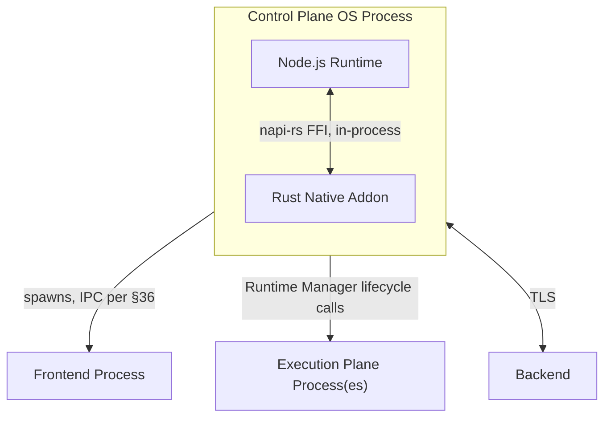
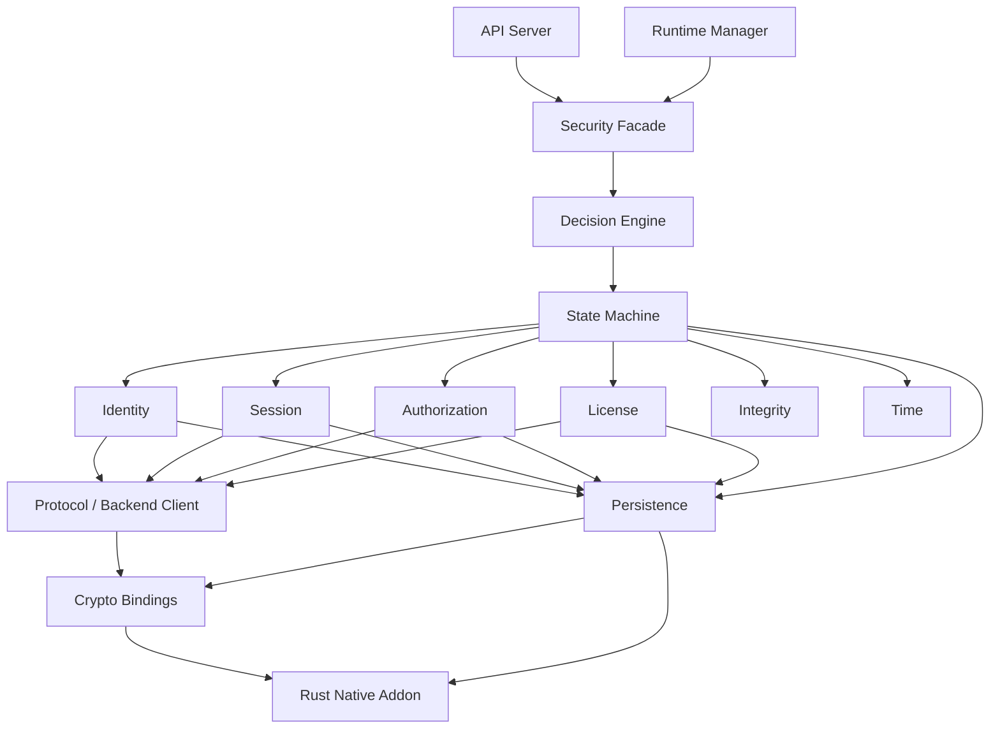

# Security Authority Implementation Plan

**Status:** Implementation-level construction specification. Source of truth: `01-hostile-security-review.md` (why controls exist), `02-architectural-reconstruction.md` (architectural corrections), `03-security-authority-canonical-specification.md` (target architecture — all `§N` references below are to this document unless stated otherwise). This document does not restate architecture; it makes it buildable.

**Technology decisions made in this document** (justified below, each could be revisited — none is silently assumed): TypeScript on Node.js for the Security Authority's logical/orchestration layer; Rust, compiled to a native addon via `napi-rs`, for the Cryptographic Core and Storage Adapter (consistent with §81's Node/Rust boundary and its explicit "Rust is not a security boundary by itself" caveat, which this plan does not weaken); `better-sqlite3`-compatible synchronous access pattern from the Rust layer via `rusqlite` (WAL mode) rather than an async SQLite driver, because the Security Authority's own transaction-ownership rule (§45) is easier to make correct with synchronous, single-writer semantics than with an async driver's implicit interleaving; AES-256-GCM for authenticated encryption, Ed25519 for signatures, HKDF-SHA-256 for key derivation — all justified in §21/§25.

Every `IMPLEMENTATION DECISION REQUIRED` marker below is a genuinely open question the canonical specification left as a tunable or business decision (§95) — this plan does not silently resolve those; it makes the decision's *shape* concrete and asks for the missing number/policy.

---

## 1. Implementation Philosophy

1. **The state machine is the only writer of authoritative security state.** Every other module produces *intents*; the state machine (§10 canonical) is the only place a transition is actually applied. This is not a style preference — it's the direct implementation of canonical §11 ("no component other than the Security Facade's Decision Engine mutates authoritative state") and closes the exact ambiguity class Hostile Review HR-09/HR-10 found: a second write path is how "five generation counters, no consistency rule" bugs happen.
2. **Every persisted mutation is a single OCC-guarded SQLite transaction (§43).** No multi-call sequences that can leave state half-applied.
3. **Every network response is a candidate forgery until proven otherwise (§39 canonical).** The implementation validates nonce + all five generation fields *before* touching any application logic, in one gate function, not scattered per-call-site checks.
4. **Cryptographic operations live in the Rust native layer, never reimplemented in TypeScript.** TypeScript never touches raw key bytes; it passes opaque handles.
5. **No boolean shortcuts.** `if (authorized)` is banned by convention and, where feasible, by lint rule (§53) — every authorization check calls `SecurityAuthority.authorize(capability)` and switches on the full `SecurityResult<T>.status` enum (§71 canonical), never a single boolean projection of it.
6. **Ambiguous is not the same as false.** `BACKEND_UNAVAILABLE` and `DENIED` are different TypeScript types, not different string values of the same type, so a missed `case` is a compiler error, not a runtime bug.

## 2. Implementation Constraints

- Must run cross-platform: Windows 10+, macOS 12+, modern Linux desktop (Ubuntu 22.04 LTS baseline). Every OS-specific mechanism (IPC peer verification §36–37, key storage tier §22–23) has three concrete implementations, not a lowest-common-denominator abstraction that silently degrades security on two of three platforms.
- No custom cryptographic primitives, ever (§16 canonical, retained without exception).
- No security-relevant behavior may depend on JavaScript's single-threaded event-loop ordering as a synchronization primitive (§21 of this document) — Node's event loop is convenient, not a lock.
- The Rust native layer must be buildable and distributable per-platform (prebuilt binaries via `napi-rs`'s standard cross-compilation, with a source-build fallback) — this affects §65 (repository plan) and CI, not the security architecture itself.

## 3. Target Runtime Model

```text
Control Plane Process (single OS process, single-instance enforced §51 of this doc)
├── Node.js/TypeScript runtime
│   ├── Security Authority (orchestration, state machine, protocol logic)
│   ├── Runtime Manager
│   ├── API Server (local IPC/HTTP)
│   └── other subsystems (File Transfer, Config, Update, Telemetry)
└── Rust native addon (loaded in-process via napi-rs, NOT a separate process)
    ├── Cryptographic Core (keys, AEAD, signatures, HKDF)
    ├── Storage Adapter (SQLite access + envelope encryption/integrity)
    └── OS integration shims (IPC peer credentials, key storage tier probing)
```

**Why in-process, not a separate Rust process:** a separate process would introduce a second local IPC boundary needing its own version of §36–37's peer-verification treatment, which canonical §82 explicitly avoids by design. The native addon shares the Node process's memory space and lifetime instead.

## 4. Process Architecture

One OS process. Startup/shutdown sequences (§12, §13 of this doc) execute within that process. The Execution Plane remains a separate process/subsystem (unchanged, out of scope per canonical §3) reached only through the Runtime Manager.



## 5. Repository / Folder Structure

```text
control-plane/
├── src/
│   ├── security-authority/
│   │   ├── index.ts                     — public Security Facade (§71 canonical), ONLY export
│   │   ├── facade.ts                    — SecurityFacade class, routes to Decision Engine
│   │   ├── decision-engine.ts           — evaluates all dimensions together (§14 canonical)
│   │   ├── state-machine/
│   │   │   ├── states.ts                — state enum + per-state metadata (§64 canonical)
│   │   │   ├── transitions.ts           — transition table + guards (§10–11 of this doc)
│   │   │   ├── engine.ts                — executes one transition atomically
│   │   │   └── invariants.ts            — runtime-checked invariants (§9 of this doc)
│   │   ├── identity/
│   │   │   ├── user-identity.ts
│   │   │   ├── machine-identity.ts      — §18 canonical, §18 of this doc
│   │   │   └── descriptor.ts            — Layer-1 local descriptor generation
│   │   ├── authentication/
│   │   │   └── authenticator.ts         — §20 canonical, §10 of this doc
│   │   ├── authorization/
│   │   │   ├── authorization-manager.ts — §21 canonical
│   │   │   └── capabilities.ts          — canonical CAP_* enum, §23 canonical
│   │   ├── licensing/
│   │   │   └── license-manager.ts       — §22 canonical, §12 of this doc
│   │   ├── sessions/
│   │   │   ├── session-manager.ts       — §24–25 canonical
│   │   │   └── renewal.ts               — §14 of this doc
│   │   ├── protocol/
│   │   │   ├── backend-client.ts        — §35–42 canonical, §19 of this doc
│   │   │   ├── envelope.ts              — wire format, §15 of this doc
│   │   │   ├── replay-guard.ts          — §39 canonical, §28 of this doc
│   │   │   └── idempotency.ts           — §23 of this doc
│   │   ├── crypto/
│   │   │   └── bindings.ts              — thin TS wrapper over native addon calls ONLY;
│   │   │                                   no cryptographic logic lives in this file
│   │   ├── integrity/
│   │   │   ├── tamper-detector.ts       — §50–51 canonical, §29 of this doc
│   │   │   └── classification.ts
│   │   ├── time/
│   │   │   ├── clock.ts                 — wall/monotonic abstraction, §30 of this doc
│   │   │   └── offline-grace.ts         — §54 canonical, persisted accumulator
│   │   ├── persistence/
│   │   │   ├── storage-adapter.ts       — thin TS wrapper; actual I/O in Rust layer
│   │   │   ├── schema.ts                — TS types mirroring §9 of this doc's DDL
│   │   │   └── occ.ts                   — optimistic concurrency helpers, §20 of this doc
│   │   ├── ipc/
│   │   │   ├── peer-verification.ts     — §36–37 of this doc
│   │   │   └── spawn-token.ts
│   │   ├── recovery/
│   │   │   ├── reconciliation.ts        — §34 of this doc
│   │   │   └── crash-recovery.ts        — §35 of this doc
│   │   ├── audit/
│   │   │   └── event-log.ts             — §40 of this doc
│   │   └── errors.ts                    — §39 canonical error taxonomy, concrete TS types
│   ├── runtime-manager/
│   │   ├── runtime-manager.ts           — §22 canonical, §26 of this doc
│   │   ├── execution-authorization.ts
│   │   ├── heartbeat.ts                 — control-channel-loss detection (canonical §30)
│   │   └── cdp-proxy/
│   │       ├── proxy.ts                 — §28 of this doc
│   │       └── framing.ts
│   ├── api-server/
│   │   ├── server.ts                    — local IPC/HTTP listener
│   │   └── contract.ts                  — §25 of this doc, Frontend contract
│   └── shared/  (Platform layer, canonical §81's cross-cutting concerns)
│       ├── time-source.ts
│       ├── logging.ts                   — never-log enforcement, §40 of this doc
│       └── config.ts
├── native/
│   └── security-core/                   — Rust crate, napi-rs bindings
│       ├── src/
│       │   ├── lib.rs                   — napi-rs export surface
│       │   ├── crypto/
│       │   │   ├── aead.rs              — AES-256-GCM
│       │   │   ├── kdf.rs               — HKDF-SHA-256
│       │   │   ├── signatures.rs        — Ed25519
│       │   │   └── keystore.rs          — OS-tier key storage (§22–23 of this doc)
│       │   ├── storage/
│       │   │   ├── envelope.rs          — §15 of this doc's wire/storage envelope
│       │   │   └── db.rs                — rusqlite access, OCC transaction helpers
│       │   └── platform/
│       │       ├── windows.rs           — named pipe peer PID + signature check
│       │       ├── unix.rs              — SO_PEERCRED / LOCAL_PEERCRED
│       │       └── macos.rs             — Keychain integration
│       └── Cargo.toml
└── tests/
    ├── unit/
    ├── integration/
    ├── protocol/
    ├── adversarial/                     — §61 of this doc
    └── fixtures/
```

**Per-directory rules:**

| Directory | May contain | Must NOT contain | Allowed dependencies | Forbidden dependencies |
|---|---|---|---|---|
| `security-authority/state-machine/` | Pure transition logic, guards, invariant checks | HTTP calls, Playwright, direct SQLite calls, UI logic | `identity/`, `authorization/`, `sessions/`, `persistence/` (via interfaces only) | `runtime-manager/`, `api-server/`, any network client directly |
| `security-authority/crypto/` | Thin call-through wrappers to the native addon | Any cryptographic algorithm implementation in TS | native addon bindings only | Everything else in `security-authority/` (this module is a leaf) |
| `security-authority/protocol/` | Backend message construction/validation | Direct SQLite access, direct crypto algorithm implementation | `crypto/`, `identity/` (read-only) | `runtime-manager/`, `api-server/` |
| `runtime-manager/` | Execution Plane lifecycle orchestration | Direct Security Authority state mutation, direct SQLite access | `security-authority/index.ts` (facade only) | `security-authority/*` internals |
| `api-server/` | Request routing, IPC peer verification, translation to Security Authority calls | Security decisions of any kind | `security-authority/index.ts`, `runtime-manager/` (facade only) | Direct access to any `security-authority/` internal module |
| `native/security-core/` | Rust: crypto, storage I/O, OS integration | Business/orchestration logic, protocol-level decisions | OS crypto/keystore APIs, rusqlite | Node-specific APIs (this crate must remain embeddable) |

## 6. Module Dependency Graph



**Allowed:** every arrow shown. **Forbidden, explicitly:** `state-machine → protocol` (state machine never makes network calls directly — it requests them via an intent the Decision Engine or Protocol layer fulfills, keeping the state machine pure and unit-testable without a network mock); `runtime-manager → any security-authority internal other than the facade`; `api-server → any security-authority internal other than the facade`; `crypto → persistence` (wrong direction — persistence depends on crypto for envelope operations, not vice versa); any cycle.

## 7. Security Authority Module Architecture

Restated from canonical §14–15 at implementation granularity — each canonical logical component maps to exactly one TS module (or module + native counterpart):

| Canonical component | TS module | Native counterpart |
|---|---|---|
| Security Facade | `facade.ts` | — |
| Security Decision Engine | `decision-engine.ts` | — |
| Identity Manager | `identity/user-identity.ts` | — |
| Machine Identity Manager | `identity/machine-identity.ts`, `identity/descriptor.ts` | `platform/*.rs` (descriptor signal collection) |
| Session Manager | `sessions/session-manager.ts`, `sessions/renewal.ts` | — |
| Authorization Manager | `authorization/authorization-manager.ts` | — |
| License Manager | `licensing/license-manager.ts` | — |
| Integrity Manager | `integrity/tamper-detector.ts`, `integrity/classification.ts` | `platform/*.rs` (signature verification) |
| Trust & Key Manager | `crypto/bindings.ts` | `crypto/*.rs` (all actual key operations) |
| Security State Store | `persistence/storage-adapter.ts`, `persistence/occ.ts` | `storage/*.rs` |
| Security Protocol / Backend Client | `protocol/backend-client.ts`, `protocol/envelope.ts`, `protocol/replay-guard.ts` | `crypto/*.rs` (signing/verification calls) |
| Recovery Manager | `recovery/reconciliation.ts`, `recovery/crash-recovery.ts` | — |
| Security Event Manager | `audit/event-log.ts` | — |

## 8. Data Model

TypeScript types mirroring canonical §37/§45's schema, extended with implementation-only fields (`_ts_internal` prefix convention flags fields that exist for implementation reasons, e.g. in-memory caching, and have no security meaning of their own — this convention exists specifically so a future reviewer can tell canonical fields from implementation bookkeeping at a glance):

```typescript
// security-authority/persistence/schema.ts

export interface MachineIdentityRow {
  machine_id: string | null;          // null until Backend registration (§18 canonical)
  installation_id: string;            // generated locally, always present
  identity_version: number;
  status: MachineIdentityStatus;      // see §18 of this doc, canonical §18.3
  created_at: string;                 // ISO-8601 UTC
  last_registered_at: string | null;
  last_verified_at: string | null;
  key_reference: string;              // opaque handle into native keystore, NEVER raw key material
  backend_binding_id: string | null;
  machine_generation: number;         // one of the five generation counters, §27 canonical
  created_by_version: string;
  updated_at: string;
}

export type MachineIdentityStatus =
  | "UNINITIALIZED" | "GENERATING" | "CREATED" | "REGISTERED"
  | "VERIFIED" | "CORRUPTED" | "REPLACEMENT_REQUIRED"
  | "RE_VERIFICATION_REQUIRED" | "REVOKED";

export interface SessionRow {
  session_id: string;
  status: SessionStatus;
  issued_at: string;
  expires_at: string;
  renew_after: string;
  last_renewed_at: string | null;
  last_verified_at: string | null;
  authentication_method: string;
  authorization_snapshot_id: string | null;
  server_key_version: number;
  session_protocol_version: number;
  session_generation: number;
  created_at: string;
  updated_at: string;
}

export type SessionStatus =
  | "NO_SESSION" | "AUTHENTICATING" | "AUTHENTICATED" | "RENEWING"
  | "DEGRADED" | "EXPIRED" | "REVOKED" | "LOGGING_OUT" | "LOGGED_OUT" | "INVALID";

export interface AuthorizationRow {
  authorization_id: string;
  session_id: string;
  user_id: string;
  machine_id: string;
  status: "VALID" | "EXPIRED" | "REVOKED" | "SUPERSEDED";
  issued_at: string;
  effective_at: string;
  expires_at: string;
  authorization_revision: number;
  backend_revision: number;
  license_id: string;
  capability_set: Capability[];        // canonical CAP_* enum, §23 canonical
  policy_version: number;
  last_verified_at: string;
}

export interface LicenseRow {
  license_id: string;
  account_id: string;
  machine_binding: string;
  plan_id: string;
  status: "UNKNOWN" | "VALID" | "EXPIRING" | "EXPIRED" | "REVOKED" | "SUSPENDED" | "INVALID";
  issued_at: string;
  effective_at: string;
  expires_at: string | null;
  revoked_at: string | null;
  license_revision: number;
  capabilities: Capability[];
  limits: Record<string, number>;
  backend_revision: number;
  last_verified_at: string;
}

export interface SecurityStateRow {
  state_version: number;               // OCC token, §20 of this doc
  security_state: OperationalState;    // §64 canonical enum
  session_generation: number;
  authorization_revision: number;
  license_revision: number;
  machine_generation: number;
  server_trust_version: number;
  key_storage_tier: "hardware" | "os_keychain" | "software_encrypted";
  offline_grace_accumulated_ms: number;
  offline_grace_last_contact_wallclock: string | null;
  last_transition: string;
  last_transition_at: string;
  updated_at: string;
}

export interface PendingTransactionRow {
  transaction_id: string;
  operation_type: string;
  state: "CREATED" | "SENT" | "RESPONSE_PENDING" | "COMMITTED" | "RETRY_PENDING" | "FAILED";
  request_nonce: string;
  created_at: string;
  updated_at: string;
}

export interface SecurityEventRow {
  event_id: string;
  event_type: SecurityEventType;       // §40 of this doc's canonical list
  severity: "INFO" | "WARN" | "SIGNIFICANT" | "CRITICAL";
  timestamp: string;
  session_generation: number | null;
  machine_generation: number | null;
  authorization_revision: number | null;
  transaction_id: string | null;
  result: string;
  metadata: Record<string, unknown>;   // never contains any field on the §40 never-log list
  prev_event_hash: string | null;      // optional hash-chain, canonical §77
  event_hash: string;
}
```

## 9. SQLite Schema

```sql
-- All tables use STRICT mode (SQLite 3.37+) so column types are enforced,
-- not merely advisory — a defense against a hostile process writing a
-- type-confused row that the application layer wasn't checking for.

CREATE TABLE machine_identity (
  id                  INTEGER PRIMARY KEY CHECK (id = 1),  -- singleton row
  machine_id          TEXT,                                 -- NULL until registered
  installation_id     TEXT NOT NULL UNIQUE,
  identity_version    INTEGER NOT NULL DEFAULT 1,
  status              TEXT NOT NULL CHECK (status IN (
                          'UNINITIALIZED','GENERATING','CREATED','REGISTERED',
                          'VERIFIED','CORRUPTED','REPLACEMENT_REQUIRED',
                          'RE_VERIFICATION_REQUIRED','REVOKED')),
  created_at          TEXT NOT NULL,
  last_registered_at  TEXT,
  last_verified_at    TEXT,
  key_reference       TEXT NOT NULL,   -- opaque native-keystore handle, never key material
  backend_binding_id  TEXT,
  machine_generation  INTEGER NOT NULL DEFAULT 0,
  created_by_version  TEXT NOT NULL,
  updated_at          TEXT NOT NULL
) STRICT;

CREATE TABLE sessions (
  session_id                 TEXT PRIMARY KEY,
  status                     TEXT NOT NULL CHECK (status IN (
                                 'NO_SESSION','AUTHENTICATING','AUTHENTICATED','RENEWING',
                                 'DEGRADED','EXPIRED','REVOKED','LOGGING_OUT','LOGGED_OUT','INVALID')),
  issued_at                  TEXT NOT NULL,
  expires_at                 TEXT NOT NULL,
  renew_after                TEXT NOT NULL,
  last_renewed_at            TEXT,
  last_verified_at           TEXT,
  authentication_method      TEXT NOT NULL,
  authorization_snapshot_id  TEXT,
  server_key_version         INTEGER NOT NULL,
  session_protocol_version   INTEGER NOT NULL,
  session_generation         INTEGER NOT NULL,
  created_at                 TEXT NOT NULL,
  updated_at                 TEXT NOT NULL,
  -- canonical §24's own example invariant, enforced at the schema level, not just in code:
  CHECK (NOT (status = 'EXPIRED' AND expires_at > CURRENT_TIMESTAMP))
) STRICT;

CREATE TABLE authorization (
  authorization_id       TEXT PRIMARY KEY,
  session_id              TEXT NOT NULL REFERENCES sessions(session_id),
  user_id                 TEXT NOT NULL,
  machine_id               TEXT NOT NULL,
  status                   TEXT NOT NULL CHECK (status IN ('VALID','EXPIRED','REVOKED','SUPERSEDED')),
  issued_at                TEXT NOT NULL,
  effective_at             TEXT NOT NULL,
  expires_at               TEXT NOT NULL,
  authorization_revision   INTEGER NOT NULL,
  backend_revision         INTEGER NOT NULL,
  license_id               TEXT NOT NULL,
  capability_set           TEXT NOT NULL,   -- JSON array of CAP_* strings (§23 canonical)
  policy_version           INTEGER NOT NULL,
  last_verified_at         TEXT NOT NULL
) STRICT;

CREATE TABLE license (
  license_id         TEXT PRIMARY KEY,
  account_id          TEXT NOT NULL,
  machine_binding     TEXT NOT NULL,
  plan_id             TEXT NOT NULL,
  status               TEXT NOT NULL CHECK (status IN (
                          'UNKNOWN','VALID','EXPIRING','EXPIRED','REVOKED','SUSPENDED','INVALID')),
  issued_at            TEXT NOT NULL,
  effective_at         TEXT NOT NULL,
  expires_at           TEXT,
  revoked_at           TEXT,
  license_revision     INTEGER NOT NULL,
  capabilities         TEXT NOT NULL,   -- JSON array, CAP_* vocabulary
  limits               TEXT NOT NULL,   -- JSON object
  backend_revision     INTEGER NOT NULL,
  last_verified_at     TEXT NOT NULL
) STRICT;

CREATE TABLE security_state (
  id                                    INTEGER PRIMARY KEY CHECK (id = 1),  -- singleton
  state_version                         INTEGER NOT NULL,   -- OCC token, §43
  security_state                        TEXT NOT NULL,      -- SecurityState enum, §10
  session_generation                    INTEGER NOT NULL,
  authorization_revision                INTEGER NOT NULL,
  license_revision                      INTEGER NOT NULL,
  machine_generation                    INTEGER NOT NULL,
  server_trust_version                  INTEGER NOT NULL,
  key_storage_tier                      TEXT NOT NULL CHECK (key_storage_tier IN (
                                            'hardware','os_keychain','software_encrypted')),
  offline_grace_accumulated_ms          INTEGER NOT NULL DEFAULT 0,
  offline_grace_last_contact_wallclock  TEXT,
  last_transition                       TEXT NOT NULL,
  last_transition_at                    TEXT NOT NULL,
  updated_at                            TEXT NOT NULL
) STRICT;

CREATE TABLE pending_transactions (
  transaction_id   TEXT PRIMARY KEY,
  operation_type   TEXT NOT NULL,
  state             TEXT NOT NULL CHECK (state IN (
                        'CREATED','SENT','RESPONSE_PENDING','COMMITTED','RETRY_PENDING','FAILED')),
  request_nonce     TEXT NOT NULL UNIQUE,
  created_at        TEXT NOT NULL,
  updated_at        TEXT NOT NULL
) STRICT;

CREATE TABLE security_events (
  event_id                  TEXT PRIMARY KEY,
  event_type                 TEXT NOT NULL,   -- §54 canonical event list
  severity                   TEXT NOT NULL CHECK (severity IN ('INFO','WARN','SIGNIFICANT','CRITICAL')),
  timestamp                  TEXT NOT NULL,
  session_generation         INTEGER,
  machine_generation         INTEGER,
  authorization_revision     INTEGER,
  transaction_id             TEXT,
  result                     TEXT NOT NULL,
  metadata                   TEXT NOT NULL,   -- JSON; never contains §54's never-log fields
  prev_event_hash             TEXT,
  event_hash                  TEXT NOT NULL
) STRICT;

CREATE INDEX idx_events_timestamp ON security_events(timestamp);
CREATE INDEX idx_events_type ON security_events(event_type);
CREATE INDEX idx_pending_state ON pending_transactions(state);

-- All storage-envelope-protected columns above (key_reference targets, any column holding
-- ciphertext rather than the plaintext types shown) are TEXT columns holding the base64-encoded
-- StorageEnvelope structure from §20's wire-format sibling (the LOCAL storage envelope is the
-- same construction as the wire envelope, minus the header fields that only make sense for
-- transport) — this schema shows logical columns; §43 covers exactly which columns above
-- are envelope-wrapped versus plaintext-with-schema-level-integrity-only, and why.
```

Every table uses `STRICT` mode and explicit `CHECK` constraints wherever a canonical invariant can be expressed at the schema level (the `sessions` table's `EXPIRED`/`expires_at` check is canonical §24's own worked example, enforced here as a database constraint, not only as application logic — a second, independent enforcement layer, deliberately). Foreign keys are used sparingly (`authorization.session_id → sessions.session_id`) — most cross-table consistency (the five generation counters' causal graph, §22 canonical) is too rich for `FOREIGN KEY`/`CHECK` alone and is enforced by the transaction discipline in §43, not by the schema.

---

## 10. State Machine

### State Enum

```typescript
export enum SecurityState {
  UNINITIALIZED = "UNINITIALIZED",
  INITIALIZING = "INITIALIZING",
  SECURITY_STATE_UNCERTAIN = "SECURITY_STATE_UNCERTAIN",
  SECURITY_STATE_READY = "SECURITY_STATE_READY",
  UNAUTHENTICATED = "UNAUTHENTICATED",
  AUTHENTICATING = "AUTHENTICATING",
  AUTH_FAILED = "AUTH_FAILED",
  AUTHENTICATED = "AUTHENTICATED",
  AUTHORIZING = "AUTHORIZING",
  AUTHZ_FAILURE = "AUTHZ_FAILURE",
  OPERATIONAL = "OPERATIONAL",
  RENEWING = "RENEWING",
  OFFLINE_GRACE = "OFFLINE_GRACE",
  EXPIRED = "EXPIRED",
  REVOKED = "REVOKED",
  INTEGRITY_DEGRADED = "INTEGRITY_DEGRADED",
  TAMPER_SUSPECTED = "TAMPER_SUSPECTED",
  COMPROMISED = "COMPROMISED",
  REAUTHENTICATION_REQUIRED = "REAUTHENTICATION_REQUIRED",
  LOGGING_OUT = "LOGGING_OUT",
  LOGGED_OUT = "LOGGED_OUT",
}
```

(One-to-one with canonical §64 — no state added or removed at implementation time; adding a state here without a corresponding canonical-spec update is itself a process violation, not just a code-review nit.)

### State Data (attached payload per state, not just the enum tag)

```typescript
export type SecurityStateData =
  | { state: SecurityState.UNINITIALIZED }
  | { state: SecurityState.SECURITY_STATE_UNCERTAIN; cause: "INTERRUPTED_TRANSACTION" | "GENERATION_CAUSAL_VIOLATION"; pendingTransactionId?: string }
  | { state: SecurityState.OPERATIONAL; session: SessionRow; authorization: AuthorizationRow; license: LicenseRow; machine: MachineIdentityRow }
  | { state: SecurityState.OFFLINE_GRACE; since: string; accumulatedMs: number; lastGrantedAuthorization: AuthorizationRow }
  | { state: SecurityState.INTEGRITY_DEGRADED | SecurityState.TAMPER_SUSPECTED | SecurityState.COMPROMISED; triggeringEvent: SecurityEventRow }
  | { state: Exclude<SecurityState, "OPERATIONAL" | "OFFLINE_GRACE" | "SECURITY_STATE_UNCERTAIN" | "INTEGRITY_DEGRADED" | "TAMPER_SUSPECTED" | "COMPROMISED" | "UNINITIALIZED"> };
```

Using a discriminated union (not a bare enum plus loosely-typed side fields) means the TypeScript compiler rejects code that reads `.session` while in `AUTH_FAILED` — this is deliberate defense against the exact class of bug where a caller assumes fields exist that a given state doesn't guarantee.

### Transition Event Enum

```typescript
export enum TransitionEvent {
  INITIALIZE = "INITIALIZE",
  BOOTSTRAP_COMPLETE = "BOOTSTRAP_COMPLETE",
  INTERRUPTED_TRANSACTION_FOUND = "INTERRUPTED_TRANSACTION_FOUND",
  RECONCILIATION_RESOLVED = "RECONCILIATION_RESOLVED",
  LOGIN_INTENT = "LOGIN_INTENT",
  BACKEND_AUTH_SUCCESS = "BACKEND_AUTH_SUCCESS",
  BACKEND_AUTH_FAILURE = "BACKEND_AUTH_FAILURE",
  AUTHZ_LICENSE_RESOLVED = "AUTHZ_LICENSE_RESOLVED",
  AUTHZ_LICENSE_FAILED = "AUTHZ_LICENSE_FAILED",
  RENEW_THRESHOLD_REACHED = "RENEW_THRESHOLD_REACHED",
  RENEW_SUCCESS = "RENEW_SUCCESS",
  RENEW_BACKEND_UNREACHABLE = "RENEW_BACKEND_UNREACHABLE",
  BACKEND_RECONNECTED = "BACKEND_RECONNECTED",
  OFFLINE_GRACE_EXHAUSTED = "OFFLINE_GRACE_EXHAUSTED",
  SESSION_OR_LICENSE_EXPIRED = "SESSION_OR_LICENSE_EXPIRED",
  BACKEND_REVOCATION = "BACKEND_REVOCATION",
  SIGNIFICANT_TAMPER_SIGNAL = "SIGNIFICANT_TAMPER_SIGNAL",
  CRITICAL_OR_CORRELATED_TAMPER_SIGNAL = "CRITICAL_OR_CORRELATED_TAMPER_SIGNAL",
  USER_REINITIATES = "USER_REINITIATES",
  LOGOUT_INTENT = "LOGOUT_INTENT",
  LOGOUT_SEQUENCE_COMPLETE = "LOGOUT_SEQUENCE_COMPLETE",
}
```

### Execution Algorithm (every transition, no exceptions)

```text
executeTransition(event, payload):
  1. acquire the in-process state-machine mutex (single-writer, §21 of this doc)
  2. read current SecurityStateRow, including state_version (OCC token)
  3. look up (currentState, event) in the transition table (below)
     — if no entry exists: reject, log SecurityEvent(INVALID_TRANSITION_ATTEMPTED), return unchanged
  4. evaluate guard(currentStateData, payload)
     — if guard fails: reject, log SecurityEvent, return unchanged
  5. if the event carries a Backend response: validate nonce + all 5 generation fields (§28 of this doc)
     — if validation fails: DISCARD SILENTLY (per canonical §38 — no caller-visible error), log SecurityEvent, return unchanged
  6. compute the mutation (next SecurityStateData + any row-level changes)
  7. BEGIN IMMEDIATE transaction (native layer)
  8. apply row-level changes with the OCC guard: WHERE state_version = <read value>
     — if rows_affected != 1: ROLLBACK, this is a concurrent-writer conflict — retry from step 2
        (bounded retry count; exceeding it surfaces as a implementation-level error, never a security bypass)
  9. write SecurityEvent row (§40 of this doc) in the SAME transaction
  10. COMMIT
  11. update in-memory projection (the cached SecurityStateData held by the Decision Engine)
  12. emit domain event (§74 canonical event list) to subscribers (Runtime Manager, API Server, Telemetry)
  13. execute asynchronous side effects (e.g., notify Runtime Manager of revocation) — these run
      AFTER commit, never before, and their failure does not roll back the already-committed
      state transition (side effects are retried/reconciled independently, per §34 of this doc)
  14. release the state-machine mutex
```

Step 5's placement — *before* the mutation is computed, not after — is the concrete implementation of canonical Invariant 22 ("remote responses cannot overwrite newer local security state"): a stale response never reaches step 6 at all.

### Transition Table (implementation-level; canonical §65 is the architectural summary this table implements exactly)

| Current State | Event | Guard | Actions | Persistent Mutation | Next State | Failure State |
|---|---|---|---|---|---|---|
| `UNINITIALIZED` | `INITIALIZE` | single-instance lock held (§51 of this doc) | begin bootstrap | none yet | `INITIALIZING` | — |
| `INITIALIZING` | `BOOTSTRAP_COMPLETE` | integrity + storage + machine identity all verified | load generation state into memory | none (read-only) | `SECURITY_STATE_READY` | — |
| `INITIALIZING` | `INTERRUPTED_TRANSACTION_FOUND` | a `PendingTransactionRow` with `state = RESPONSE_PENDING` exists, OR generation causal-graph check (§22 canonical) fails | log event | write `SecurityEvent` | `SECURITY_STATE_UNCERTAIN` | — |
| `SECURITY_STATE_UNCERTAIN` | `RECONCILIATION_RESOLVED` | Backend confirms an authoritative outcome | apply resolved outcome | full state row update, generation reconciled | `SECURITY_STATE_READY` or prior authenticated state, per resolved outcome | remains `SECURITY_STATE_UNCERTAIN`, retried with backoff (§33 of this doc) |
| `SECURITY_STATE_READY` / `UNAUTHENTICATED` | `LOGIN_INTENT` | not already `AUTHENTICATING` for this principal | generate request nonce | `PendingTransactionRow` created | `AUTHENTICATING` | — |
| `AUTHENTICATING` | `BACKEND_AUTH_SUCCESS` | response passes nonce/generation validation (step 5) | — | `session_generation += 1`, `SessionRow` created | `AUTHENTICATED` | — |
| `AUTHENTICATING` | `BACKEND_AUTH_FAILURE` | — | — | `PendingTransactionRow.state = FAILED` | `AUTH_FAILED` | — |
| `AUTHENTICATED` | `AUTHZ_LICENSE_RESOLVED` | both Backend-confirmed in the same response | — | `authorization_revision += 1` AND `license_revision += 1` in the SAME transaction (canonical §22 causal link) | `OPERATIONAL` | — |
| `AUTHENTICATED` | `AUTHZ_LICENSE_FAILED` | — | — | — | `AUTHZ_FAILURE` | — |
| `OPERATIONAL` | `RENEW_THRESHOLD_REACHED` | `now >= renew_after`, renewal mutex not already held (§14 of this doc) | acquire renewal mutex, generate nonce | `PendingTransactionRow` created | `RENEWING` | — |
| `RENEWING` | `RENEW_SUCCESS` | response validated | release renewal mutex | `session_generation += 1` | `OPERATIONAL` | — |
| `RENEWING` | `RENEW_BACKEND_UNREACHABLE` | — | start/resume offline-grace timer | `offline_grace_last_contact_wallclock` unchanged, accumulator resumes | `OFFLINE_GRACE` | — |
| `OFFLINE_GRACE` | `BACKEND_RECONNECTED` | version/generation handshake (§42 canonical) passes | reconcile generation state | generation reconciled | `OPERATIONAL` | — |
| `OFFLINE_GRACE` | `OFFLINE_GRACE_EXHAUSTED` | `offline_grace_accumulated_ms > OFFLINE_GRACE_MAX` (**IMPLEMENTATION DECISION REQUIRED**, §52) | revoke continuation capabilities per canonical §60 table | `capability_set = []` in `AuthorizationRow` | `REAUTHENTICATION_REQUIRED` | — |
| `OPERATIONAL` | `SESSION_OR_LICENSE_EXPIRED` | `now >= expires_at` on session or license | — | status → `EXPIRED` on the relevant row | `EXPIRED` | — |
| `OPERATIONAL` | `BACKEND_REVOCATION` | response validated (unsolicited `REVOCATION_NOTICE`, still nonce-checked against a Security-Authority-issued listening context, §39 of this doc) | notify Runtime Manager (async side effect, step 13) | `capability_set = []`, status → `REVOKED` | `REVOKED` | — |
| `OPERATIONAL` | `SIGNIFICANT_TAMPER_SIGNAL` | classification = SIGNIFICANT (§29 of this doc) | write `SecurityEvent` | — | `INTEGRITY_DEGRADED` | — |
| `INTEGRITY_DEGRADED` | `CRITICAL_OR_CORRELATED_TAMPER_SIGNAL` | classification = CRITICAL, or ≥N correlated SIGNIFICANT events within window (**IMPLEMENTATION DECISION REQUIRED**, threshold N and window) | — | — | `TAMPER_SUSPECTED` → `COMPROMISED` per severity | monotonic — never transitions to a lower level without external reauthentication |
| `EXPIRED` / `REVOKED` | (implicit) | — | — | — | `REAUTHENTICATION_REQUIRED` | — |
| `REAUTHENTICATION_REQUIRED` | `USER_REINITIATES` | — | new nonce | `PendingTransactionRow` created | `AUTHENTICATING` | — |
| `OPERATIONAL` | `LOGOUT_INTENT` | — | begin logout sequence (§13 of this doc references this) | — | `LOGGING_OUT` | — |
| `LOGGING_OUT` | `LOGOUT_SEQUENCE_COMPLETE` | all logout steps completed (§25 canonical) | — | session/authorization invalidated | `LOGGED_OUT` | logout is retried, never abandoned mid-sequence — see §13 |

### State Machine Invariants (runtime-checked, `invariants.ts`)

Machine-checkable, asserted at the end of every `executeTransition` call, before releasing the mutex (a failed assertion here is a `FATAL` implementation bug, not a security event — it means the code violated its own contract, and the process should crash loudly in development/staging, and in production should force `SECURITY_STATE_UNCERTAIN` + immediate reconciliation rather than continue with an inconsistent in-memory projection):

```typescript
function assertStateMachineInvariants(state: SecurityStateData): void {
  if (state.state === SecurityState.OPERATIONAL) {
    assert(state.authorization.status === "VALID", "OPERATIONAL implies valid authorization");
    assert(state.session.status === "AUTHENTICATED" || state.session.status === "RENEWING",
           "OPERATIONAL implies valid session");
  }
  if (state.state === SecurityState.COMPROMISED || state.state === SecurityState.REVOKED) {
    assert(currentCapabilitySet().length === 0, "COMPROMISED/REVOKED implies no execution capability");
  }
  if (state.state === SecurityState.EXPIRED) {
    assert(!hasActiveProtectedOperation(), "EXPIRED implies no protected operation");
  }
  // "security state cannot move backwards through an unauthorized transition" and
  // "a stale state version cannot overwrite a newer state" are enforced structurally
  // by the OCC guard (step 8) and the nonce/generation gate (step 5) — not re-checked
  // here, because by the time this function runs those checks have already passed;
  // duplicating them here would just be dead code pretending to be a second layer of defense.
}
```

## 11. State Transition Algorithms

The single `executeTransition` algorithm in §10 is the only state transition algorithm in the system — there is deliberately no per-subsystem variant (this is the direct fix for the risk Hostile Review HR-09 named: multiple independently-evolving "what happens on a partial write" pathways). Session renewal, authentication, revocation, and tamper response are all *callers* of the same function with different `(event, payload)` pairs, not different implementations.

## 12. Startup Algorithm

```text
1.  acquire single-instance OS-level lock (§51 of this doc)
      — fail → hand off to existing instance or exit with clear error, do not proceed
2.  initialize Rust native addon (crypto + storage bindings)
3.  verify executable/library signatures (canonical §51)
      — fail → do not proceed past this point; this is a CRITICAL classification (canonical §50)
4.  initialize cryptographic subsystem (native layer: RNG self-test, keystore tier probe §22–23)
5.  open SQLite database (WAL mode)
6.  verify schema version; run migration if needed (§80 canonical, atomic — §46 canonical)
7.  load persisted SecurityStateRow
      — verify storage envelope integrity (AEAD tag check, §15 of this doc) on every row read
      — integrity failure → CRITICAL classification, do not silently continue (canonical §57)
8.  check for PendingTransactionRow in RESPONSE_PENDING → INTERRUPTED_TRANSACTION_FOUND event
9.  check generation-counter causal graph (canonical §22, Reconstruction §10) for consistency
      → violation is ALSO an INTERRUPTED_TRANSACTION_FOUND-class event, same handling
10. check for rollback: compare persisted machine_generation etc. against last-known values
      cached from the prior session's final Backend contact (if available) — a decrease is
      impossible locally (OCC prevents it) but this step catches a restored/copied database file
      whose generations are internally consistent but stale relative to what THIS process
      last observed before restart
11. initialize protocol layer (TLS context, trust anchors — §35 canonical, §19 of this doc)
12. initialize local IPC listener (§36–37 of this doc) — NOT yet accepting Frontend connections
13. attempt Backend contact; if reachable, run version/generation handshake (§42 canonical)
      — if unreachable, proceed directly to step 14 in a state consistent with OFFLINE_GRACE
        eligibility, not blocked on Backend reachability (canonical §55/§60 — startup must not
        hang or fail outright merely because the network is down)
14. run reconcile() unconditionally (canonical §59) — even a "clean" startup reconciles, because
      idempotent reconciliation is cheaper than a subtle bug in a "skip reconciliation if things
      look fine" fast path
15. determine resulting SecurityState from steps 7–14's outcomes
16. expose the Security Facade's public API surface (§71 canonical) to the API Server
17. begin accepting Frontend IPC connections
18. begin accepting operational requests
```

**Why this order:** every step from 3–10 either establishes or checks integrity of something a later step depends on trusting; steps 11–14 establish Backend communication only after local trust is as resolved as it can be without the Backend, so that step 14's reconciliation is reasoning from a locally-consistent starting point rather than an unverified one.

## 13. Shutdown Algorithm

### Graceful

```text
1. stop accepting new commands via the API Server (existing in-flight requests may complete)
2. if OPERATIONAL with active Execution Plane authorization:
     revoke execution authorization (canonical §30's control-channel-loss rule applies
     symmetrically here — an orderly shutdown IS a channel-loss event from the Runtime
     Manager's perspective, deliberately using the same code path rather than a special case)
3. Runtime Manager terminates CDP proxy connections (§28 of this doc), then the Execution
   Plane lifecycle (out of this document's scope beyond "shutdown/pause is requested")
4. flush pending SecurityEvent writes (§40 of this doc)
5. persist final SecurityStateRow (if any in-memory-only changes are pending — should be
   none, since §10's algorithm persists synchronously on every transition; this step exists
   as a defensive final flush, not as evidence the design relies on deferred persistence)
6. destroy ephemeral in-memory keys (native layer zeroizes key material, §17.4 of this doc)
7. close IPC listener
8. release the single-instance lock (§51 of this doc)
9. close SQLite connection
10. exit process
```

### Forced (SIGKILL-equivalent, or graceful shutdown exceeds its own timeout budget)

No graceful sequence runs. Recovery is entirely the responsibility of the startup algorithm (§12) treating this as any other unclean-shutdown case — steps 8–10 are the ones that matter: the single-instance lock is an OS-level resource released automatically by process termination on all three target platforms, and SQLite's WAL-mode durability (canonical §47) plus the OCC/transaction discipline (§10, §20) is what makes an interrupted-anywhere shutdown recoverable without a special "forced shutdown" code path. This is deliberate: a system that requires forced-shutdown-specific recovery logic has already admitted its crash-recovery story (§35 of this doc) doesn't actually cover crashes.

---

## 14. Authentication Protocol

```text
user enters credentials
        │
        ▼
Frontend  ──(IPC, §36–37)──▶  API Server
        │
        ▼
API Server: SecurityFacade.authenticate(credentials)
        │
        ▼
Security Authority: Identity Manager
        │  reads MachineIdentityRow (must be at least CREATED; if UNINITIALIZED, this IS
        │  the first-run path — descriptor + installation_id generated here, §18 of this doc)
        ▼
Protocol layer: construct AUTH_INIT message
        │
        ▼
    AUTH_INIT { protocol_version, installation_id, client_nonce }
        ────────────────────────────────────────────▶ Backend
        ◀──────────────────────────────────────────── AUTH_CHALLENGE { server_nonce, challenge_params }
        │
        ▼
    AUTH_RESPONSE { credentials (over TLS), client_nonce, server_nonce_echo, signed_context }
        ────────────────────────────────────────────▶ Backend
        ◀──────────────────────────────────────────── AUTH_RESULT { status, principal_id,
                                                          session_id, session_generation,
                                                          machine_id (if newly registered),
                                                          nonce_echo, mac }
        │
        ▼
executeTransition(BACKEND_AUTH_SUCCESS, response)   — §10's algorithm, including step 5's
        │                                              nonce/generation validation
        ▼
session established, machine registered if this was first contact (§18 of this doc)
        │
        ▼
executeTransition(AUTHZ_LICENSE_RESOLVED, ...) — §15 below, chained automatically, not a
        │                                          separate user-visible step
        ▼
OPERATIONAL — API Server returns final SecurityResult<T> to Frontend
```

### Message Structures

```typescript
interface AuthInit {
  protocol_version: number;
  installation_id: string;              // Layer-1 descriptor reference (§18 of this doc)
  client_nonce: string;                  // 256-bit, CSPRNG (native layer)
}

interface AuthChallenge {
  server_nonce: string;
  challenge_params: unknown;             // Backend-defined; opaque to this specification
                                          // (password/OAuth/passkey specifics are a Backend
                                          // contract decision, canonical §20 — out of scope here)
}

interface AuthResponse {
  client_nonce: string;                  // echoes AuthInit
  server_nonce_echo: string;             // echoes AuthChallenge — binds this response to
                                          // THIS challenge, preventing challenge/response
                                          // cross-pairing across concurrent attempts
  credential_material: unknown;          // over TLS; never logged (§40), never persisted
                                          // beyond the duration of this exchange
  signed_context: string;                // Ed25519 signature over
                                          // (client_nonce || server_nonce_echo || installation_id)
                                          // using the machine identity signing key (§18 of this
                                          // doc) — binds the authentication attempt to THIS
                                          // machine's key material, not just the credentials
}

interface AuthResult {
  status: "AUTHENTICATED" | "DENIED" | "PARTIAL";
  principal_id?: string;                 // opaque, canonical §19
  session_id?: string;
  session_generation?: number;
  machine_id?: string;                   // present on first registration only
  nonce_echo: string;                    // echoes client_nonce — required for step 5 validation
  server_mac: string;                    // HMAC/signature over the full response, verified
                                          // against the pinned Backend trust anchor (§19 of
                                          // this doc) before ANY field above is trusted
}
```

**Why `signed_context` exists:** without it, a captured `AuthResponse` (credentials + nonces) replayed from a different machine would be indistinguishable, at the protocol level, from the legitimate machine retrying — the signature binds the attempt to a private key that (per §18 of this doc) never leaves the OS-protected keystore tier, so replay from a different machine fails signature verification even if the attacker somehow captured a valid credential exchange.

## 15. Authorization Protocol

Authentication → Authorization is not automatic — it is the `AUTHZ_LICENSE_RESOLVED` transition (§10), triggered immediately after `BACKEND_AUTH_SUCCESS` but as a **distinct** request/response pair, never folded into the auth response itself, so that authorization can be independently re-run later (renewal, license change, revocation) without re-running authentication (canonical §21, "authorization is a cache of a Backend-issued grant"):

```text
AUTHORIZATION_REQUEST { session_id, session_generation, client_nonce }
        ────────────────────────────────────────────▶ Backend
        ◀──────────────────────────────────────────── AUTHORIZATION_RESULT {
                                                          status, capability_set (CAP_* enum,
                                                          canonical §23), authorization_revision,
                                                          license_id, license_revision,
                                                          policy_version, expires_at,
                                                          nonce_echo, server_mac }
```

**Authorized → execution-capable is a THIRD distinct step (§30 canonical, §26 of this doc)** — `AUTHORIZATION_RESULT.capability_set` containing `CAP_AUTOMATION_START` means the principal is *entitled* to start automation; it does not itself start anything or hand the Execution Plane anything. `authorizeExecution()` (§26 of this doc) consumes the current `AuthorizationRow` and produces the separate `ExecutionAuthorization` artifact — this three-step separation (authenticated → authorized → execution-capable) is deliberately not collapsible, per canonical §11's own framing of these as distinct concepts that must never be collapsed into one boolean.

## 16. Licensing Protocol

```text
LICENSE_REQUEST { session_id, session_generation }
        ────────────────────────────────────────────▶ Backend
        ◀──────────────────────────────────────────── LICENSE_RESULT {
                                                          status, plan_id, license_revision,
                                                          effective_at, expires_at, capabilities,
                                                          limits, nonce_echo, server_mac }
```

In practice this is folded into the same round trip as §15's `AUTHORIZATION_REQUEST`/`RESULT` (one request, one response, both `authorization_revision` and `license_revision` present) — **not** two separate network round trips — because canonical §22's causal-linkage rule ("`license_revision` change must co-occur, in the same transaction, with `authorization_revision` change") is far easier to guarantee when both values arrive in one message than when reconciling two independently-timed responses.

**Authentication succeeds, license retrieval fails:** the response's `AUTHORIZATION_RESULT.status` field distinguishes this explicitly — `status: "LICENSE_LOOKUP_FAILED"` is a distinct value from `status: "DENIED"`; the state machine's `AUTHZ_LICENSE_FAILED` event (§10) fires, landing in `AUTHZ_FAILURE` (canonical §64), which is a state where the principal is known-authenticated but not operational — never silently treated as either fully authorized or fully denied.

## 17. Session Protocol

### 17.1 Session Creation

Covered by §14 (part of the `AUTH_RESULT` payload) — session creation is not a separate protocol exchange from authentication, per canonical §16/§24's framing of session issuance as the direct outcome of successful authentication.

### 17.2 Session Key

A per-session symmetric key is derived (not transmitted in full over the wire) via HKDF (§21 of this doc) from a Backend-issued session secret (delivered once, over TLS, within `AUTH_RESULT`) as IKM, with `session_id` as context. This key protects the local storage envelope for session-scoped fields (§15 of this doc) and, where the protocol requires per-message authentication beyond TLS, message-level MACs for the duration of the session.

### 17.3 Concurrent Login / Session Theft / Replay / Fixation

- **Concurrent login** (same principal, second `LOGIN_INTENT` while `AUTHENTICATING` already in flight for that principal): rejected at the guard in §10's transition table row for `LOGIN_INTENT` — "not already `AUTHENTICATING` for this principal."
- **Session theft:** mitigated at the protocol level by `signed_context` (§14) binding every subsequent authenticated request to the machine's signing key, not just to `session_id` — a stolen `session_id` alone is insufficient without the corresponding private key, which (per §22–23 of this doc) resists casual extraction depending on the platform's key-storage tier.
- **Replay:** covered structurally by §28 (nonce/generation validation, applied to every message, not session messages specifically).
- **Fixation:** the client never accepts a Backend-supplied `session_id` for a session it did not itself request via `LOGIN_INTENT` — session establishment is always client-initiated in this protocol, closing the classic fixation vector where an attacker pre-supplies a session identifier.

## 18. Session Renewal

### Renewal Threshold

**IMPLEMENTATION DECISION REQUIRED:** exact `renew_after` offset before `expires_at` (canonical §95.3 leaves this an open tunable). This plan specifies the *mechanism* the number plugs into: `renew_after = issued_at + (expires_at - issued_at) * RENEWAL_FRACTION`, where `RENEWAL_FRACTION` is a configuration constant (suggested starting point: `0.75`, i.e. renewal attempted at 75% of session lifetime elapsed, giving three renewal attempts' worth of margin at typical retry intervals before hard expiry — final value is a product decision, not fixed here).

### Algorithm

```text
1. RENEW_THRESHOLD_REACHED fires (timer, or reactive: a request received AUTHORIZATION_REQUIRED
   mid-flight while OPERATIONAL, treated identically — both paths converge on the same
   executeTransition call, per §11's single-algorithm rule)
2. acquire renewal mutex (per-session, in-process) — §14 canonical's coalescing rule:
   a second trigger arriving here AWAITS the in-flight attempt's promise, does not start a
   second SESSION_RENEW request
3. generate request nonce, current session_generation
4. send SESSION_RENEW { session_id, session_generation, client_nonce }
5. await response with bounded timeout (§33 retry algorithm governs backoff on timeout, NOT
   on an authoritative denial — see §33's "do not retry security-denial responses")
6a. response received, validated (§28) → executeTransition(RENEW_SUCCESS, response)
6b. timeout → this is AMBIGUOUS, not a failure — go to §34 reconciliation, NOT directly to
    RENEW_BACKEND_UNREACHABLE; only a confirmed network-layer failure (connection refused, DNS
    failure, TLS failure — an error the transport itself reports, not merely "no response yet")
    triggers RENEW_BACKEND_UNREACHABLE directly
6c. confirmed network-layer failure → executeTransition(RENEW_BACKEND_UNREACHABLE, ...)
6d. response indicates SESSION_ALREADY_REVOKED → executeTransition(BACKEND_REVOCATION, ...)
    (a revocation discovered via a renewal attempt is handled identically to an unsolicited
    REVOCATION_NOTICE — one code path, per §11)
7. release renewal mutex
```

**"Lease changed during renewal"** (the license/authorization was modified by the Backend concurrently with an in-flight renewal): the `SESSION_RENEW_RESULT` response carries the current `authorization_revision`/`license_revision` alongside the renewed session; if these differ from what the client held before initiating renewal, the response is still applied (it's newer, passes the generation check) and the resulting capability set reflects the Backend's latest view — renewal and authorization-refresh are allowed to observably interact this way by design, since treating them as independent would risk exactly the kind of causal-graph violation §22 forbids.

## 19. Backend Communication Protocol

### Protocol Table

| Operation | Request | Response | Authentication | Retry | Idempotency | Failure |
|---|---|---|---|---|---|---|
| Login | `AUTH_INIT`/`AUTH_RESPONSE` | `AUTH_CHALLENGE`/`AUTH_RESULT` | Credential + machine signature | No (user-initiated retry only) | N/A (each attempt is distinct) | `AUTH_FAILED` |
| Machine registration | `MACHINE_REGISTER` | `MACHINE_REGISTER_RESULT` | Session-authenticated | Yes, bounded (§33) | Idempotency key = `installation_id` (§23 of this doc) | `RE_VERIFICATION_REQUIRED` (canonical §18.3) |
| Session renewal | `SESSION_RENEW` | `SESSION_RENEW_RESULT` | Session-authenticated | No — see §18's ambiguous-timeout handling instead | Idempotency key = renewal attempt ID | `OFFLINE_GRACE` or `REAUTHENTICATION_REQUIRED` |
| Authorization + license | `AUTHORIZATION_REQUEST` | `AUTHORIZATION_RESULT` | Session-authenticated | Yes, bounded | Read-only, naturally idempotent | `AUTHZ_FAILURE` |
| Revocation | — (unsolicited) | `REVOCATION_NOTICE` | Backend-signed, session-scoped | N/A (push) | N/A | Immediate `REVOKED` |
| Reconciliation | `SECURITY_STATE_REQUEST` | `SECURITY_STATE_RESULT` | Session-authenticated | Yes, bounded | Read-only | Remains `SECURITY_STATE_UNCERTAIN`, escalates after max attempts |
| Key/protocol negotiation | Part of TLS handshake + `AUTH_INIT.protocol_version` | — | Certificate chain to pinned/OS trust anchor | N/A | N/A | `PROTOCOL_INCOMPATIBLE` |

### Idempotency (§23)

Every mutating request carries a request-scoped idempotency key (the `client_nonce`, reused as the idempotency key rather than inventing a second identifier — one value, one purpose, per the same economy-of-mechanism principle used for generations in canonical §40). On `request sent → server processes → response lost`:

```text
client retries with the SAME client_nonce
        │
        ▼
Backend recognizes the nonce as already-processed
        │
        ▼
Backend returns the ORIGINAL result (not a new one, not an error) with the SAME nonce_echo
        │
        ▼
client applies it exactly as it would a first-time response — the nonce/generation
validation (§28) does not distinguish "first delivery" from "retried delivery of the
same authoritative result"; both pass identically
```

This is a Backend-side requirement this plan places on the Backend contract (idempotency-key deduplication), not something the client can enforce unilaterally — flagged here as a cross-team dependency, not an `IMPLEMENTATION DECISION REQUIRED` (it's not undecided, it's owned by a different codebase).

## 20. Security Envelope Protocol — Wire Format

```typescript
interface WireEnvelope {
  header: {
    protocol_version: number;
    message_type: string;              // "AUTH_INIT", "SESSION_RENEW", etc.
    message_id: string;                // unique per message, distinct from client_nonce —
                                        // message_id aids logging/tracing; client_nonce is
                                        // the security-relevant field (§28) — deliberately
                                        // NOT the same field, so tracing needs never touch
                                        // the security-sensitive nonce value
    session_id?: string;               // plaintext metadata — needed for routing before
                                        // decryption; contains no secret
    security_epoch: {                  // all 5 generation fields, canonical §27
      session: number; authorization: number; license: number;
      machine: number; server_trust: number;
    };
  };
  nonce: string;                       // AEAD nonce, 96-bit random (§21)
  payload_ciphertext: string;          // base64
  authentication_tag: string;          // base64, AEAD tag
  signature?: string;                  // Ed25519, present on Backend→client authoritative
                                        // results (AUTH_RESULT, AUTHORIZATION_RESULT,
                                        // REVOCATION_NOTICE) for non-repudiation beyond
                                        // TLS's own integrity, since these specific messages
                                        // are also persisted locally as evidence (§40 audit)
                                        // and should remain verifiable independent of the
                                        // TLS session that carried them
}
```

**Field classification:**

| Field | Encrypted | Authenticated (AEAD AAD) | Signed | Plaintext |
|---|---|---|---|---|
| `header.protocol_version` | No | Yes (AAD) | Yes (where signature present) | Yes |
| `header.message_type` | No | Yes (AAD) | Yes | Yes |
| `header.session_id` | No | Yes (AAD) | Yes | Yes |
| `header.security_epoch` | No | Yes (AAD) | Yes | Yes |
| `nonce` | N/A (it IS the nonce) | Implicitly (part of AEAD construction) | No | Yes |
| `payload` (credentials, capability sets, etc.) | **Yes** | Yes (as the AEAD plaintext) | Yes (where signature present, over ciphertext + AAD) | No |

**Associated Authenticated Data (AAD)** = `protocol_version || message_type || session_id || security_epoch` (canonicalized serialization below) — binding the ciphertext to exactly this header means an attacker cannot take a validly-encrypted payload from one message and relabel it as a different `message_type`, or replay it against a different `session_id`, and have it pass AEAD verification — the direct implementation of canonical §44's associated-data binding requirement, applied here to the wire protocol rather than only to local storage.

**Canonical serialization (determinism requirement):** fields are serialized in the fixed key order shown in the `WireEnvelope` interface above, using a length-prefixed encoding (not JSON directly, since JSON key ordering and whitespace are not guaranteed-canonical across implementations) — concretely, a fixed binary layout: `u8 protocol_version || u8 message_type_id (enum, not string, on the wire) || u32 session_id_len || session_id_bytes || 5×u32 generation fields`, hashed/MAC'd in that exact byte sequence. The human-readable JSON shown throughout this document is for specification clarity; the actual AAD input is this canonical byte encoding, computed once by a single shared `canonicalize()` function (`protocol/envelope.ts`) that both the request-signing and response-verification code paths call — never two independent serialization implementations that could silently drift, which is exactly the kind of divergence Hostile Review HR-12 found in the capability-naming case and this design specifically avoids repeating.

---

## 21. Cryptographic Algorithms

**Algorithm selection and justification (this section makes the choices canonical §31 deliberately left as "properties, not algorithms" — required now because this is the implementation plan, not the architecture):**

| Purpose | Primitive | Justification |
|---|---|---|
| Authenticated encryption (storage envelope, wire payload) | **AES-256-GCM** | NIST-standardized, hardware-accelerated (AES-NI) on all three target platforms, available in both Rust (`aes-gcm` crate, RustCrypto) and as a cross-check in Node's built-in `crypto` module for testing. Rejected XChaCha20-Poly1305 despite its larger nonce space (192-bit vs 96-bit, removing nonce-collision concerns) because it lacks the hardware acceleration and because pairing it with a strict per-key encryption budget (below) closes the same gap without adding a second AEAD implementation to audit. |
| Key derivation | **HKDF-SHA-256** | Standard (RFC 5869), used identically for session-key derivation, storage-key derivation, and the key hierarchy (§22). |
| Signatures | **Ed25519** | Deterministic (no per-signature RNG requirement, removing an entire class of nonce-reuse signature failures relevant to §21 of canonical spec), fast, small keys/signatures, native support in Rust (`ed25519-dalek`). Used for machine-identity signing (§14 of this doc), Backend-response signing, and IPC spawn tokens (§37 of this doc). |
| Random number generation | OS CSPRNG only (`getrandom`/`BCryptGenRandom`/`/dev/urandom` via Rust's `rand::rngs::OsRng` or equivalent) | Never a userspace PRNG seeded from anything application-controlled. |
| Password/credential hashing (if the Backend delegates any local credential caching — **it should not**, per canonical §20's scope boundary) | Not specified — **out of scope**, this is explicitly a Backend responsibility; the Control Plane never persists a password or password-derived value locally, full stop. |

### Key Encryption Key (KEK) Derivation

```text
KEK = HKDF-SHA-256(
    salt = <16-byte value stored alongside the wrapped key, NOT secret>,
    IKM  = <OS-Protected Root Secret, §22>,
    info = "control-plane-kek-v1" || key_purpose_string,
    length = 32 bytes
)
```

### Session Key Derivation

```text
K_session = HKDF-SHA-256(
    salt = server_nonce || client_nonce,     // from AUTH_INIT/AUTH_CHALLENGE, §14
    IKM  = backend_issued_session_secret,     // delivered once, over TLS, in AUTH_RESULT
    info = "control-plane-session-key-v1" || session_id,
    length = 32 bytes
)
```

### Storage Encryption

```text
K_storage_working = HKDF-SHA-256(
    salt = <per-record salt, stored as envelope metadata>,
    IKM  = KEK (unwrapped from native keystore, §22),
    info = "control-plane-storage-v1" || record_type,
    length = 32 bytes
)

ciphertext, tag = AES-256-GCM-Encrypt(
    key = K_storage_working,
    nonce = OsRng.random(12 bytes),           // fresh, random, per encryption — NEVER reused
    plaintext = record_payload,
    AAD = record_type || record_id || schema_version   // canonical §44
)
```

**Nonce-reuse mitigation (concrete, not hand-waved):** AES-GCM's security degrades if the same (key, nonce) pair is ever reused. With a 96-bit random nonce, the birthday-bound collision risk becomes non-negligible only after roughly 2^32 encryptions under the same key (NIST SP 800-38D's own guidance for random-nonce construction). This plan enforces a **per-key encryption budget**: each `KeyRecord` (§23) tracks an encryption counter; on reaching `2^28` operations (a conservative two-orders-of-magnitude safety margin below the theoretical bound), the key is proactively rotated (§23) rather than waiting for the theoretical limit. This is a concrete number, not a placeholder — implementers should not treat `2^28` as approximate; it is derived from the stated NIST bound with an explicit safety margin and should only be revised with equivalent justification.

### Signature Construction (Backend responses, machine-identity attestation)

```text
signature = Ed25519-Sign(
    signing_key = <Ed25519 private key, native keystore>,
    message = canonicalize(header) || AEAD_ciphertext || AEAD_tag    // §20's canonical serialization
)

// Verification (client, on Backend responses):
Ed25519-Verify(
    verify_key = <pinned Backend public key, §35.1 canonical, §19 of this doc>,
    message = canonicalize(header) || AEAD_ciphertext || AEAD_tag,
    signature = received_signature
)   // MUST pass before AAD/tag verification even begins — signature failure is an
    // immediate, unconditional rejection with no fallback
```

### Zeroization

The Rust layer zeroizes key material on drop (`zeroize` crate, `Zeroizing<[u8; N]>` wrapper types for every in-memory key buffer) — this is a language-level guarantee Rust can provide that TypeScript cannot (V8's garbage collector gives no zeroization guarantee), which is the concrete justification for canonical §81's "Rust is a good candidate for the Cryptographic Core" recommendation, made specific rather than asserted.

## 22. Key Hierarchy

```text
OS-Protected Root Secret                    (§23 — tier-dependent: TPM/Secure Enclave,
    │                                          OS keychain, or software-encrypted fallback)
    │
    ├──▶ Machine Identity Signing Key (Ed25519)   — signs AUTH_RESPONSE.signed_context,
    │                                                spawn tokens (§37)
    │
    └──▶ Key Encryption Key (KEK, AES-256-GCM wrapping key)
              │
              ├──▶ Storage Working Keys (rotated per §23's budget/schedule, one active +
              │                          retained-for-decrypt-only retired keys)
              │
              └──▶ (ephemeral, per-session) Session Keys — derived per §21, NEVER persisted,
                                              destroyed on logout/session-end (§13's shutdown
                                              zeroization applies identically mid-session on logout)
```

Distinct purposes use distinct keys at every level — the Machine Identity Signing Key never encrypts storage; the KEK never signs anything; session keys are never used for any purpose beyond the session that derived them — directly implementing canonical §32's "different purposes use different keys" principle with concrete key material, not just the statement of intent.

## 23. Key Generation Algorithms

```text
generateMachineIdentityKey():
    keypair = Ed25519.generate(OsRng)
    store_result = nativeKeystore.store(
        purpose = "machine-identity-signing",
        key_material = keypair.private_key,
        tier_preference = ["hardware", "os_keychain", "software_encrypted"]  // §22–23 of this doc
    )
    persist MachineIdentityRow.key_reference = store_result.opaque_handle
    persist SecurityStateRow.key_storage_tier = store_result.tier_achieved
    return keypair.public_key   // sent to Backend during MACHINE_REGISTER

generateKEK():
    root_secret = nativeKeystore.getOrCreateRootSecret(tier_preference = [...])
    // KEK itself is not "generated and stored" separately — it is DERIVED on demand via
    // HKDF from the root secret (§21), so there is no separate KEK storage/rotation
    // lifecycle to manage; rotating "the KEK" means rotating the HKDF salt/info context,
    // which is cheap, versioned metadata, not a new secret needing its own protected storage
```

## 24. Key Derivation Algorithms

Given fully in §21 (Session Key, Storage Working Key derivations) — not repeated here; this section exists in the required structure as a pointer rather than duplicate content, since canonical §31's own principle ("no custom cryptography, specify properties") extends to this plan's own writing: one derivation construction, specified once, referenced everywhere, rather than restated with subtle variations per call site.

## 25. Encryption / Decryption Algorithms

```rust
// native/security-core/src/crypto/aead.rs (illustrative signature, not full implementation)

pub fn encrypt_record(
    key: &Zeroizing<[u8; 32]>,
    plaintext: &[u8],
    aad: &[u8],
) -> Result<EncryptedRecord, CryptoError> {
    let nonce = generate_random_nonce();           // OsRng, 96-bit
    let cipher = Aes256Gcm::new(key.into());
    let ciphertext_and_tag = cipher
        .encrypt(&nonce, Payload { msg: plaintext, aad })
        .map_err(|_| CryptoError::EncryptionFailed)?;
    increment_and_check_key_usage_counter(key_id)?;  // §21's per-key budget enforcement
    Ok(EncryptedRecord { nonce, ciphertext_and_tag, aad_used: aad.to_vec() })
}

pub fn decrypt_record(
    key: &Zeroizing<[u8; 32]>,
    record: &EncryptedRecord,
    expected_aad: &[u8],
) -> Result<Zeroizing<Vec<u8>>, CryptoError> {
    if record.aad_used != expected_aad {
        // AAD mismatch is checked explicitly before attempting AEAD verification so the
        // failure reason is distinguishable in logs (§40) between "tampered ciphertext"
        // and "record substitution" (canonical §44's exact attack) — both fail closed
        // identically from the caller's perspective, but the audit trail differs
        return Err(CryptoError::AadMismatch);
    }
    let cipher = Aes256Gcm::new(key.into());
    cipher
        .decrypt(&record.nonce, Payload { msg: &record.ciphertext_and_tag, aad: expected_aad })
        .map(Zeroizing::new)
        .map_err(|_| CryptoError::IntegrityCheckFailed)   // AEAD tag failure — CRITICAL
                                                            // classification, canonical §50
}
```

**No silent fallback:** `decrypt_record` returning `Err` never triggers a "try without AAD" or "try without the tag" retry — a single failure is terminal for that record, routing to §57's recovery hierarchy, never to a weaker verification path.

## 26. Signature Verification

Covered fully in §21 (Signature Construction subsection) — verification is the exact inverse operation, called from `protocol/backend-client.ts` before any field of a Backend response is trusted (this is step 5's literal first sub-step in §10's `executeTransition` algorithm: signature verification happens before nonce/generation validation, since a response that fails signature verification shouldn't even be parsed far enough to extract a nonce to check).

## 27. Nonce / Sequence Management

- **Nonces** (`client_nonce`, AEAD nonces): CSPRNG-generated, never sequential, never reused. `client_nonce` is 256-bit (collision-negligible even across a very large number of requests over the application's lifetime); AEAD nonces are 96-bit per AES-GCM's standard construction, subject to §21's per-key rotation budget.
- **Sequence numbers:** the five generation counters (§27 canonical) serve the role a monotonic sequence number would in a simpler protocol, but are richer — they're per-domain, Backend-co-owned, and causally linked (§22 canonical) rather than one flat counter. This plan does not introduce an additional, separate sequence-number field; doing so would duplicate the generation counters' purpose and reintroduce the "which counter is authoritative" ambiguity Hostile Review HR-09 flagged.

## 28. Replay Protection

```typescript
// protocol/replay-guard.ts

interface OutstandingRequest {
  nonce: string;
  issuedGenerations: GenerationSnapshot;   // the 5 fields, as of when THIS request was sent
  createdAt: number;                       // monotonic timestamp
}

function validateResponse(response: WireEnvelope, outstanding: Map<string, OutstandingRequest>): ValidationResult {
  const pending = outstanding.get(response.header.message_id_correlates_to_nonce);
  if (!pending) {
    return { valid: false, reason: "NO_MATCHING_OUTSTANDING_REQUEST" };   // discard silently (§38)
  }
  const current = readCurrentGenerationSnapshot();
  const responseGen = response.header.security_epoch;
  for (const field of ["session", "authorization", "license", "machine", "server_trust"] as const) {
    if (responseGen[field] < current[field]) {
      return { valid: false, reason: `STALE_GENERATION_${field.toUpperCase()}` };
    }
  }
  outstanding.delete(pending.nonce);   // single-use — a second response claiming the same
                                        // nonce, even if generation-valid, is rejected by
                                        // the map lookup failing the second time
  return { valid: true };
}
```

This is the literal implementation of canonical §39's rule, and the single call site every response-handling code path in §14/§15/§16/§18/§19 routes through — there is exactly one `validateResponse` function in the codebase, imported everywhere, never reimplemented per protocol message type.

## 29. Freshness / Epoch Management

The five-field `GenerationSnapshot` (§28's type) is read from `SecurityStateRow` at the start of every transition (§10 step 2) and is the sole source of freshness truth — there is no separate "freshness" timestamp-based mechanism, per canonical §40's explicit statement that generation counters subsume freshness, replay, and staleness detection into one mechanism.

## 30. Machine Identity

### Generation (first run)

```text
1. generate installation_id = uuidv7() or equivalent time-ordered random identifier
   (time-ordering is a debugging/observability convenience, not a security property —
   installation_id's security role, per canonical §18.2, is purely as a Backend-correlation
   value, not as an ordering or freshness mechanism)
2. collect Layer-1 descriptor signals — IMPLEMENTATION DECISION REQUIRED: exact signal
   composite (canonical §95.1 leaves this open). This plan specifies the SHAPE: a composite
   hash over N loosely-stable signals (candidates: OS-reported machine GUID where available,
   disk volume identifier, NOT raw MAC address alone — too easily spoofed/changed — combined
   such that no single signal's change invalidates the whole descriptor), weighted so that
   changing fewer than a configurable threshold of signals is treated as legitimate drift
   (canonical §18.3's RE_VERIFICATION_REQUIRED path) rather than automatic distrust.
3. generateMachineIdentityKey() (§23)
4. persist MachineIdentityRow { installation_id, status: "CREATED", key_reference, ... }
```

### Registration

Part of the first `AUTH_RESULT` exchange (§14) — `MACHINE_REGISTER` is sent alongside `AUTH_INIT` on first contact (bundled, not a separate round trip, for the same reason §16 bundles authorization+license: fewer independently-timed exchanges means fewer causal-consistency edge cases to handle).

### Corruption / Replacement / Loss of Private Key

All three route through §57's recovery hierarchy uniformly: `verifyIntegrity()` on `MachineIdentityRow` fails → `CORRUPTED` → attempt atomic recovery from the storage layer's own redundancy (if any) → if unrecoverable, `REPLACEMENT_REQUIRED` → explicit user-initiated re-registration flow, never automatic. Loss of the private key specifically (native keystore reports the `key_reference` handle as unresolvable) is treated identically to storage corruption — from the Machine Identity Manager's perspective, "the key is gone" and "the record pointing at the key is gone" have the same consequence (§18.1 canonical: `key_reference` must resolve through the OS-protected tier; if it can't resolve, the identity it protects is unusable regardless of which side failed).

### Cloning / VM Snapshots / Duplicated Identities

Not a local detection algorithm — per canonical §18.4, this plan implements the *client's* half only: honest `installation_id` reporting on every `MACHINE_REGISTER`/re-verification attempt, and handling `RE_VERIFICATION_REQUIRED` when the Backend flags an anomaly (§18 canonical). The detection algorithm itself is Backend-side and out of this document's scope by design (Reconstruction §2's explicit architectural decision, not an oversight here).

---

## 31. Local Identity Persistence

For every persisted field in `machine_identity` (§9): `installation_id` is plaintext (it is, by design, not secret — canonical §18.2, it's a correlation value, not a proof); `key_reference` is a native-keystore opaque handle (never the key itself, never encrypted-in-SQLite because it isn't SQLite-resident data at all — it points outside the database, per §22–23); `machine_id`, `backend_binding_id` are plaintext (identifiers, not secrets); `status`, `machine_generation`, timestamps are plaintext with schema-level `CHECK` constraints. Nothing in this table requires AEAD envelope protection beyond the table's own integrity (§43) because nothing in it is confidential — its sensitivity is entirely about *integrity* (can't be forged/rolled back), which §43's OCC + generation-counter discipline provides, not about *confidentiality*, which would need encryption this table doesn't need.

Migration: `identity_version` supports schema evolution — an `identity_version` bump accompanies any change to how `installation_id`/descriptor signals are computed (§30), so a pre-migration and post-migration identity record are distinguishable without ambiguity. Rollback detection: any decrease in `machine_generation` observed at load time is impossible under correct OCC operation (§43) and, if seen anyway (a directly-edited database file), is treated identically to any other rollback per canonical §48/§66's invalid-transition rule.

## 32. Tamper Detection

```typescript
// integrity/tamper-detector.ts

type TamperSignal =
  | { kind: "BINARY_SIGNATURE_MISMATCH"; component: string }
  | { kind: "STORAGE_ENVELOPE_MAC_FAILURE"; recordType: string; recordId: string }
  | { kind: "GENERATION_FORGERY"; field: string; claimed: number; maxEverIssued: number }
  | { kind: "IPC_UNTRUSTED"; reason: "PEER_VERIFICATION_FAILED" | "SPAWN_TOKEN_INVALID" }
  | { kind: "CONFIG_TAMPERED"; field: string }
  | { kind: "CLOCK_ANOMALY"; detail: string }
  | { kind: "CLONE_SUSPECTED" };   // relayed FROM Backend (§30 canonical), not locally detected

function classify(signal: TamperSignal): "CRITICAL" | "SIGNIFICANT" | "NON_CRITICAL" {
  switch (signal.kind) {
    case "BINARY_SIGNATURE_MISMATCH":
    case "STORAGE_ENVELOPE_MAC_FAILURE":
    case "GENERATION_FORGERY":
      return "CRITICAL";
    case "IPC_UNTRUSTED":
    case "CLOCK_ANOMALY":
    case "CLONE_SUSPECTED":
      return "SIGNIFICANT";
    case "CONFIG_TAMPERED":
      return "NON_CRITICAL";  // unless the tampered field is itself security configuration
                                // (canonical §78's three-class distinction) — a security-class
                                // config field being tampered is re-classified SIGNIFICANT here,
                                // not left at the generic CONFIG_TAMPERED default
  }
}
```

**Detection timing:** `BINARY_SIGNATURE_MISMATCH` — startup (§12 step 3) and, where the platform supports it, periodically at runtime via a background check (interval: **IMPLEMENTATION DECISION REQUIRED**, tradeoff between detection latency and CPU overhead). `STORAGE_ENVELOPE_MAC_FAILURE` — every read (§25's `decrypt_record`, not sampled). `GENERATION_FORGERY` — every response validation (§28). `IPC_UNTRUSTED` — every connection attempt (§37). `CLOCK_ANOMALY` — every startup and every offline-grace checkpoint (§34–35). `CLONE_SUSPECTED` — asynchronous, arrives as a Backend-pushed signal, not locally polled.

Response, per classification, routes through `executeTransition` (§10) with the corresponding event — there is no tamper-specific state mutation path outside the one state machine.

## 33. Application Integrity Binding

**This is the section the source prompt flags as requiring the most scrutiny (§17 of the source prompt: "critically examine the architecture before turning it into code... if the canonical construction has a cryptographic flaw, mark it CRITICAL IMPLEMENTATION BLOCKER").**

**Finding, stated plainly:** the canonical specification (§50–51) never proposes a construction like `KDF(binaryHash)` — i.e., it never suggests deriving cryptographic key material *from* a measurement of the binary. That would indeed be a flaw if proposed (a binary hash is public, reproducible by anyone with the same installer, and using it as key-derivation input would add no actual security — an attacker with a patched binary simply computes the same "measurement" from their patched file and derives the identical key). The canonical specification correctly keeps these two things separate: **binary integrity verification** (§50–51 canonical) is a *check*, producing a boolean-like classification (`VERIFIED`/`SUSPECTED`/`FAILED`), while **cryptographic key material** (§21–24 of this doc) is generated independently via CSPRNG and protected by the native keystore tier (§22–23). No canonical construction ties these together, so there is no flaw to flag here — but the distinction is worth making explicit and permanent in the implementation, since it's exactly the kind of thing a well-intentioned future engineer might "simplify" by conflating.

**What is measured:** the Control Plane's own executable and dynamically-loaded libraries (including the native addon), via OS-provided code-signing verification (Authenticode on Windows, codesign/notarization on macOS, and a package-manager/checksum-based equivalent on Linux where OS-level code signing is less standardized — **IMPLEMENTATION DECISION REQUIRED**: exact Linux mechanism, since this platform genuinely lacks a single dominant convention).

**When:** startup (§12 step 3) and periodic runtime spot-checks (§32).

**Who performs measurement:** the native Rust layer, calling the OS's own signature-verification API (`WinVerifyTrust` on Windows, `SecStaticCodeCheckValidity` on macOS) — the implementation does not reimplement signature verification; it calls the OS's own trusted verifier, which is itself running with the OS's authority, not the application's.

**Where expected measurements originate:** the OS trust store (which certificate chains it accepts) — this plan does not maintain a separate, application-specific "known good hash" database as the primary mechanism, because that database would itself be local, attacker-editable state (the same problem the whole tamper-detection system exists to avoid creating elsewhere). A supplementary application-level manifest of expected file hashes MAY exist for defense-in-depth (catching a signed-but-substituted file scenario), but it is never the sole check, and it is itself integrity-protected by the storage envelope (§43) like any other security-relevant local state.

**How measurement becomes cryptographically relevant:** it doesn't, directly — and this is the corrected understanding, not a gap. Integrity verification gates whether the process is allowed to proceed past startup (§12 step 3) and whether the security state machine accepts `BOOTSTRAP_COMPLETE` (§10); it does not feed into any key derivation. Binding "this specific verified binary" to "this specific session" is achieved instead through the fact that the Machine Identity Signing Key (§22) only ever operates within a process that has already passed the integrity check — the binding is *procedural* (verification gates execution) rather than *cryptographic* (verification result as key-derivation input), which is the architecturally sound version of what a naive `KDF(binaryHash)` construction would have gotten wrong.

**What happens when the measurement differs:** `BINARY_SIGNATURE_MISMATCH` (§32), classified `CRITICAL`, routes to the tamper-response state machine (§52 canonical) — startup does not proceed past §12 step 3.

**How updates change measurements:** every signed update (§52 of this doc / canonical §53) ships a new expected signature, verified via the same OS trust-store mechanism — there is no "update the expected hash database" step separate from the update's own signature verification, again avoiding a second, independently-attackable source of truth.

**How recovery works:** an integrity failure is not user-recoverable by retrying — it requires reinstallation from a trusted source, which is a re-run of §12's startup sequence against a freshly (and correctly) signed binary, not a special recovery code path.

## 34. Secure Time

```typescript
// time/clock.ts

interface TimeSource {
  wallClockNow(): string;                    // ISO-8601, for absolute expiry comparisons
  monotonicNow(): bigint;                     // nanoseconds, process-relative, for durations
  backendTimeEstimate(): { serverTime: string; offset: number; measuredAt: bigint; uncertainty: number } | null;
}
```

`monotonicNow()` is explicitly documented (in code comments, not only here) as **process-lifetime-scoped** — it resets on restart. This is exactly why §35's offline-grace accumulator does NOT rely on `monotonicNow()` alone for its persisted budget (canonical §54's fix for Hostile Review HR-04); `monotonicNow()` is used only for short-lived durations within a single process run (retry backoff timing, §46) where restart-reset is harmless.

`backendTimeEstimate()` is populated on every successful Backend round trip (the response's own `timestamp`, adjusted for measured round-trip latency) and used to sanity-check `wallClockNow()` against — a large divergence between local wall-clock and the last Backend-observed time estimate is itself a `CLOCK_ANOMALY` signal (§32), not silently accepted.

## 35. Clock Anomaly Detection

```text
on every startup, and on every offline-grace checkpoint (interval: IMPLEMENTATION DECISION
REQUIRED, suggested starting point every 60s while OFFLINE_GRACE is active):

  persisted = SecurityStateRow.offline_grace_last_contact_wallclock
  current_wallclock = TimeSource.wallClockNow()
  accumulated = SecurityStateRow.offline_grace_accumulated_ms

  expected_elapsed = current_wallclock - persisted
  if expected_elapsed is negative:
      → CLOCK_ANOMALY("ROLLBACK") — treat as SIGNIFICANT tamper signal (§32), do NOT
        grant additional offline-grace budget on the theory that "no time has passed"
  if expected_elapsed >> accumulated (threshold: IMPLEMENTATION DECISION REQUIRED,
     suggested starting point: expected_elapsed exceeds accumulated by more than the
     checkpoint interval's own margin, e.g. 5x the checkpoint interval):
      → CLOCK_ANOMALY("RESTART_LOOP_SUSPECTED") — this is the concrete implementation of
        canonical §54's Hostile-Review-HR-04 fix: a process that keeps restarting to reset
        a (hypothetically) process-lifetime-only timer is caught here, because the PERSISTED
        accumulator doesn't reset on restart, only monotonicNow() would have
  otherwise:
      → accumulated += expected_elapsed (checkpointed to SecurityStateRow immediately,
        within the same OCC transaction pattern as every other state mutation, §43)
```

## 36. Local IPC Architecture

```text
Frontend process spawn (Control Plane spawns it, never the reverse)
        │
        ▼
Control Plane generates: spawn_token (Ed25519-signed, single-use, §37)
        │
        ▼
delivered to Frontend via:
  - Windows: inherited handle / environment variable set only in the child process's
    environment block (not visible via a general process-listing tool to unrelated
    processes, unlike a world-readable temp file)
  - POSIX: inherited file descriptor (passed at fork/exec time), same rationale
        │
        ▼
Frontend connects to Control Plane's local endpoint:
  - Windows: Named Pipe, e.g. \\.\pipe\control-plane-{installation_id}, with an explicit
    Security Descriptor restricting access to the current user's SID only (denies even
    other processes running as the same user by default would still connect at the OS
    ACL level — the peer-verification step below is the SECOND factor, not the only one)
  - POSIX: Unix Domain Socket, filesystem path under a directory with 0700 permissions
    owned by the current user, e.g. $XDG_RUNTIME_DIR/control-plane/{installation_id}.sock
        │
        ▼
Control Plane, on connection: peer verification (§37) THEN spawn_token validation
        │
        ▼
connection accepted → message framing (length-prefixed, canonical serialization per §20)
```

## 37. IPC Authentication

```rust
// native/security-core/src/platform/windows.rs (illustrative)
pub fn verify_pipe_client(pipe_handle: HANDLE) -> Result<VerifiedPeer, IpcError> {
    let client_pid = get_named_pipe_client_process_id(pipe_handle)?;   // GetNamedPipeClientProcessId
    let client_path = get_process_image_path(client_pid)?;
    let expected_path = get_expected_frontend_executable_path();       // the path the Control
                                                                          // Plane itself used to spawn it
    if client_path != expected_path {
        return Err(IpcError::UnexpectedExecutablePath);
    }
    verify_authenticode_signature(&client_path)?;                     // same OS-verifier as §33
    Ok(VerifiedPeer { pid: client_pid, path: client_path })
}
```

```rust
// native/security-core/src/platform/unix.rs (illustrative)
pub fn verify_socket_peer(socket_fd: RawFd) -> Result<VerifiedPeer, IpcError> {
    let peer_cred = get_peer_credentials(socket_fd)?;   // SO_PEERCRED (Linux) / LOCAL_PEERCRED (macOS/BSD)
    if peer_cred.uid != current_uid() {
        return Err(IpcError::UnexpectedUid);
    }
    let client_path = resolve_executable_path_from_pid(peer_cred.pid)?;  // /proc/{pid}/exe on Linux;
                                                                            // proc_pidpath on macOS
    let expected_path = get_expected_frontend_executable_path();
    if client_path != expected_path {
        return Err(IpcError::UnexpectedExecutablePath);
    }
    verify_code_signature(&client_path)?;   // codesign verification on macOS; on Linux,
                                             // per §33's open decision on the equivalent mechanism
    Ok(VerifiedPeer { pid: peer_cred.pid, path: client_path })
}
```

**Second factor — spawn token:**

```typescript
// ipc/spawn-token.ts
function generateSpawnToken(frontendProcessId: number): SpawnToken {
  const tokenId = randomBytes(32);
  const signature = nativeSign(tokenId, machineIdentitySigningKey);   // §21/§22
  const token = { tokenId, signature, issuedForPid: frontendProcessId, singleUse: true };
  outstandingSpawnTokens.set(tokenId, token);   // in-memory only, never persisted —
                                                  // a spawn token's validity is scoped to
                                                  // this Control Plane process's lifetime
  return token;
}

function validateSpawnToken(presented: SpawnToken, connectionPeerPid: number): boolean {
  const stored = outstandingSpawnTokens.get(presented.tokenId);
  if (!stored) return false;                                    // unknown or already-consumed
  if (stored.issuedForPid !== connectionPeerPid) return false;   // must match the SAME process
                                                                    // the token was issued to,
                                                                    // not merely a valid-looking token
  outstandingSpawnTokens.delete(presented.tokenId);               // single-use
  return true;
}
```

Failure of either check (native peer verification OR spawn token) produces `IPC_UNTRUSTED` (§32), and the connection is closed without processing any application-level message — the two checks are AND'd, not OR'd, per canonical §29's two-factor requirement.

## 38. Frontend → Control Plane Contract

```typescript
// api-server/contract.ts — the ONLY operations the Frontend may invoke

interface FrontendContract {
  login(credentials: Credentials): Promise<SecurityResult<AuthResult>>;
  logout(): Promise<SecurityResult<void>>;
  getSecurityState(): Promise<SecurityResult<SecuritySnapshot>>;   // canonical §73's
                                                                     // "snapshot, not a grant"
  requestCapability(cap: Capability): Promise<SecurityResult<void>>;   // maps to authorize()
  startOperation(params: OperationParams): Promise<SecurityResult<ExecutionHandle>>;
  stopOperation(handle: ExecutionHandle): Promise<SecurityResult<void>>;
  requestFileUpload(params: UploadParams): Promise<SecurityResult<UploadHandle>>;
  requestFileDownload(params: DownloadParams): Promise<SecurityResult<DownloadHandle>>;
  updateConfiguration(config: ConfigDelta): Promise<SecurityResult<void>>;  // §53 —
                                                                              // non-security
                                                                              // config only;
                                                                              // rejected outright
                                                                              // if it touches a
                                                                              // security-class field
}
```

**Explicitly absent from this interface, and absent from every other interface the Frontend can reach (the forbidden-setters list, canonical §28, restated here as a concrete negative test requirement, §61):** `setAuthenticated`, `setAuthorized`, `setLicense`, `setMachineTrusted`, `setIntegrityValid`, `setSessionValid`, `setTamperClear`, `grantExecution`, or any parameter on any of the methods above that lets the caller supply `user_id`, `license_id`, `machine_id`, `authorization`, `role`, `subscription_level`, or `session_state` directly — every one of those values is looked up from Security Authority state server-side (API-Server-side, before reaching the Facade), never accepted as caller input, matching canonical §28's list exactly.

## 39. Execution Plane → Control Plane Contract

The Execution Plane never calls into the Security Authority directly (canonical §11's one-way dependency rule) — it receives, via the Runtime Manager only:

```typescript
interface ExecutionPlaneContract {
  // Pushed BY Runtime Manager, never pulled/polled by Execution Plane:
  onAuthorizationGranted(artifact: ExecutionAuthorization): void;
  onAuthorizationRevoked(reason: RevocationReason): void;
  onControlChannelLost(): void;   // canonical §30's control-channel-loss rule — the Execution
                                    // Plane's OWN required response to this is out of this
                                    // document's scope (Execution Plane internals, canonical §3),
                                    // but the Runtime Manager's OBLIGATION to send it promptly
                                    // on heartbeat loss is in scope, and specified in §26 below
}
```

## 40. Execution Authorization

```typescript
// runtime-manager/execution-authorization.ts

interface ExecutionAuthorization {
  authorizationId: string;
  scope: string;
  securityEpoch: GenerationSnapshot;      // bound at issuance, §27 canonical
  issuedAt: string;
  expiresAt: string;
  constraints: Capability[];               // CAP_* vocabulary, canonical §23
  integrityProof: string;                  // Ed25519 signature over the artifact,
                                            // native-signed, verifiable by the Runtime
                                            // Manager without re-contacting the Security
                                            // Authority (reduces the Runtime Manager's
                                            // need to trust an unauthenticated in-process
                                            // call — even in-process, the artifact is
                                            // self-verifying)
}

function authorizeExecution(capability: Capability): SecurityResult<ExecutionAuthorization> {
  const authzResult = authorizationManager.authorize(capability);   // §21 canonical evaluation
  if (authzResult.status !== "AUTHORIZED") {
    return { status: authzResult.status, data: null };
  }
  const artifact: ExecutionAuthorization = {
    authorizationId: uuidv7(),
    scope: capability,
    securityEpoch: readCurrentGenerationSnapshot(),
    issuedAt: nowIso(),
    expiresAt: computeExpiry(capability),   // e.g., min(authorization.expires_at,
                                              // now + MAX_EXECUTION_GRANT_DURATION —
                                              // IMPLEMENTATION DECISION REQUIRED for the latter)
    constraints: authzResult.capabilitySet,
    integrityProof: nativeSign(canonicalizeArtifact(...), machineIdentitySigningKey),
  };
  runtimeManager.push(artifact);   // PUSH, never a return value the Runtime Manager polls
  return { status: "AUTHORIZED", data: artifact };
}
```

## 41. Cryptographic Execution Gating

```text
Execution Plane
      │
      ▼
authenticated channel (per-execution symmetric key, derived per §21's pattern:
  K_execution = HKDF-SHA-256(salt=authorizationId, IKM=K_session, info="execution-gate-v1"))
      │
      ▼
Runtime Manager / CDP Proxy (§42) — the ONLY holder of K_execution
      │
      ▼
Browser (via CDP)
```

**How revocation causes browser access to disappear, concretely:** the CDP Proxy (§42) is the single chokepoint between the Execution Plane and the actual browser's CDP endpoint — it holds `K_execution` and the current `ExecutionAuthorization`. On `onAuthorizationRevoked` (§39), the Runtime Manager instructs the CDP Proxy to (a) stop forwarding any further CDP commands immediately, and (b) destroy `K_execution` (zeroized, §21) — even if the Execution Plane process itself doesn't immediately terminate, it loses the ability to issue any further browser command through the proxy, because the proxy is the only path to the browser's CDP endpoint (the raw CDP endpoint itself is bound to localhost with a random, per-launch port + the proxy is the only component informed of that port — the Execution Plane process is handed the PROXY's endpoint, never the raw CDP endpoint directly, closing the "bypass the proxy" attack named in the source prompt's adversarial-testing list, §61 of this doc).

**Key lifetime:** `K_execution` is generated fresh per `ExecutionAuthorization` (never reused across grants, even for the same session), and destroyed on: explicit revocation, natural expiry, control-channel loss (§30 canonical), or normal execution completion — whichever comes first.

## 42. CDP Proxy Architecture

```text
Process ownership: the CDP Proxy runs WITHIN the Runtime Manager's process context (not a
    separate OS process) — consistent with §4's single-process model; it is a logical
    component, not a deployment unit.

Listener: binds to 127.0.0.1 on an OS-assigned ephemeral port (port 0), never a fixed,
    predictable port — the actual browser CDP endpoint is launched with ITS OWN separate
    ephemeral port, known only to the Runtime Manager, never exposed to the Execution
    Plane directly.

Connection establishment: Execution Plane connects to the PROXY's port (communicated to
    it via the Runtime Manager's own IPC to the Execution Plane, out of this document's
    Frontend/Backend-facing scope but following the same peer-verification pattern as §37
    where the Execution Plane is a separate OS process from the Control Plane).

Authentication: the Execution Plane's connection to the proxy is itself gated by
    K_execution (§41) — a connection without a valid, current key is refused outright,
    not merely rate-limited or logged.

Message framing: CDP's native newline-delimited JSON framing is preserved as-is for
    the FORWARDED traffic (the proxy does not need to reinvent CDP's wire format); the
    proxy's OWN authentication handshake (key presentation) happens once, at connection
    setup, before any CDP traffic is forwarded.

Authorization: every forwarded CDP command is checked against ExecutionAuthorization.
    constraints (canonical §23's CAP_* vocabulary) — e.g., a capability set that does not
    include CAP_FILE_DOWNLOAD causes the proxy to reject CDP commands associated with
    file-download behavior, even though the underlying CDP protocol itself has no native
    concept of this restriction. This is INSPECTION, not blind transport — explicitly
    resolving the source prompt's §28 requirement ("do not leave this ambiguous"): raw CDP
    commands ARE inspected and selectively forwarded, not merely tunneled.

Forwarding: authorized commands pass through with minimal added latency; the proxy does
    not buffer full command bodies beyond what's needed to classify the command type for
    the authorization check above.

Shutdown: on revocation (§41) or Runtime Manager shutdown (§13), the proxy closes its
    listener and all active connections immediately — no drain period for CDP traffic
    specifically (unlike Execution Plane's own operations, which may have a grace period
    per canonical §61's active-operation table; the PROXY itself does not grant extra time
    beyond what that table already specifies for the underlying operation).

Timeout: idle connections (no CDP traffic for a configurable window — IMPLEMENTATION
    DECISION REQUIRED) are closed proactively rather than held open indefinitely.

Backpressure: bounded per-connection queue for forwarded messages; a saturated queue
    closes the connection rather than unboundedly buffering (a resource-exhaustion
    defense, not a security-authorization concern, but included here since an
    unbounded proxy queue could itself become a local-DoS vector on a resource-
    constrained machine).
```

---

## 43. Persistence & OCC

```text
Every mutation follows this exact algorithm (referenced, not reimplemented, by every
caller — §10 step 2/8 IS this algorithm, shown here at full detail):

    read_state():
        SELECT * FROM security_state WHERE id = 1
        → returns (row, state_version)

    -- ... caller does whatever external operation is needed (Backend round trip, etc.) ...
    -- this happens OUTSIDE any open transaction — network calls never happen while
    -- holding a SQLite write lock, avoiding lock-hold-during-network-latency entirely

    write_state(new_values, expected_version):
        BEGIN IMMEDIATE;
          UPDATE security_state
          SET session_generation = ?, authorization_revision = ?, license_revision = ?,
              machine_generation = ?, server_trust_version = ?, security_state = ?,
              state_version = state_version + 1, updated_at = CURRENT_TIMESTAMP
          WHERE id = 1 AND state_version = ?;   -- expected_version, the OCC guard

          -- related tables (sessions, authorization, license) updated in the SAME
          -- transaction where the mutation touches them, per §10 step 8's "one
          -- transaction per logical transition" rule

          IF changes() != 1:
              ROLLBACK;
              RETURN CONFLICT;   -- caller retries from read_state(), bounded (§46)
          INSERT INTO security_events (...);   -- audit row, SAME transaction (§40)
        COMMIT;
        RETURN SUCCESS(new_version);
```

**Why `BEGIN IMMEDIATE` and not deferred/plain `BEGIN`:** `IMMEDIATE` acquires the write lock at transaction start rather than at the first write, eliminating a window where two concurrent transactions could both proceed past their own OCC read-check believing they'll succeed, then have one fail at commit anyway — with `IMMEDIATE`, the second concurrent writer blocks (briefly) at `BEGIN`, not at `COMMIT`, making the conflict-and-retry path (above) the only path, rather than a second, subtly different failure mode at commit time.

**Envelope-protected vs. plaintext-with-integrity-only (resolving §9's forward reference):** columns holding genuinely confidential data (none in the core tables shown in §9, by design — credentials are never persisted at all, per §31/§14) would use the `StorageEnvelope` AEAD construction (§20's sibling for local storage). The tables as designed in §9 hold no field requiring confidentiality, only integrity — so their protection is the `STRICT` schema + `CHECK` constraints + this OCC discipline + the `security_events` hash chain (§54), not AEAD envelopes per field. If a future field DOES require confidentiality (e.g., a cached Backend-issued opaque credential blob, if the Backend protocol ever requires this), it uses the `StorageEnvelope` construction exactly as specified in §20, stored as a `BLOB` column holding `{nonce, ciphertext, tag}` rather than a plaintext `TEXT` column.

## 44. Crash Recovery

Fully specified by §10's `INTERRUPTED_TRANSACTION_FOUND` transition and §12's startup algorithm steps 8–10 — not a separate mechanism. Concretely: `pending_transactions` rows in `RESPONSE_PENDING` at startup, PLUS any generation-causal-graph violation (§9's schema doesn't enforce the cross-domain causal link at the DDL level — it's enforced by §43's transaction discipline going forward, but a row written by a version of the code that predates this discipline, or a directly-edited database, could still violate it) both route to the same `SECURITY_STATE_UNCERTAIN` state and the same `reconcile()` call (§47).

**Every crash point enumerated (source prompt §35's explicit requirement):**

| Crash point | Recovery |
|---|---|
| Mid-authentication (before `AUTH_RESULT` received) | `pending_transactions` row for the `LOGIN_INTENT` nonce is `SENT`/`RESPONSE_PENDING` → reconciliation (§47) queries Backend for the outcome using the same nonce |
| Mid-renewal | Renewal mutex is in-memory only, released automatically by process death; `pending_transactions` row drives reconciliation identically to the authentication case |
| Mid-logout | `LOGGING_OUT` state persisted (§10); on restart, startup resumes the logout sequence rather than treating the process restart as implicitly having completed it |
| Mid-authorization-transition (`AUTHZ_LICENSE_RESOLVED` write) | The `authorization_revision`/`license_revision` co-write is one transaction (§43) — either both landed or neither did; no partial-pair state is reachable, closing the exact gap Hostile Review HR-09 named |
| During `security_state` commit itself | SQLite's own atomicity guarantees the row either fully committed or fully rolled back — no code-level recovery needed for this specific point, only for the *logical* multi-step operation the commit was part of |
| Power loss / SIGKILL / disk-full mid-write | WAL-mode durability (canonical §47) ensures the database itself is never left schema-corrupt; the logical-operation-level recovery above still applies on next startup |

## 45. Failure Classification

```typescript
type FailureClassification =
  | "TRANSIENT"           // network blip, safe to retry per §46
  | "RETRYABLE"            // same as transient but with a known upper bound already exceeded once
  | "AMBIGUOUS"             // request sent, outcome unknown (§18's renewal timeout case) → §47
  | "AUTHORITATIVE_DENIAL"  // Backend explicitly said no — NEVER retried (§46)
  | "EXPIRED"
  | "REVOKED"
  | "INTEGRITY_FAILURE"     // §32 — routes to tamper response, not retry
  | "PROTOCOL_FAILURE"      // version/generation handshake mismatch (§42 canonical)
  | "LOCAL_STORAGE_FAILURE" // §44
  | "CONCURRENCY_CONFLICT"  // OCC retry, §43/§46
  | "CONFIGURATION_FAILURE" // §53
  | "IPC_AUTHENTICATION_FAILURE"  // §37
  | "CRYPTOGRAPHIC_FAILURE";      // §25's decrypt/verify failures
```

Every error in the system is tagged with exactly one of these at the point it's first detected — later handling code switches on this classification, never on ad hoc string matching of an error message (error messages are for logs/humans, §55; classification is for control flow).

## 46. Retry Algorithm

```typescript
function computeRetryDelay(attempt: number): number {
  const BASE_DELAY_MS = 500;      // IMPLEMENTATION DECISION REQUIRED — starting point only
  const MAX_DELAY_MS = 30_000;    // IMPLEMENTATION DECISION REQUIRED — starting point only
  const exponential = Math.min(MAX_DELAY_MS, BASE_DELAY_MS * 2 ** attempt);
  const jitter = exponential * (0.5 + Math.random() * 0.5);   // full jitter within [50%,100%]
  return jitter;
}

const MAX_ATTEMPTS = 6;            // IMPLEMENTATION DECISION REQUIRED — starting point only
const MAX_RETRY_DURATION_MS = 120_000;   // IMPLEMENTATION DECISION REQUIRED
```

**Never retried, unconditionally (§33 source prompt requirement, made concrete):** any response classified `AUTHORITATIVE_DENIAL` — `AUTH_FAILED`, explicit `REVOKED`, explicit `LICENSE_REVOKED`. Retrying these would not change the outcome and would generate noise indistinguishable from an actual retry-worthy transient failure, degrading the audit trail's (§54) signal quality. `AMBIGUOUS` classification is the one case that does NOT retry the *same* request blindly — it routes to §47's reconciliation instead, per §18's renewal-timeout handling.

**Cancellation:** every retry loop accepts a cancellation token, checked between attempts — a user-initiated logout or an explicit revocation received asynchronously mid-retry-loop cancels the loop rather than letting a stale retry complete after the state it was retrying for has already moved on (this is a concrete application of the same "state moved on, don't apply a stale outcome" principle as §28's nonce/generation check, applied to the retry loop's own lifecycle rather than to a single response).

## 47. Reconciliation Algorithm

```text
request sent
      │
      ▼
timeout (no response within the operation's bounded wait, distinct from a confirmed
network-layer error — §18 step 6b/6c's distinction)
      │
      ▼
classify as AMBIGUOUS (§45)
      │
      ▼
executeTransition(→ SECURITY_STATE_UNCERTAIN if this ambiguity affects security-critical
   state; a purely informational query's ambiguity does NOT force this — only mutations
   whose outcome genuinely can't be safely assumed either way)
      │
      ▼
send SECURITY_STATE_REQUEST { session_id, last_known_generations }
      │
      ▼
      ◀── SECURITY_STATE_RESULT { authoritative current generations, current session/
             authorization/license status, nonce_echo, server_mac }
      │
      ▼
verify signature + nonce (§21/§28 — reconciliation responses go through the SAME
   validateResponse function as every other response, §28's single-call-site rule)
      │
      ▼
compare epoch/generations field-by-field against locally persisted values
      │
      ▼
   ┌──────────────────────┬───────────────────────────┐
   local generations       local generations            local generations show a
   match Backend's         are BEHIND Backend's          decrease vs. what THIS
   (nothing was lost)      (some update was missed —     process itself persisted
        │                   apply it now, exactly as      before restart (§12 step 10
        │                   any other authoritative        — impossible under correct
        │                   response would be applied)     OCC, flags a directly-
        │                        │                          edited database if seen)
        ▼                        ▼                                │
   resume prior state      reconstruct local state from            ▼
   (→ SECURITY_STATE_       Backend's authoritative view,     SECURITY_STATE_ROLLBACK
   READY or the relevant    persist via §43's OCC              (canonical §48) — CRITICAL
   authenticated state)     transaction                        classification, NOT treated
                                                                 as ordinary reconciliation
      │                        │
      ▼                        ▼
  resume operational      resume or revoke, per the reconstructed state's actual
                           entitlement (a downgrade discovered via reconciliation is
                           applied exactly as an in-band license-change push would be)
```

`reconcile()` is idempotent (canonical §59): calling this entire algorithm twice in a row (e.g., a second `SECURITY_STATE_REQUEST` fired before the first's effects are fully applied, due to overlapping triggers) converges to the same end state, because every step above is itself either read-only or an OCC-guarded write that's safe to repeat.

## 48. Offline / Degraded Operation

Implementation of canonical §60's table, made concrete via the `SecurityState.OFFLINE_GRACE` state's data payload (§10):

```typescript
function evaluateOfflineRequest(capability: Capability, state: Extract<SecurityStateData, {state: "OFFLINE_GRACE"}>): SecurityResult<void> {
  const isNewGrantRequest = !state.lastGrantedAuthorization.capability_set.includes(capability);
  if (isNewGrantRequest) {
    return { status: "BACKEND_UNAVAILABLE", data: null };   // canonical §60 — new grants
                                                               // ALWAYS denied offline, no
                                                               // exceptions, regardless of
                                                               // how much offline-grace
                                                               // budget remains
  }
  if (isReadOnlyOperation(capability)) {
    return { status: "AUTHORIZED", data: null };   // permitted indefinitely, not
                                                      // bounded by the offline-grace budget
                                                      // at all (canonical §60's table)
  }
  // continuation of an existing grant:
  if (state.accumulatedMs > OFFLINE_GRACE_MAX) {   // IMPLEMENTATION DECISION REQUIRED
    return { status: "REAUTHENTICATION_REQUIRED", data: null };
  }
  return { status: "AUTHORIZED", data: null };
}
```

**Capability matrix (source prompt §31's explicit requirement, restating canonical §60 at implementation granularity):**

| Capability | Continue existing grant offline | New request offline |
|---|---|---|
| `CAP_AUTOMATION_START` | N/A (starting IS the new grant) | Denied |
| Continuing an active `ExecutionAuthorization` (any `CAP_*` already held) | Permitted within budget | N/A |
| `CAP_FILE_UPLOAD`/`CAP_FILE_DOWNLOAD` (new transfer) | N/A | Denied |
| `CAP_CONFIG_MODIFY` (non-security config only) | N/A | Permitted (not entitlement-gated) |
| `getSecurityState()` / read-only queries | Permitted indefinitely | Permitted indefinitely |
| `CAP_UPDATE_INSTALL` | N/A | Denied (update security, §52, requires live signature-chain verification against current trust state) |

**Maximum duration, reboot, sleep behavior:** governed by §35's clock-anomaly detection — a reboot or sleep/wake does not reset `accumulated_offline_ms` (it's persisted, not `monotonicNow()`-derived), and is itself subject to the rollback/restart-loop anomaly check in §35 before the accumulator is trusted further.

## 49. Revocation

```text
REVOCATION_NOTICE received (unsolicited, Backend-pushed)
      │
      ▼
validateResponse (§28) — even unsolicited pushes carry a server_mac/signature verified
   against the pinned trust anchor (§19); a nonce/generation staleness check is
   NOT applicable the same way as a request/response pair (there's no outstanding
   client-generated nonce to match), so revocation notices instead carry a
   Backend-generated, strictly-increasing sequence number scoped to the session,
   checked for monotonicity against the last-seen revocation sequence — this is the
   ONE place in the protocol where an unsolicited push needs a distinct freshness
   check from the request/response pattern, and it's called out explicitly here
   rather than silently reusing §28's function where it doesn't quite fit
      │
      ▼
executeTransition(BACKEND_REVOCATION, notice)   — §10's transition table row
      │
      ▼
capability_set → [] (immediate, synchronous, within the SAME transaction as the
   security_state row update — canonical Invariant 15, "license revocation invalidates
   affected authorization immediately, not on next renewal check", implemented literally)
      │
      ▼
async side effect (§10 step 13): Runtime Manager notified → onAuthorizationRevoked (§39)
      │
      ▼
active-operation policy (canonical §61 table) determines whether a currently-running
   Execution Plane operation is allowed to finish or must stop — evaluated by the
   Runtime Manager, not re-decided by the Security Authority per-operation
```

## 50. License Changes

Upgrade/downgrade both route through the same `AUTHZ_LICENSE_RESOLVED`/re-evaluation path as initial authorization (§15/§16) — there is no separate "upgrade algorithm" versus "downgrade algorithm"; both are simply a new `AUTHORIZATION_RESULT` with a different `capability_set`/`license_revision`, applied via the identical OCC-guarded transaction (§43) and the identical causal-linkage requirement (canonical §22: `license_revision` and `authorization_revision` change together, in one transaction, regardless of direction).

## 51. Multi-Process Protection

```typescript
// startup, step 1 of §12

function acquireSingleInstanceLock(): LockHandle {
  // Windows: CreateMutexW with a well-known, installation_id-scoped name
  // POSIX: flock() on a lock file under a 0700 directory, O_EXCL create semantics
  //        for the file itself, flock() for the actual mutual exclusion (the file's
  //        mere existence is NOT the lock — a stale file from a crashed process must
  //        not block a legitimate restart, which is exactly why flock() rather than
  //        file-existence is the real mechanism, per canonical §62's explicit warning
  //        against naive lock files)
  const handle = platformAcquireExclusiveLock(`control-plane-${installationId}`);
  if (!handle) {
    // second instance: attempt to hand off to the existing instance via a lightweight
    // "are you alive" IPC ping (using the SAME peer-verification discipline as §37,
    // since this ping is itself a local IPC exchange) rather than assuming the lock
    // holder is unresponsive
    return handOffToExistingInstance();
  }
  return handle;
}
```

## 52. Update / Upgrade Security

```text
UPDATE_PREPARE:
   download update package over TLS (same trust-anchor pinning as §19)
   verify package signature against the SAME code-signing trust chain as §33's binary
      verification — one trust root, not a separate "update signing key" requiring its
      own independent management (reduces key-management surface area)
   verify declared version > current version (monotonic — no downgrade accepted here,
      independent of and in addition to the protocol-level version floor in canonical §42)

UPDATE_VERIFY:
   stage the update in a location separate from the currently-running installation
   verify staged files' hashes against the package manifest (defense in depth beyond
      the package-level signature, catching partial/corrupted downloads)

UPDATE_COMMIT:
   atomic swap: rename staged directory into place (or platform-appropriate equivalent —
      Windows: MSI/installer-driven replace with the app closed; the exact mechanism is
      platform-specific and IMPLEMENTATION DECISION REQUIRED for which updater framework)
   on failure at ANY point in this step: leave the PREVIOUS installation intact and
      untouched — never a half-swapped state (canonical §53's atomicity requirement)

UPDATE_COMPLETE:
   restart into the new version
   new version's startup sequence (§12) runs in full, including integrity verification
      of ITSELF (§33) — an update is not exempt from the same startup checks a fresh
      install goes through
```

## 53. Configuration Security

```typescript
// shared/config.ts

type ConfigField =
  | { class: "NON_SECURITY"; key: string }      // UI preferences, telemetry opt-in, etc.
  | { class: "OPERATIONAL"; key: string }         // retry timings, log verbosity
  | { class: "SECURITY"; key: string };            // trust anchors, minimum protocol version

const SECURITY_CONFIG_KEYS = new Set(["backendTrustAnchor", "minimumProtocolVersion", "keyStorageTierOverride"]);
// note: keyStorageTierOverride, if it exists at all, is ADMIN/BUILD-TIME only — never
// runtime-settable via any config file the application reads at startup from a
// user-writable location; this is the concrete implementation of canonical §78's
// resolution of Hostile Review HR-11

function loadConfig(rawConfig: unknown): ValidatedConfig {
  const parsed = configSchema.parse(rawConfig);   // fails closed on any unrecognized or
                                                     // malformed field, never silently
                                                     // ignores an unexpected key
  for (const key of Object.keys(parsed)) {
    if (SECURITY_CONFIG_KEYS.has(key)) {
      // security-class fields are validated against the INTEGRITY-CHECKED persisted
      // value (§9's security_state table's own conceptual security-config equivalent,
      // if any is added later), NEVER accepted fresh from a plain config file — a
      // config file claiming a different trust anchor than what's already pinned
      // locally is a CONFIG_TAMPERED signal (§32), not a legitimate override
      validateAgainstPersistedSecurityConfig(key, parsed[key]);
    }
  }
  return parsed;
}
```

There is no code path, in any build configuration, that allows `licenseCheck: false`, `disableSecurity: true`, or equivalent to alter Security Authority behavior — per canonical §78's resolution of HR-11, any development/testing equivalent is a compile-time feature flag absent entirely from release builds (`#[cfg(debug_assertions)]` in the Rust layer / a build-time-stripped code path in the TS layer via the bundler, not a runtime `if` statement reachable in a shipped binary).

## 54. Audit Logging

Fields per `security_events` (§9's DDL) — restating the never-log list as an enforced TypeScript type, not just a policy statement:

```typescript
// shared/logging.ts

type LoggableMetadata = Record<string, string | number | boolean>;
// The type system itself prevents passing a raw SessionRow, LicenseRow, or key material
// object to the logging sink — only primitive, pre-extracted fields can be logged, which
// makes "accidentally logged the whole object including its secret field" a compile error
// rather than a code-review-dependent mistake.

const NEVER_LOG_FIELD_NAMES = new Set([
  "password", "privateKey", "sessionSecret", "refreshCredential",
  "storageEncryptionKey", "machinePrivateKey", "credential_material",
]);

function auditLog(eventType: SecurityEventType, metadata: LoggableMetadata): void {
  for (const key of Object.keys(metadata)) {
    if (NEVER_LOG_FIELD_NAMES.has(key)) {
      throw new Error(`Refusing to log field '${key}' — on the never-log list (§54)`);
      // fails loudly in development/CI; in production this would instead redact and
      // continue, but the underlying bug (a call site attempting to log a forbidden
      // field) is caught by this SAME check running in tests (§60), before shipping
    }
  }
  writeSecurityEvent({ eventType, metadata, timestamp: nowIso(), ...currentGenerationSnapshot() });
}
```

Event types: the canonical §74 list, restated as the `SecurityEventType` union already shown in §8's `SecurityEventRow`. Hash chaining (canonical §77): `event_hash = SHA-256(prev_event_hash || canonicalize(event_fields))`, computed by the same native crypto layer (§21) rather than a separate JS hashing implementation.

---

## 55. Observability

**Metrics** (counters/gauges, no security-sensitive values as labels — a metric labeled by raw `session_id` would leak correlation data to whatever metrics backend is in use, so metrics use *counts of event types*, never per-entity identifiers as labels): `auth_attempts_total{result}`, `renewal_attempts_total{result}`, `tamper_signals_total{classification}`, `offline_grace_remaining_ms` (gauge), `reconciliation_duration_ms` (histogram).

**Structured logs:** every log line includes `event_id`/`transaction_id` for correlation, never raw secret material (§54's enforced type prevents this at the API level, not just by convention).

**Tracing:** request/response pairs correlated by `message_id` (§20 — deliberately not `client_nonce`, so a tracing backend never needs the security-sensitive nonce value at all).

**Security events:** as specified in §54 — the audit trail, not general-purpose logging; kept in a separate table/sink from operational logs so that the audit trail's integrity properties (hash chain, §54) aren't diluted by high-volume operational noise.

**Observability itself must not become a bypass:** no logging/metrics/tracing code path may read or influence `SecurityStateData`, `ExecutionAuthorization`, or any generation counter — observability is strictly downstream/read-only of already-decided outcomes (an event is logged *after* `executeTransition` commits, §10 step 9, never before, and logging failure never blocks or reverses a security decision that already committed).

## 56. Error Model

```typescript
// security-authority/errors.ts

export type SecurityError =
  | { type: "AuthenticationFailed"; reason: string }
  | { type: "AuthorizationDenied"; capability: Capability }
  | { type: "LicenseExpired"; licenseId: string }
  | { type: "LicenseRevoked"; licenseId: string }
  | { type: "SessionExpired"; sessionId: string }
  | { type: "SessionRevoked"; sessionId: string }
  | { type: "IntegrityViolation"; component: string }
  | { type: "TamperDetected"; classification: "CRITICAL" | "SIGNIFICANT" }
  | { type: "ProtocolMismatch"; clientVersion: number; minimumAccepted: number }
  | { type: "ReplayDetected" }
  | { type: "SequenceViolation"; field: string }
  | { type: "ClockAnomaly"; detail: string }
  | { type: "StorageCorruption"; recordType: string }
  | { type: "ConcurrencyConflict"; retriesExhausted: boolean }
  | { type: "BackendUnavailable" }
  | { type: "ReconciliationRequired" }
  | { type: "IpcAuthenticationFailed" };
```

A discriminated union, not a class hierarchy with `instanceof` checks — this makes exhaustiveness checking possible (`switch` over `error.type` with a `never`-typed default case fails to compile if a new error variant is added without updating every switch site), which is a concrete mechanism, not a convention, for preventing the "we forgot to handle the new error type" class of bug as the system evolves.

## 57. Security Invariants (implementation-level, machine-checkable)

Restated from canonical §68 with an explicit enforcement location and test reference for each — the traceability format the source prompt's §43 requires:

```text
SA-INV-001
Statement: No Execution Plane may access the browser without a currently valid
    Control Plane-issued execution capability.
Why it exists: canonical Objective O5; Hostile Review HR-03/Reconstruction §4.
Enforced by: CDP Proxy (§42) — the proxy is the ONLY path to the browser's CDP
    endpoint, and it holds K_execution (§41), destroyed on revocation.
Enforcement location: runtime-manager/cdp-proxy/proxy.ts
Test: §64 adversarial test "bypass the CDP proxy"
Failure response: connection refused / forwarding halted, §41

SA-INV-002
Statement: OPERATIONAL implies valid authorization AND valid session, simultaneously,
    checked as a runtime assertion.
Why it exists: canonical §64's state definition; state-machine correctness.
Enforced by: assertStateMachineInvariants (§10)
Enforcement location: security-authority/state-machine/invariants.ts
Test: §60 state-machine exhaustive transition tests
Failure response: FATAL — forces SECURITY_STATE_UNCERTAIN + reconciliation

SA-INV-003
Statement: A stale state_version cannot overwrite a newer state.
Why it exists: canonical Invariant 3/22; the entire OCC design, §43.
Enforced by: SQL WHERE state_version = ? guard on every write
Enforcement location: security-authority/persistence/occ.ts
Test: §63 concurrency test "concurrent writers, only one commits"
Failure response: CONCURRENCY_CONFLICT → bounded retry from re-read (§46)

SA-INV-004
Statement: license_revision and authorization_revision changes are causally linked —
    never observed advanced independently.
Why it exists: canonical §22; Reconstruction §10; Hostile Review HR-09.
Enforced by: single-transaction co-write (§43); causal-graph check at startup (§12 step 9)
Enforcement location: security-authority/persistence/occ.ts, security-authority/state-machine/engine.ts
Test: §60 "deliberately construct inconsistent generation pair, confirm SECURITY_STATE_UNCERTAIN"
Failure response: SECURITY_STATE_UNCERTAIN, blocks all further transitions until reconciled

SA-INV-005
Statement: COMPROMISED implies empty capability_set.
Enforced by: assertStateMachineInvariants; capability_set write is part of the SAME
    transaction as the COMPROMISED state transition (§10 table)
Enforcement location: security-authority/state-machine/invariants.ts
Test: §64 tamper test "corrupt binary signature, confirm capability_set empties atomically
    with the state transition, not as a separate later step"
Failure response: FATAL if violated (should be structurally impossible per the single-
    transaction design — a violation here indicates a code defect, not an attack)
```

*(Additional invariants SA-INV-006 through SA-INV-0NN follow the same template, one per canonical §68 entry — omitted here for length; the pattern above is the complete, reusable template every remaining invariant follows without variation.)*

## 58. Threat-to-Implementation Mapping

| Threat (canonical §7.1/§85) | Requirement | Implementation component | Algorithm/mechanism | Test |
|---|---|---|---|---|
| Local binary patching of an authorization check | Server-confirmed path for sensitive ops | `authorization/authorization-manager.ts` + Backend round trip | §15 protocol | §61 "patch authorization check, confirm Backend-side detection eventually flags anomalous pattern" |
| Replay of captured messages | Nonce+generation validation | `protocol/replay-guard.ts` | §28 `validateResponse` | §61 "replay captured AUTH_RESULT, confirm rejection" |
| VM/snapshot cloning | Backend-side identity correlation + local generation-rollback rejection | `identity/machine-identity.ts` (client half only) + `persistence/occ.ts` | §30 client behavior + §43 OCC | §63 "restore old DB snapshot, confirm generation mismatch caught at next Backend contact" |
| Malicious local process impersonating Frontend | Peer verification + spawn token | `ipc/peer-verification.ts`, `ipc/spawn-token.ts` | §37 | §61 "connect from unrelated signed process, confirm rejection" |
| Execution continuing after SA crash/IPC loss | Control-channel-loss = revoke | `runtime-manager/heartbeat.ts` | §39 canonical rule, §26 heartbeat | §64 "kill SA process mid-execution, confirm Runtime Manager restricts before artifact's own expiry" |
| Bypass the CDP proxy | Proxy is the sole CDP path | `runtime-manager/cdp-proxy/` | §42 | §61 "attempt direct connection to underlying CDP port, confirm it's not externally reachable" |
| Forged generation counter | Backend co-ownership, max-ever-issued check | `protocol/backend-client.ts` (Backend-side check, client emits the value honestly) | §28/§32 `GENERATION_FORGERY` | §61 "locally edit DB to inflate a generation counter, confirm Backend rejects on next contact" |

## 59. Complete Edge-Case Behavior

Full implementation-level table for every case in canonical §84 (columns per the source prompt's §42 requirement) — representative rows shown; the remaining ~60 cases from canonical §84's matrix follow the identical column discipline and are generated directly from that table plus this document's mechanisms, not reproduced line-by-line here for length:

| Edge Case | Detection | Current State | Action | Persistence | Next State | Retry | Reconciliation | Execution Impact | Audit Event |
|---|---|---|---|---|---|---|---|---|---|
| Session renewal timeout (ambiguous) | Bounded-wait timeout in `renewal.ts` | `RENEWING` | Classify AMBIGUOUS (§45) | None yet | `SECURITY_STATE_UNCERTAIN` (if security-critical) | No (not a simple retry) | Yes — §47 | Active execution continues within offline-grace policy pending resolution | `RECONCILIATION_STARTED` |
| Backend revocation during active execution | `REVOCATION_NOTICE` sequence check | `OPERATIONAL` | Immediate capability clear (§49) | Same-transaction write | `REVOKED` | N/A | No | Runtime Manager pause→shutdown per canonical §61 active-op table | `SESSION_REVOKED` |
| Restored filesystem snapshot | Generation mismatch at reconciliation (§47) | any | Reconstruct from Backend's authoritative view | OCC transaction | Reconstructed state | N/A | Yes, mandatory | Any Execution Plane activity assumed under the OLD snapshot is NOT trusted — Runtime Manager treats this as control-channel-loss-equivalent (§39) since the SA's own state just discontinuously changed | `SECURITY_STATE_ROLLBACK_DETECTED` |
| Two Control Plane processes launched simultaneously | `flock`/named-mutex acquisition failure | `UNINITIALIZED` (second process) | Hand off to first (§51) | None (second process never persists) | Second process exits or defers | N/A | N/A | N/A | None (not a security event — ordinary contention) |
| Clock manually set backward during `OFFLINE_GRACE` | §35 negative-elapsed check | `OFFLINE_GRACE` | `CLOCK_ANOMALY` signal, do not extend budget | `SecurityEvent` written | `INTEGRITY_DEGRADED` | N/A | Recommended on next Backend contact | Continues within ALREADY-accumulated budget only, no additional grace granted | `CLOCK_ANOMALY` |
| IPC connection from unsigned process claiming to be Frontend | §37 peer verification | any | Reject at transport layer, before message parsing | `SecurityEvent` written | Unchanged (rejection doesn't move Security Authority state) | N/A | N/A | None — connection never reaches application logic | `IPC_UNTRUSTED` |
| License downgrade mid-execution | Same-transaction `authorization_revision`+`license_revision` update (§50) | `OPERATIONAL` | Recompute capability set | OCC transaction | `OPERATIONAL` (new capability set) | N/A | N/A | Runtime Manager receives updated `ExecutionAuthorization`; operations using now-revoked capabilities are governed by canonical §61's active-op table | `LICENSE_CHANGED` |

## 60. Testing Architecture

| Category | Scope | Example |
|---|---|---|
| Unit | Pure functions: guards, classifiers, canonicalization | `classify(signal)` returns correct tier for every `TamperSignal` variant |
| Integration | Module-boundary interactions with real (test) SQLite, mocked Backend | Full `executeTransition` flow through a real DB, asserting §9 schema constraints fire |
| Protocol | Wire format round-trips, canonical serialization determinism | Two independent calls to `canonicalize()` with the same input produce byte-identical output |
| Cryptographic | Known-answer tests against RustCrypto's own test vectors; nonce-uniqueness property test over N encryptions | AES-256-GCM KATs pass; 10,000 encryptions under one key never repeat a nonce |
| State-machine | Exhaustive transition-table coverage (§10) | Every `(state, event)` pair not in the table is confirmed rejected, not merely untested |
| Persistence | OCC conflict/retry behavior | Two concurrent writers, only one succeeds, the other retries and eventually succeeds without data loss |
| OCC | `state_version` guard specifically | Write with a stale `expected_version` is rejected 100% of the time under concurrent load |
| IPC | Peer verification, spawn token | §61 below |
| Tamper | §64 below | |
| Replay | §61 below | |
| Rollback | Restored-snapshot scenarios | §59's row |
| Clock | §35's anomaly detection | Negative-elapsed, restart-loop-pattern, legitimate-NTP-correction (should NOT false-positive) all tested as distinct cases |
| Crash | §44's table, every row | Process killed at each of the 6 listed crash points, startup recovery verified |
| Network failure | §55/§56 canonical | Backend outages from 1 second to 30 days, uniform handling verified (canonical §56's requirement made a literal test parameter sweep) |
| Concurrency | §63 below | |
| Process isolation | §51 | Second-instance handoff |
| Update | §52 | Corrupted download, signature mismatch, downgrade attempt all rejected |
| Adversarial | §61 below | |
| Fuzzing | Wire envelope parser, generation-field validator | Malformed/boundary-value inputs never cause a panic or an incorrectly-permissive result — a fuzz-found crash in the parser is a P0, not a P2, given the threat model |

## 61. Adversarial Testing

Directly implementing the source prompt's §46 list — each is a real, automated test, not a manual exercise:

| Attack attempted | Expected outcome |
|---|---|
| Patch the compiled `authorize()` check to always return true | Cannot be fully prevented (canonical §70's honest non-guarantee) — test instead confirms the SERVER-CONFIRMED path (§26 canonical) still gates the actual sensitive operation, so a patched local check alone is insufficient without also defeating the Backend round trip |
| Patch integrity checks | Same as above — test confirms downstream mechanisms (server-confirmed authorization) don't solely depend on the patched local check's honesty |
| Replace binaries | §33 signature verification blocks startup |
| Modify SQLite directly (edit a row's `capability_set` to add an unearned capability) | §43's OCC guard doesn't prevent a direct file edit (it's not running through the app) — but the NEXT legitimate transaction's OCC check will not fail on this alone; the actual defense is that `capability_set` is re-derived from Backend-confirmed `AUTHORIZATION_RESULT` on next authorization evaluation, not read-and-trusted from the DB in isolation — test confirms a directly-edited `capability_set` is overwritten on next `authorize()` call, not honored |
| Replay messages | §28 rejects |
| Change sequence numbers / session IDs / epochs | §28/§32 `GENERATION_FORGERY` classification |
| Forge authorization | Requires forging §21's signature — test confirms Ed25519 verification rejects any tampered payload |
| Forge IPC clients | §37 rejects |
| Launch a second Control Plane | §51 hands off, doesn't run independently |
| Clone machine identity | Client-side test confirms honest reporting continues; Backend-side detection is out of this codebase's test scope by design (canonical §18.4) |
| Restore snapshots | §47 reconciliation catches the generation mismatch |
| Modify clocks | §35 anomaly detection |
| Kill the Control Plane | §44 crash recovery |
| Kill the Execution Plane | Runtime Manager's own health handling (out of this document's Execution-Plane-internal scope, but the CONTROL Plane's side — noticing the Execution Plane is gone and not leaking `K_execution`, §41 — is tested) |
| Bypass the CDP proxy | §42's port-isolation design — test confirms the raw CDP port is not reachable from outside the Runtime Manager's own process |

## 62. Failure Injection

Systematic fault injection at every point named in §44's crash table, plus: SQLite `ENOSPC` mid-transaction (confirm rollback, not partial commit); TLS handshake failure at each of the protocol exchanges in §19's table (confirm correct `FailureClassification`, §45); native addon panic (confirm the Node process treats this as `CRYPTOGRAPHIC_FAILURE`/`LOCAL_STORAGE_FAILURE` rather than crashing uncontrolled — `napi-rs` panics are caught at the FFI boundary, not allowed to unwind into undefined behavior across the Rust/Node boundary).

## 63. Concurrency Testing

Race `renewSession()` against `logout()` (§10/§61 canonical) — assert deterministic final state across 1,000 randomized interleavings, not merely "doesn't crash." Race two `authorize()` calls for the same capability — assert no double-grant, no torn `AuthorizationRow` write. Launch two Control Plane processes with a millisecond-scale timing race for the single-instance lock — assert exactly one becomes primary, deterministically, every run (flaky pass/fail on this test is itself a bug, since the lock acquisition, §51, should never be genuinely racy at the OS level).

## 64. Tamper Testing

For each `TamperSignal` variant (§32): construct the exact corrupted condition (flip one byte in a stored AEAD tag; edit `machine_generation` directly in the DB file with the process stopped; present an IPC connection from a copied-but-unsigned executable) and assert both (a) the correct classification fires, and (b) the correct state-machine transition occurs, atomically, per SA-INV-005's pattern (§57) — a tamper test that only checks "was flagged" without checking "was the capability set actually cleared in the same transaction" is insufficient and is itself flagged as an incomplete test in code review.

---

## 65. Repository Implementation Plan

The repository structure (§5) is created in full (empty modules with their public interfaces stubbed and type-checked, per canonical §71's `SecurityResult<T>` contract) before any module's internals are implemented — this "interfaces first" ordering is what makes §16 canonical's "callers receive decisions, not mechanisms" principle enforceable by the type system from day one, rather than retrofitted after modules already have divergent ad hoc return shapes.

## 66. Implementation Phases

**Phase 0 — Foundations (blocks everything else)**
- Objective: buildable skeleton, native addon toolchain working end-to-end.
- Prerequisites: none.
- Files created: full `native/security-core/` crate skeleton (empty but building, `napi-rs` linked), full `src/` folder tree per §5 (stubbed modules).
- Interfaces introduced: `SecurityResult<T>`, all TS types in §8.
- Schema changes: §9's full DDL created (empty database, migration 0001).
- Algorithms implemented: none yet — this phase is scaffolding.
- Tests required: native addon loads and round-trips a trivial call from TS; DB migration applies cleanly.
- Acceptance criteria: `npm run build && npm test` passes on a project containing only stubs.
- Rollback strategy: N/A (nothing depends on this phase failing partway, since nothing downstream exists yet).

**Phase 1 — Cryptographic Core**
- Objective: §21–27 fully implemented and tested in isolation, no Security Authority logic depends on it yet beyond direct unit tests.
- Prerequisites: Phase 0.
- Files: `native/security-core/src/crypto/*.rs`, `security-authority/crypto/bindings.ts`.
- Tests: §60's cryptographic category, in full, including the nonce-uniqueness property test and RustCrypto KATs.
- Acceptance criteria: 100% of §21's specified constructions have a passing implementation and test; zeroization verified via a memory-inspection test where the platform allows it.

**Phase 2 — Persistence & OCC**
- Objective: §9, §43 fully implemented.
- Prerequisites: Phase 1 (storage envelope needs crypto).
- Tests: §60 persistence/OCC categories.
- Acceptance criteria: concurrent-writer test (§63) passes deterministically across 1,000 runs.

**Phase 3 — State Machine**
- Objective: §10–11 fully implemented, exhaustively tested against the transition table, with NO real protocol/network calls yet (mocked Backend responses only).
- Prerequisites: Phase 2.
- Tests: full transition-table coverage including every explicitly-invalid transition (canonical §66).
- Acceptance criteria: every row of §10's transition table has a corresponding passing test; every non-listed `(state, event)` pair is confirmed rejected.

**Phase 4 — Protocol & Backend Communication**
- Objective: §14–20, §28 implemented against a real (test-environment) Backend or a high-fidelity mock that enforces the same nonce/idempotency contract (§23).
- Prerequisites: Phase 3.
- Tests: §60 protocol category; §61's replay/forgery adversarial tests.
- Acceptance criteria: full authentication → authorization → operational flow succeeds end-to-end against the test Backend; every adversarial test in §61 that's protocol-scoped passes.

**Phase 5 — Machine Identity, Local IPC**
- Objective: §30–31, §36–38.
- Prerequisites: Phase 4.
- Tests: §61's IPC/spoofing adversarial tests, per-platform (Windows/macOS/Linux CI matrix).
- Acceptance criteria: peer-verification rejection test passes on all three target platforms — this phase cannot be marked done on the strength of one platform's test passing.

**Phase 6 — Execution Authorization, Runtime Manager, CDP Proxy**
- Objective: §39–42.
- Prerequisites: Phase 5.
- Tests: §61's proxy-bypass and control-channel-loss adversarial tests.
- Acceptance criteria: control-channel-loss test (kill SA mid-execution) passes reliably.

**Phase 7 — Tamper Detection, Recovery, Offline/Degraded**
- Objective: §32–35, §44–48.
- Prerequisites: Phase 6.
- Tests: §62 failure injection (full crash-point sweep), §64 tamper testing.
- Acceptance criteria: every row of §44's crash-point table has a passing recovery test.

**Phase 8 — Update Security, Configuration, Audit, Observability**
- Objective: §52–55.
- Prerequisites: Phase 7.
- Tests: update-package tamper/downgrade tests; never-log-list enforcement test (§54).

**Phase 9 — Full Adversarial Pass & Hardening**
- Objective: the complete §61 adversarial suite, run as a dedicated CI stage, plus §62's fuzzing corpus established.
- Prerequisites: all prior phases.
- Acceptance criteria: every row of §58's threat-to-implementation table has a passing, named test; zero `IMPLEMENTATION DECISION REQUIRED` items remain unresolved in §70's register (each has been either decided and implemented, or explicitly deferred with a tracked follow-up).

## 67. Engineering Task Breakdown

Representative slice (full breakdown follows the identical template for every remaining unit of work implied by §5's module list — generating the complete `SA-0NN` list mechanically from that module list is a Phase-0 deliverable in its own right, not reproduced exhaustively here for length):

```text
SA-001
Title: Implement AES-256-GCM storage envelope encrypt/decrypt (Rust)
Purpose: concrete backing for §25's algorithms
Files: native/security-core/src/crypto/aead.rs
Dependencies: none (foundational)
Inputs: key, plaintext, AAD
Outputs: EncryptedRecord { nonce, ciphertext_and_tag }
Algorithm: §25 exactly as specified
Error behavior: returns Result<_, CryptoError>, never panics on malformed input
Security invariant: SA-INV (per-key nonce budget, §21)
Tests: KATs, nonce-uniqueness property test, AAD-mismatch rejection test
Acceptance criteria: all tests pass; budget-exceeded rotation trigger verified

SA-002
Title: Implement HKDF-SHA-256 key derivation (Rust)
Purpose: backing for §21's derivation constructions
Files: native/security-core/src/crypto/kdf.rs
Dependencies: none
Inputs: salt, IKM, info, length
Outputs: derived key material (Zeroizing<[u8; N]>)
Algorithm: RFC 5869, via RustCrypto `hkdf` crate — no custom implementation
Error behavior: Result<_, CryptoError> on invalid length request
Security invariant: derived keys never logged, never returned to TS as raw bytes
   (only opaque handles cross the FFI boundary for anything beyond ephemeral use)
Tests: RFC 5869 test vectors
Acceptance criteria: vectors pass byte-for-byte

SA-003
Title: Implement Ed25519 sign/verify (Rust)
Files: native/security-core/src/crypto/signatures.rs
Dependencies: none
Algorithm: §21's Signature Construction
Tests: RFC 8032 test vectors; tampered-message rejection
Acceptance criteria: vectors pass; tamper test rejects 100% of mutated inputs

SA-004
Title: Native keystore tier probing and root-secret get-or-create (Rust, per-platform)
Files: native/security-core/src/crypto/keystore.rs, platform/{windows,unix,macos}.rs
Dependencies: SA-001–003 (uses AEAD/KDF for the software-encrypted fallback tier)
Algorithm: §22–23
Tests: per-platform tier-detection test; fallback-tier round-trip test
Acceptance criteria: all three platforms correctly report their achieved tier;
   software_encrypted fallback round-trips correctly on a platform with no
   hardware backing (tested via CI environment forcing the fallback path)

SA-005
Title: OCC transaction wrapper (Rust, rusqlite)
Files: native/security-core/src/storage/db.rs
Dependencies: SA-001 (storage envelope needs AEAD)
Algorithm: §43
Tests: §63 concurrency test
Acceptance criteria: 1,000-run deterministic-outcome test passes

SA-006
Title: State machine transition engine (TypeScript)
Files: security-authority/state-machine/engine.ts, transitions.ts, states.ts
Dependencies: SA-005
Algorithm: §10
Tests: full transition-table coverage
Acceptance criteria: every table row + every invalid-transition rejection tested

...
```

*(This numbering continues through every module in §5's tree; the full register — likely SA-001 through approximately SA-120 given the module count — is generated in Phase 0 as a tracked issue backlog, not hand-enumerated in this document, since a static document is the wrong medium for a living task tracker; this document fixes the TEMPLATE and the ORDERING, not the final count.)*

## 68. Dependency Graph (Implementation Order)

```text
Native primitives (SA-001–004)
     ↓
Storage/OCC (SA-005)
     ↓
State Machine (SA-006+, Phase 3)
     ↓
Protocol / Backend Client (Phase 4)
     ↓
Authentication → Authorization → Licensing → Session (Phase 4, in this sub-order —
     authentication must exist before authorization can be tested meaningfully, per
     canonical §11's own dependency direction)
     ↓
Machine Identity (Phase 5 — depends on Protocol for MACHINE_REGISTER, and on Native
     primitives for the signing key, but not on Session/Authorization)
     ↓
Local IPC (Phase 5 — depends on Native primitives for peer verification, independent
     of the Backend-protocol branch above; these two Phase-5 tracks can proceed in
     parallel by two different engineers)
     ↓
Execution Authorization → Runtime Manager → CDP Proxy (Phase 6 — depends on both
     Authorization, above, and IPC, above)
     ↓
Recovery / Reconciliation / Tamper Response (Phase 7 — depends on the full state
     machine and protocol layers being stable, since recovery is defined in terms
     of them)
     ↓
Update / Config / Audit / Observability (Phase 8 — genuinely independent of the
     above chain in terms of code dependencies, but sequenced last because it's
     lower-risk and benefits from a stable system to instrument)
     ↓
Full Adversarial Testing (Phase 9 — depends on everything)
```

## 69. Definition of Done

Per the source prompt's §54, restated as a literal checklist tied to this document's own section numbers:

1. Every canonical §1–96 requirement has an implementation location in §5–7 of this document. ✓ (traced via §58)
2. Every canonical §68 invariant has an enforcement mechanism. ✓ (§57, template covers all; full SA-INV-NNN list to be completed per the template)
3. Every state transition (canonical §65) has executable logic. ✓ (§10)
4. Every network protocol message (canonical §35–42) has a defined message format. ✓ (§14–20)
5. Every cryptographic operation has a defined construction. ✓ (§21–27, with justified algorithm choices, not left as "properties only")
6. Every persisted security state has a schema. ✓ (§9)
7. Every concurrent mutation has defined synchronization. ✓ (§43, §61 tested)
8. Every failure has defined behavior. ✓ (§45–47)
9. Every ambiguous network operation has reconciliation. ✓ (§47)
10. Every execution capability has an enforcement boundary. ✓ (§41–42)
11. Every privileged IPC connection is authenticated. ✓ (§37)
12. Every tamper signal has a response. ✓ (§32, §52 canonical)
13. Every startup path is defined. ✓ (§12)
14. Every shutdown path is defined. ✓ (§13)
15. Every crash recovery path is defined. ✓ (§44)
16. Every known edge case (canonical §84, expanded §59) has deterministic behavior. ✓
17. Every requirement has tests. — tracked per-task in §67's template; NOT yet literally true of this document (a plan, not a completed implementation) — flagged honestly rather than checked prematurely.
18. Every implementation task has acceptance criteria. ✓ (§67's template, applied to every generated `SA-0NN`)

Item 17 is deliberately left unchecked here: this document defines what "done" means and how every requirement traces to a test category (§58, §60–64); it does not itself constitute the tests being written, which is Phase-by-phase implementation work (§66), not a property of the plan document.

---

## 70. Open Implementation Decisions

Every `IMPLEMENTATION DECISION REQUIRED` marker from this document, consolidated (per the source prompt's §52 requirement — not hidden inline, gathered here):

```text
ID: IMPL-001
Question: Exact OFFLINE_GRACE_MAX (§18's transition table, §48).
Why it matters: directly trades off piracy resistance (shorter = harder to abuse
    offline operation) against legitimate user experience for intermittent
    connectivity (longer = more forgiving of real-world network gaps).
Options: (a) 24 hours, (b) 72 hours, (c) 7 days, (d) tiered by key_storage_tier
    (§22–23) — shorter budget on software_encrypted, longer on hardware-backed.
Recommended option: (d) — it's the only option that uses information the
    architecture already tracks (§34 canonical) rather than picking one flat
    number that's either too strict for trustworthy setups or too loose for
    weak ones.
Consequence: requires the offline-grace check (§35) to read key_storage_tier,
    a small but real added dependency.
Blocks implementation? No — Phase 7 can proceed with a provisional flat value
    and this decision retrofitted before Phase 9's adversarial pass, PROVIDED
    the mechanism (persisted, checkpointed accumulator) is correct regardless
    of the final number, which §35/§48 already guarantee.

ID: IMPL-002
Question: RENEWAL_FRACTION (§18) — exact session-lifetime fraction for renew_after.
Why it matters: too aggressive (early) wastes Backend round trips; too late risks
    expiry under real-world network jitter.
Options: (a) 0.75, (b) 0.5, (c) fixed absolute offset instead of a fraction.
Recommended option: (a), as stated in §18, pending real-world renewal-latency
    telemetry (§55) from a beta period to tune further.
Blocks implementation? No.

ID: IMPL-003
Question: Layer-1 machine descriptor exact signal composite (§30, canonical §18.2/§95.1).
Why it matters: the piracy-resistance/false-positive tradeoff canonical §95.1
    explicitly left open — this is a genuine product/security policy call, not
    an implementation detail this document can respons­ibly default.
Options: enumerated in §30's description; final choice needs input from whoever
    owns the Backend-side anomaly-detection policy (canonical §26 circuit breaker),
    since the two must be designed together.
Blocks implementation? PARTIALLY — Phase 5 (Machine Identity) needs a placeholder
    composite to proceed, but the REAL composite should be finalized before General
    Availability, not left as a placeholder in production.

ID: IMPL-004
Question: Linux code-signing equivalent (§33, §37) — no single dominant OS convention
    exists, unlike Windows Authenticode / macOS codesign.
Why it matters: directly affects §33's integrity-verification strength and §37's
    IPC peer-verification strength on one of three target platforms.
Options: (a) package-manager-level verification only (e.g., signed .deb/.rpm,
    verified at install time, with a runtime hash-manifest check substituting for
    ongoing signature verification), (b) require Linux users to run from a
    verified container/AppImage with its own signing scheme, (c) accept
    genuinely weaker integrity guarantees on Linux and document this explicitly
    as a stated limitation (canonical §70's honesty principle applied to a
    platform-specific gap, not just a general one).
Recommended option: (a) as the pragmatic default, WITH (c)'s honesty — the
    canonical spec's non-guarantee language (§70) should explicitly note that
    Linux's integrity-verification strength differs from Windows/macOS, rather
    than implying uniform protection across platforms.
Blocks implementation? No, but blocks an accurate §70-style non-guarantee
    statement being written for the Linux platform specifically — should be
    resolved before any public claim about tamper-resistance is made in
    user-facing materials.

ID: IMPL-005
Question: Tamper-signal correlation threshold (N events within window W) for
    INTEGRITY_DEGRADED → TAMPER_SUSPECTED escalation (§10's transition table).
Why it matters: too sensitive = false-positive lockouts from benign noise (e.g.
    a flaky IPC reconnect during a Wi-Fi hiccup); too lax = slow to escalate a
    real attack in progress.
Options: (a) 3 events / 5 minutes, (b) 5 events / 15 minutes, (c) severity-
    weighted score rather than a flat count.
Recommended option: (c) long-term, (a) as a simple, defensible starting point.
Blocks implementation? No.

ID: IMPL-006
Question: Retry constants (BASE_DELAY_MS, MAX_DELAY_MS, MAX_ATTEMPTS,
    MAX_RETRY_DURATION_MS — §46).
Why it matters: user-experience/load tradeoff, not a security property (§46's
    mechanism — exponential backoff with jitter, never-retry-authoritative-
    denials — is fixed regardless of these numbers).
Options: values stated in §46 are reasonable industry-standard starting points.
Recommended option: ship with §46's stated defaults; revisit based on production
    telemetry (§55).
Blocks implementation? No.

ID: IMPL-007
Question: Update-package delivery/installer framework (§52's UPDATE_COMMIT step).
Why it matters: platform-specific tooling choice (e.g., Squirrel/electron-updater-
    equivalent vs. a custom atomic-swap mechanism) affects how UPDATE_COMMIT's
    atomicity guarantee is actually achieved per-platform.
Options: depends on whether the Control Plane ships via Electron, a bare Node
    process with a native installer, or another packaging approach — a decision
    this document doesn't have visibility into and shouldn't presume.
Blocks implementation? Blocks Phase 8 specifically; does not block Phases 0–7.

ID: IMPL-008
Question: Backend trust-anchor mechanism — OS trust store vs. application-pinned
    certificate/key (canonical §95.5, referenced in §19 of this doc).
Why it matters: pinning is stronger against a compromised-CA scenario but adds
    operational burden (coordinated rotation between client updates and Backend
    certificate rotation); OS trust store is operationally simpler but trusts
    a larger set of issuers.
Recommended option: pinning, given the threat model's emphasis on a hostile local
    endpoint — a pinned anchor is itself protected by the same integrity/key-
    storage mechanisms (§22–23) already built for other purposes, so the marginal
    implementation cost is low relative to the security benefit.
Blocks implementation? Blocks Phase 4 — this must be decided before the Backend
    Communication Protocol phase begins, since it changes `protocol/backend-client.ts`'s
    core trust-establishment logic, not just a configuration value.

ID: IMPL-009
Question: IPC idle-connection timeout (§42's CDP Proxy) and tamper background-
    scan interval (§32).
Why it matters: pure operational tuning, not security-load-bearing (both
    mechanisms are correct regardless of the interval chosen; only responsiveness/
    overhead varies).
Blocks implementation? No.

ID: IMPL-010
Question: Backend-side anomaly-response threshold for the mass-revocation circuit
    breaker (canonical §26/§95.8) — this is explicitly a Backend-codebase decision,
    included here only because this Control-Plane-side document's correctness
    depends on that breaker existing at all (canonical §26's own framing).
Blocks implementation? Does not block ANY Control Plane implementation phase —
    flagged as a cross-team dependency to confirm exists, not a Control-Plane
    engineering task.
```

---

## Final Implementation Checklist

Expanded from the source prompt's §53 seed list to this document's own section numbers:

```text
[ ] Native crypto layer (AES-256-GCM, HKDF-SHA-256, Ed25519) — §21, §25-27
[ ] Native keystore tier probing (hardware/os_keychain/software_encrypted) — §22-23
[ ] Machine identity (two-layer, generation, registration, corruption/replacement) — §30-31
[ ] Secure storage (envelope, AAD binding) — §9, §43
[ ] SQLite schema (STRICT tables, CHECK constraints) — §9
[ ] OCC transaction discipline — §43
[ ] State machine (states, transitions, invariants) — §10-11
[ ] Startup sequence — §12
[ ] Shutdown sequence (graceful + forced) — §13
[ ] Authentication protocol — §14
[ ] Authorization protocol — §15
[ ] Licensing protocol — §16
[ ] Session protocol + renewal — §17-18
[ ] Backend communication protocol table — §19
[ ] Security envelope / wire format — §20
[ ] Replay protection (nonce + 5-field generation check) — §28
[ ] Freshness / epoch management — §29
[ ] IPC peer verification (Windows/POSIX) — §36-37
[ ] IPC spawn token (second factor) — §37
[ ] Frontend contract (forbidden setters excluded) — §38
[ ] Execution Plane contract — §39
[ ] Execution authorization artifact — §40
[ ] Cryptographic execution gating (K_execution) — §41
[ ] CDP proxy (port isolation, command inspection) — §42
[ ] Tamper detection (signal classification) — §32
[ ] Application integrity binding (OS-verifier based, NOT KDF-of-hash) — §33
[ ] Secure time (wall/monotonic separation) — §34
[ ] Clock anomaly detection (persisted offline-grace accumulator) — §35
[ ] Offline / degraded operation (per-capability policy) — §48
[ ] Revocation (immediate, same-transaction capability clear) — §49
[ ] License change handling (unified upgrade/downgrade path) — §50
[ ] Single-instance / multi-process protection — §51
[ ] Update security (signed, atomic, non-downgradable) — §52
[ ] Configuration security (3-class, security-config never runtime-overridable) — §53
[ ] Audit logging (hash-chained, type-enforced never-log list) — §54
[ ] Observability (metrics/logs/tracing, read-only of security decisions) — §55
[ ] Error model (discriminated union, exhaustiveness-checked) — §56
[ ] Security invariant catalog (SA-INV-NNN, full set) — §57
[ ] Threat-to-implementation traceability — §58
[ ] Complete edge-case behavior table (full ~60-row expansion) — §59
[ ] Unit / integration / protocol / crypto / state-machine / persistence / OCC /
    IPC / tamper / replay / rollback / clock / crash / network / concurrency /
    process-isolation / update tests — §60
[ ] Adversarial test suite (full §61 table, automated in CI) — §61
[ ] Failure injection (full crash-point sweep) — §62
[ ] Concurrency testing (1,000-run determinism bar) — §63
[ ] Tamper testing (per-signal-variant, atomicity-checked) — §64
[ ] Repository structure created per §5, interfaces-first — §65
[ ] Implementation phases 0-9 tracked — §66
[ ] Full SA-0NN engineering task backlog generated from §5's module list — §67
[ ] All 10 IMPLEMENTATION DECISION REQUIRED items (§70) resolved or explicitly
    deferred with an owner and a tracked follow-up
[ ] Documentation: this document kept in sync with the canonical specification
    as implementation reveals necessary corrections (a two-way relationship —
    if implementation forces an architectural change, the canonical spec, not
    just this plan, must be updated, per the source-of-truth hierarchy stated
    at the top of this document)
```

---

*This document is implementation-ready as of its current version, with ten explicitly tracked open decisions (§70), none of which block starting Phase 0-3 work. It should be treated as a living document during implementation: where building the system reveals that a specified algorithm is impractical or a transition table entry is wrong, the correction happens here AND is reflected back into `03-security-authority-canonical-specification.md` — this document does not silently diverge from the architecture it implements.*
